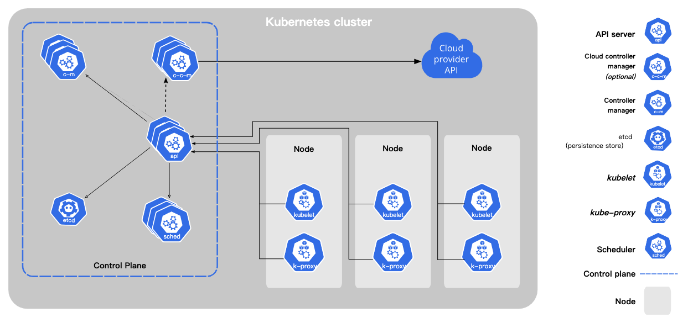

## Kubernetes 架构与核心组件

  Kubernetes 采用 <strong>主从架构（Master-Node 架构）</strong>，由控制平面（Control Plane）与工作节点（Worker Node）组成，用于统一管理容器化工作负载。

### 🧠 控制平面组件（Control Plane）

  

    <h3>API Server</h3>
    
Kubernetes 的统一入口，接收外部请求并将操作提交至集群状态（Etcd）。

  

  

    <h3>Etcd</h3>
    
分布式 Key-Value 存储，保存所有集群状态的“真实来源”。

  

  

    <h3>Scheduler</h3>
    
根据资源和策略将 Pod 分配到合适的节点上运行。

  

  

    <h3>Controller Manager</h3>
    
负责各种控制循环（如副本数管理、节点监控等），维护期望状态。

  

### ⚙️ 工作节点组件（Node Components）

  

    <h3>Kubelet</h3>
    
运行在每个节点上，接收 API Server 指令并控制容器运行。

  

  

    <h3>Kube-Proxy</h3>
    
实现集群内部网络通信与服务暴露，处理网络转发与负载均衡。

  

  

    <h3>Container Runtime</h3>
    
容器运行时（如 Docker、containerd），负责容器的真正执行。

  

## 🧭 架构示意图

## 📦 核心对象资源（部分）

    

    <h3>Pod</h3>
    
最小的部署单元，可以包含一个或多个共享网络与存储的容器。

    
<strong>使用场景：</strong> 运行单个服务或协作容器。

  

  

    <h3>Deployment</h3>
    
定义 Pod 的副本、升级策略和回滚能力，是最常用的部署控制器。

    
<strong>使用场景：</strong> 部署 Web 应用、API 服务等。

  

  

    <h3>ReplicaSet</h3>
    
用于维持特定数量的 Pod 副本，但通常由 Deployment 自动创建。

    
<strong>使用场景：</strong> 很少单独使用，供 Deployment 管理副本。

  

  

    <h3>StatefulSet</h3>
    
用于部署有状态应用，每个 Pod 有固定名称和存储。

    
<strong>使用场景：</strong> 数据库、ZooKeeper、Kafka 等。

  

  

    <h3>DaemonSet</h3>
    
确保所有（或指定）节点上运行一个 Pod 实例。

    
<strong>使用场景：</strong> 日志采集、监控代理等。

  

  

    <h3>Job</h3>
    
一次性任务，运行至完成（成功或失败）。

    
<strong>使用场景：</strong> 批量处理、数据库备份。

  

  

    <h3>CronJob</h3>
    
基于时间调度的 Job，类似 Linux 的 crontab。

    
<strong>使用场景：</strong> 定时任务，如日志归档、报表生成。

  

  

    <h3>Service</h3>
    
定义访问 Pod 的方式，支持 ClusterIP、NodePort、LoadBalancer 等类型。

    
<strong>使用场景：</strong> 内部服务通信、对外暴露服务。

  

  

    <h3>Ingress</h3>
    
基于七层（HTTP/HTTPS）转发规则的路由入口，需搭配 Ingress Controller。

    
<strong>使用场景：</strong> 按域名、路径暴露应用。

  

  

    <h3>ConfigMap</h3>
    
以键值对存储非敏感配置数据，用于解耦应用配置。

    
<strong>使用场景：</strong> 配置文件、环境变量。

  

  

    <h3>Secret</h3>
    
以加密方式存储敏感信息，如密码、token、证书等。

    
<strong>使用场景：</strong> 数据库密码、API 密钥。

  

  

    <h3>PersistentVolume（PV）</h3>
    
集群中的存储资源，由管理员预先配置。

    
<strong>使用场景：</strong> 提供持久数据存储能力。

  

  

    <h3>PersistentVolumeClaim（PVC）</h3>
    
用户请求 PV 的方式，通过声明所需存储大小与模式。

    
<strong>使用场景：</strong> 应用请求磁盘空间。

  

  

    <h3>Namespace</h3>
    
逻辑分区，用于隔离资源、权限与环境。

    
<strong>使用场景：</strong> 多团队协作、开发与生产环境分离。

  

  

    <h3>ResourceQuota</h3>
    
限制 Namespace 中资源的使用量，如 CPU、内存、Pod 数量。

    
<strong>使用场景：</strong> 避免资源滥用。

  

  ✅ 控制平面用于全局决策和状态管理，节点组件负责运行实际业务容器。了解各组件作用，有助于诊断、调优与安全加固。

