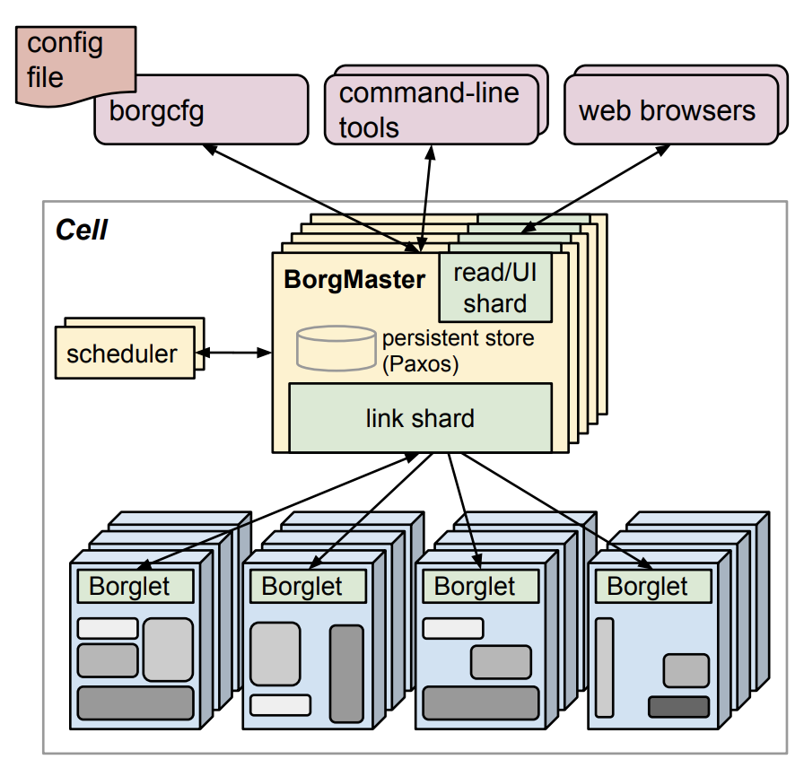

## 什么是kubernetes

  <strong>📖 说明：</strong>

  Kubernetes是一个开源容器编排平台，它可以自动化部署、管理和扩展容器化应用程序所涉及的许多手动流程。

  Kubernetes自动配置您的应用程序，并维护和跟踪资源分配。Kubernetes是云原生计算基金会（CNCF）的一个项目，于2014年首次推出，并已成为组织大规模运行分布式应用程序和服务的广泛采用的平台。

## Kubernetes的基本概念是什么？

  <strong>📖 说明：</strong>

Kubernetes是一个用于管理容器的平台，它捆绑了应用程序的代码、配置和依赖项，允许它作为一个孤立的进程与自己的资源一起运行。每个应用程序都有自己的容器或多个容器，这些容器被分组到Kubernetes pod中。

Kubernetes可以在裸机服务器、虚拟机、公共云提供商、私有云和混合云环境中运行。Kubernetes的关键优势之一是它可以在许多不同类型的基础设施上工作。

Kubernetes的构建是为了帮助用户遵循3个核心设计原则，如Kubernetes实现细节中所述。Kubernetes部署应该是：
    <ul>
        <li>安全: 它应该遵循最新的安全最佳实践。</li>
        <li> 用户友好: 它应该可以使用一些简单的命令来操作。</li>
        <li>可延伸: 它不应该偏爱一个提供商，应该从配置文件中自定义。</li>
    </ul>

## Kubernetes 历史 

  <strong>💡 起源背景：</strong> 

在云计算等技术快速发展的时代，容器技术（特别是 Docker）逐渐兴起，它使得应用的打包、部署变得更加便捷高效。然而，随着容器数量的增多以及应用架构愈发复杂，管理大量容器、协调它们之间的运行、实现高效的部署与扩展等成为了亟待解决的问题，Kubernetes 应运而生，旨在提供一套强大的容器编排与管理解决方案。

Kubernetes，也称为K8s，是一个开源系统，用于自动化容器化应用程序的部署、扩展和管理。

  <strong>💡 早期开发阶段（源自谷歌内部技术）：</strong> 

- Kubernetes 项目最初是由谷歌公司发起的，其基础建立在谷歌内部使用多年的大规模容器管理系统 Borg 之上。Borg 在谷歌内部成功地管理着数量庞大的容器和应用，具备强大的资源调度、集群管理等能力，为 Kubernetes 提供了很多成熟的经验和思路。

- 2014 年，谷歌公司决定将这一基于 Borg 经验积累的容器编排技术开源，与开源社区共同完善和发展，由此拉开了 Kubernetes 走向更广阔舞台的序幕。

  <strong>💡 开源后的发展与壮大</strong> 

- 2015 年，Kubernetes 正式发布了第一个版本（1.0 版本），这标志着它作为一个相对稳定、可用的容器编排平台开始被外界所关注和使用。它一经推出便吸引了众多开发者、企业的目光，越来越多的人参与到其社区中，为其贡献代码、反馈问题、拓展功能。

- 此后，Kubernetes 不断迭代更新，陆续发布了多个版本，每个版本都在功能上进行了增强，例如在资源调度策略上不断优化，使其能更精准地根据不同容器的需求分配资源；在网络管理方面逐步完善，解决了容器间通信、跨节点通信等复杂问题；在存储管理上也增加了更多灵活的方案，方便容器挂载和使用存储资源。

  <strong>💡 生态系统的形成与拓展</strong> 

- 众多的科技公司、开发者围绕 Kubernetes 开发了各种各样的插件、工具和扩展项目。比如，有用于可视化管理 Kubernetes 集群的 Dashboard 工具，方便运维人员直观地查看集群状态、进行操作管理；还有许多基于 Kubernetes 的监控、日志管理等方面的开源项目，帮助更好地了解集群内容器的运行情况以及收集应用的日志信息等。

- 同时，各大云服务提供商也纷纷将 Kubernetes 集成到自己的云平台中，像谷歌云的 GKE、亚马逊云的 EKS、微软云的 AKS 等，使得用户可以更加便捷地在云端使用 Kubernetes 搭建和管理自己的容器化应用，进一步推动了 Kubernetes 的普及。

  <strong>💡 当下及未来趋势</strong> 

- 如今，Kubernetes 已经成为容器编排领域的事实标准，被广泛应用于互联网、金融、制造等众多行业，无论是大型企业的复杂微服务架构应用部署，还是中小创业公司快速搭建应用环境，都离不开它的身影。

- 面向未来，Kubernetes 还在持续探索和发展，比如在边缘计算场景下如何更好地适配，实现对边缘端容器的有效管理；如何进一步提升安全性，保障容器化应用在复杂网络环境下的安全运行等，继续拓展其应用边界和功能深度。

  总之，Kubernetes 从谷歌内部的技术沉淀，通过开源走向世界，在众多开发者和企业的共同参与下，发展成为当今极为重要且应用广泛的容器编排平台。

## 为什么需要使用Kubernetes

  

    <h3>1. 自动化部署与管理</h3>
    <ul>
      <li>容器自动部署、重启</li>
      <li>自愈机制，减少人工干预</li>
      <li>资源智能调度</li>
    </ul>
  

  

    <h3>2. 可扩展性与弹性伸缩</h3>
    <ul>
      <li>根据负载动态扩缩容</li>
      <li>快速响应业务增长</li>
    </ul>
  

  

    <h3>3. 服务发现与负载均衡</h3>
    <ul>
      <li>自动分配 IP 和 DNS</li>
      <li>多种服务暴露方式</li>
      <li>流量自动分发</li>
    </ul>
  

  

    <h3>4. 配置与密钥管理</h3>
    <ul>
      <li>ConfigMap/Secret 管理配置</li>
      <li>配置与代码分离</li>
      <li>增强数据安全</li>
    </ul>
  

  

    <h3>5. 高可用性</h3>
    <ul>
      <li>多副本部署</li>
      <li>自动容错和迁移</li>
    </ul>
  

  

    <h3>6. 跨平台部署</h3>
    <ul>
      <li>支持私有云、公有云、本地部署</li>
      <li>可实现混合云架构</li>
    </ul>
  

  

    <h3>7. 基础设施即代码</h3>
    <ul>
      <li>使用 YAML 或 Helm 标准化部署</li>
      <li>支持 CI/CD 自动化流程</li>
    </ul>
  

  

    <h3>8. 丰富生态系统</h3>
    <ul>
      <li>监控：Prometheus, Grafana</li>
      <li>日志：EFK, Loki</li>
      <li>服务网格、GitOps 工具齐全</li>
    </ul>
  

  ✅ Kubernetes 是现代云原生架构的核心，解决了容器部署、扩展与管理的复杂性，助力 DevOps 实践与微服务落地。

## Kubernetes 不是什么

  <h3>1. 它不是一个传统的 PaaS 平台</h3>
  <ul>
    <li>不等同于 Heroku、App Engine、Cloud Foundry</li>
    <li>不包含代码构建、数据库托管等完整服务</li>
    <li>更像是你自建平台的底层支撑</li>
  </ul>

  <h3>2. 它不是 CI/CD 工具</h3>
  <ul>
    <li>不会自动构建、测试、部署代码</li>
    <li>需要配合 Jenkins、GitLab CI、ArgoCD 等使用</li>
  </ul>

  <h3>3. 它不是容器构建工具</h3>
  <ul>
    <li>Kubernetes 本身不构建镜像</li>
    <li>需使用 Docker、Buildah、Kaniko 等工具来构建镜像</li>
  </ul>

  <h3>4. 它不是配置管理工具</h3>
  <ul>
    <li>不等同于 Ansible、Chef、SaltStack</li>
    <li>只能管理容器中的声明式配置（ConfigMap、Secret）</li>
  </ul>

  <h3>5. 它不是操作系统</h3>
  <ul>
    <li>依赖底层 Linux 系统运行</li>
    <li>不提供驱动、内核或硬件管理</li>
  </ul>

  <h3>6. 它不是数据库或存储系统</h3>
  <ul>
    <li>不负责管理数据</li>
    <li>可集成外部存储（如 Ceph、NFS、EBS）</li>
  </ul>

  <h3>7. 它不是一个安全系统</h3>
  <ul>
    <li>具备 RBAC、网络策略等基本机制</li>
    <li>不提供完整安全检测、审计或用户认证系统</li>
  </ul>

  <h3>8. 它不是微服务架构本身</h3>
  <ul>
    <li>支持微服务部署</li>
    <li>但微服务设计仍需开发人员完成（如服务拆分、API 设计）</li>
  </ul>

  ✅ Kubernetes 是容器编排平台，而不是一站式应用开发平台。了解它“不是什么”，才能合理使用它的能力，构建高效系统。

## 对照总结表格

<table class="kube-table">
  <thead>
    <tr>
      <th>Kubernetes 是</th>
      <th>Kubernetes 不是</th>
    </tr>
  </thead>
  <tbody>
    <tr>
      <td>容器编排平台</td>
      <td>完整的 PaaS 平台</td>
    </tr>
    <tr>
      <td>运行容器的调度与管理系统</td>
      <td>代码构建与部署工具（CI/CD）</td>
    </tr>
    <tr>
      <td>声明式资源管理系统</td>
      <td>配置管理工具（如 Ansible）</td>
    </tr>
    <tr>
      <td>可扩展的运行时基础设施</td>
      <td>数据库、消息队列或业务逻辑框架</td>
    </tr>
    <tr>
      <td>支持微服务部署的平台</td>
      <td>微服务架构本身</td>
    </tr>
    <tr>
      <td>集成其他工具的容器平台</td>
      <td>安全平台、认证系统</td>
    </tr>
  </tbody>
</table>
