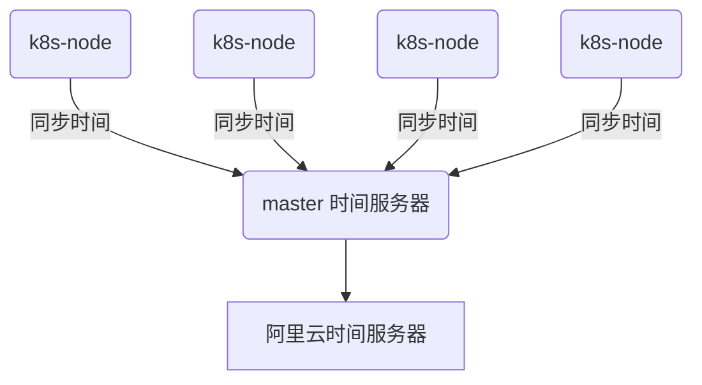

<style>
  .deploy-section {
    display: flex;
    flex-wrap: wrap;
    gap: 20px;
    margin-bottom: 20px;
  }
  .deploy-card {
    flex: 1;
    min-width: 45%;
    background: #f8f9fa;
    border-left: 5px solid #3498db;
    padding: 15px 20px;
    border-radius: 8px;
    box-sizing: border-box;
  }
  .deploy-card h3 {
    margin-top: 0;
    color: #2980b9;
  }
  .deploy-card p {
    margin: 8px 0;
  }
  .deploy-table {
    margin-top: 30px;
    width: 100%;
    border-collapse: collapse;
  }
  .deploy-table th,
  .deploy-table td {
    border: 1px solid #ccc;
    padding: 10px;
  }
  .deploy-table th {
    background: #ecf0f1;
  }
  /* .highlight {
    border-left: 5px solid #2ecc71;
    background: #eafbe7;
    padding: 15px 20px;
    border-radius: 6px;
    margin-top: 30px;
    font-weight: bold;
  } */
</style>

## 🚀 Kubernetes 部署方案

<p>Kubernetes 可通过多种方式部署，取决于使用场景、环境类型和运维能力。以下是常见部署方式的说明与对比。</p>

### 🌐 常见部署方案

<div class="deploy-section">
  <div class="deploy-card">
    <h3>1. Minikube</h3>
    <p>适用于本地测试开发，通过虚拟机或容器创建单节点集群。</p>
    <p><strong>优点：</strong> 快速启动，便于开发。</p>
    <p><strong>缺点：</strong> 不适合生产环境。</p>
  </div>

  <div class="deploy-card">
    <h3>2. Kind（Kubernetes IN Docker）</h3>
    <p>基于 Docker 创建 Kubernetes 集群，适合 CI/CD 流水线测试。</p>
    <p><strong>优点：</strong> 无需虚拟机，轻量。</p>
    <p><strong>缺点：</strong> 网络配置复杂，不适合持久化。</p>
  </div>

  <div class="deploy-card">
    <h3>3. kubeadm</h3>
    <p>官方提供的标准安装工具，适合中小型集群部署。</p>
    <p><strong>优点：</strong> 控制力强，可定制。</p>
    <p><strong>缺点：</strong> 安装过程需手动操作，对技术要求高。</p>
  </div>

  <div class="deploy-card">
    <h3>4. 云托管 Kubernetes（如 EKS、AKS、GKE）</h3>
    <p>由云服务商维护的 Kubernetes 平台。</p>
    <p><strong>优点：</strong> 高可用、自动扩缩、维护少。</p>
    <p><strong>缺点：</strong> 成本相对较高，平台锁定风险。</p>
  </div>

  <div class="deploy-card">
    <h3>5. Rancher</h3>
    <p>可视化 Kubernetes 管理平台，支持多集群、多云部署。</p>
    <p><strong>优点：</strong> 易用、界面友好。</p>
    <p><strong>缺点：</strong> 引入额外平台，资源开销大。</p>
  </div>

  <div class="deploy-card">
    <h3>6. K3s</h3>
    <p>轻量级 Kubernetes，适合边缘计算或资源受限环境。</p>
    <p><strong>优点：</strong> 安装简单，资源占用低。</p>
    <p><strong>缺点：</strong> 与原生 K8s 存在兼容差异。</p>
  </div>
</div>

### 🔍 部署方案对比表
<div>
<table class="deploy-table">
  <thead>
    <tr>
      <th>部署方式</th>
      <th>适用场景</th>
      <th>优点</th>
      <th>缺点</th>
    </tr>
  </thead>
  <tbody>
    <tr>
      <td>Minikube</td>
      <td>本地开发</td>
      <td>简单、快速启动</td>
      <td>非生产使用</td>
    </tr>
    <tr>
      <td>Kind</td>
      <td>CI/CD 测试</td>
      <td>轻量、不依赖 VM</td>
      <td>网络配置复杂</td>
    </tr>
    <tr>
      <td>kubeadm</td>
      <td>自建集群</td>
      <td>可控性强</td>
      <td>维护成本高</td>
    </tr>
    <tr>
      <td>EKS / AKS / GKE</td>
      <td>企业生产环境</td>
      <td>托管，省心</td>
      <td>费用高、云依赖</td>
    </tr>
    <tr>
      <td>Rancher</td>
      <td>多集群管理</td>
      <td>图形界面、支持混合云</td>
      <td>需要额外部署平台</td>
    </tr>
    <tr>
      <td>K3s</td>
      <td>边缘设备、IoT</td>
      <td>轻量、快速</td>
      <td>不完全兼容原生组件</td>
    </tr>
  </tbody>
</table>
</div></p>

<div style="background-color: #fff3cd; border-left: 5px solid #ffc107; padding: 10px;">
  ✅ 建议：<br/>
  - 学习与测试使用 Minikube、Kind；<br/>
  - 中小规模生产集群可用 kubeadm + 容器网络插件；<br/>
  - 企业级、稳定性要求高推荐 EKS / GKE / AKS 等云托管方案。
</div>


## 部署案例：（基于云平台）
### 实验步骤
####  1. 机器规划

<table border="1" cellpadding="8" cellspacing="0" style="border-collapse:collapse; width:100%; text-align:left;">
  <thead style="background:#f0f0f0;">
    <tr>
      <th>主机名称</th>
      <th>操作系统</th>
      <th>内核版本</th>
      <th>公网 IP 地址</th>
      <th>私有 IP 地址</th>
    </tr>
  </thead>
  <tbody>
    <tr>
      <td>k8s-master</td>
      <td>Ubuntu 24.04.2 LTS</td>
      <td>Linux 6.8.0-53-generic</td>
      <td>8.130.189.188</td>
      <td>10.0.0.222</td>
    </tr>
    <tr>
      <td>k8s-node01</td>
      <td>Ubuntu 24.04.2 LTS</td>
      <td>Linux 6.8.0-53-generic</td>
      <td>8.130.181.239</td>
      <td>10.0.0.219</td>
    </tr>
    <tr>
      <td>k8s-node02</td>
      <td>Ubuntu 24.04.2 LTS</td>
      <td>Linux 6.8.0-53-generic</td>
      <td>8.130.176.16</td>
      <td>10.0.0.220</td>
    </tr>
    <tr>
      <td>k8s-node03</td>
      <td>Ubuntu 24.04.2 LTS</td>
      <td>Linux 6.8.0-53-generic</td>
      <td>8.130.187.43</td>
      <td>10.0.0.223</td>
    </tr>
    <tr>
      <td>k8s-node04</td>
      <td>Ubuntu 24.04.2 LTS</td>
      <td>Linux 6.8.0-53-generic</td>
      <td>8.130.186.74</td>
      <td>10.0.0.221</td>
    </tr>
  </tbody>
</table>
#### 2. 部署前的准备工作
<div style="background-color: #fff3cd; border-left: 5px solid #ffc107; padding: 10px;">
  <strong>⚠️ 警告：</strong>
  <ul>
    <li><strong>Linux 主机：</strong> Kubernetes 项目支持基于 Debian 和 Red Hat 的 Linux 发行版，也支持无包管理器的发行版。</li>
    <li><strong>内存：</strong> 每台机器至少 2 GB RAM，保证应用程序有足够空间运行。</li>
    <li><strong>CPU：</strong> 控制平面机器建议至少 2 个 CPU。</li>
    <li><strong>网络连接：</strong> 集群内所有机器需具备完全网络连通性，支持公共或专用网络。</li>
    <li><strong>唯一标识：</strong> 每个节点必须有唯一的主机名、MAC 地址和 product_uuid。</li>
    <li><strong>端口开放：</strong> 相关端口需打开，若防火墙关闭可忽略此项。</li>
    <li><strong>关闭交换分区：</strong> 交换分区需永久关闭，确保 Kubernetes 资源调度稳定。</li>
  </ul>
</div>


#### 3. 配置主机(所有主机配置)

- 配置主机名
```shell
hostnamectl set-hostname k8s-master
hostnamectl set-hostname k8s-node01
hostnamectl set-hostname k8s-node02
hostnamectl set-hostname k8s-node03
hostnamectl set-hostname k8s-node04
```
- 修改hosts文件
```shell
root@k8s-master:~# cat /etc/hosts
127.0.0.1 localhost

# The following lines are desirable for IPv6 capable hosts
::1     ip6-localhost ip6-loopback
fe00::0 ip6-localnet
ff00::0 ip6-mcastprefix
ff02::1 ip6-allnodes
ff02::2 ip6-allrouters

8.130.189.188 k8s-master
8.130.181.239 k8s-node01
8.130.176.16  k8s-node02
8.130.187.43  k8s-node03
8.130.186.74  k8s-node04
```
- 互信任
```shell
ssh-keygen # 创建公钥/私钥

ssh-copy-id root@k8s-node01
ssh-copy-id root@k8s-node02
ssh-copy-id root@k8s-node03
ssh-copy-id root@k8s-node04
```

- 测试是否可以免密登录：
```shell
```

#### 4. 安装时间同步服务(切记)


<div style="background-color: #fff3cd; border-left: 5px solid #ffc107; padding: 10px; border-radius: 5px; margin: 10px 0;">
  <strong>⚠️ 警告：</strong> 如果在生产环境中请使用独立的时间服务器；
</div>

## ubuntu 部署方式

<div style="background-color: #ffffcc; padding: 10px; border-left: 5px solid #ffcc00;">
  部署方式： 使用kubeadm的方式创建集群
</div>

### 安装容器运行时


<div style="background-color: #e6f7ff; border-left: 5px solid #1890ff; padding: 10px; border-radius: 5px; margin: 10px 0;">
  <strong>💡 信息：</strong></p>
<ul>
<li>在所有节点都需要安装容器运行时</li>
<li>要在 Pod 中运行容器，Kubernetes 使用 容器运行时</li>
<li>默认情况下，Kubernetes 使用 Container Runtime Interface（CRI）与您选择的容器运行时进行交互。</li>
<li>如果您没有指定运行时，kubeadm 会自动尝试通过扫描已知端点（endpoints）列表来检测已安装的容器运行时。</li>
<li>如果检测到多个或没有检测到容器运行时，kubeadm 将抛出一个错误，并要求您指定要使用的容器运行时。</li>
</ul>
</div>

- 支持的容器运行时

  <div style="background-color: #e2f7e1; border-left: 5px solid #28a745; padding: 10px; border-radius: 5px; margin: 10px 0;">
    <strong>🎯 支持的容器运行时:</strong> </p>
    <ul>
  <li>containerd</li>
  <li>CRI-O</li>
  <li>Docker Engine</li>
  <li>Mirantis Container Runtime</li>
    </ul>
  </div>
<div style="background-color: #e2f7e1; border-left: 5px solid #28a745; padding: 10px; border-radius: 5px; margin: 10px 0;">
  <strong>⏱️ 说明：</strong> </p>我们这里使用docker作为容器运行时;</p>在kubernetes中提示在1.24版本之后官方不维护shim组件；<br>
  如果使用docker作为容器运行时需要安装<code>cri-dockerd</code>的插件；
</div>
- 安装docker

```shell
root@k8s-master:~# cat install_docker.sh 
sudo apt-get update
sudo apt-get install  -y ca-certificates curl gnupg
# step 2: 信任 Docker 的 GPG 公钥
sudo install -m 0755 -d /etc/apt/keyrings
curl -fsSL https://mirrors.aliyun.com/docker-ce/linux/ubuntu/gpg | sudo gpg --dearmor -o /etc/apt/keyrings/docker.gpg
sudo chmod a+r /etc/apt/keyrings/docker.gpg

# Step 3: 写入软件源信息
echo \
  "deb [arch=$(dpkg --print-architecture) signed-by=/etc/apt/keyrings/docker.gpg] https://mirrors.aliyun.com/docker-ce/linux/ubuntu \
  "$(. /etc/os-release && echo "$VERSION_CODENAME")" stable" | \
  sudo tee /etc/apt/sources.list.d/docker.list > /dev/null

# Step 4: 安装Docker
sudo apt-get update
sudo apt-get install docker-ce docker-ce-cli containerd.io docker-buildx-plugin docker-compose-plugin -y
sudo systemctl enable docker  --now 
```

-  安装docker插件(cri-dockerd)
<div style="background-color: #f0f8ff; border-left: 5px solid #1e90ff; padding: 10px; border-radius: 5px; margin: 10px 0;">
  <strong>📖 提示：</strong> 所有节点都需要安装
</div> 

```shell
root@k8s-master:~# wget https://github.com/Mirantis/cri-dockerd/releases/download/v0.3.17/cri-dockerd_0.3.17.3-0.ubuntu-bionic_amd64.deb
root@k8s-master:~# dpkg -i cri-dockerd_0.3.17.3-0.ubuntu-bionic_amd64.deb
```

- 配置内核

<div style="background-color: #f0f8ff; border-left: 5px solid #1e90ff; padding: 10px; border-radius: 5px; margin: 10px 0;">
  <strong>📖 提示：</strong> 所有节点都需要安装
</div>

```shell
# 配置内核模块
cat <<EOF | sudo tee /etc/modules-load.d/k8s.conf
overlay
br_netfilter
EOF
# 加载内核模块
sudo modprobe overlay
sudo modprobe br_netfilter

#配置内核网络转发
# sysctl params required by setup, params persist across reboots
cat <<EOF | sudo tee /etc/sysctl.d/k8s.conf
net.bridge.bridge-nf-call-iptables  = 1
net.bridge.bridge-nf-call-ip6tables = 1
net.ipv4.ip_forward                 = 1
EOF
# Apply sysctl params without reboot
sudo sysctl --system


#验证模块是否以加载
# lsmod | grep br_netfilter
# lsmod | grep overlay
br_netfilter           32768  0
bridge                421888  1 br_netfilter
overlay               212992  0
```


### 安装官方源

<div style="background-color: #f0f8ff; border-left: 5px solid #1e90ff; padding: 10px; border-radius: 5px; margin: 10px 0;">
  <strong>📖 提示：</strong> 所有节点都需要安装
</div>

```shell
# 官方源
sudo apt-get update
# apt-transport-https may be a dummy package; if so, you can skip that package
sudo apt-get install -y apt-transport-https ca-certificates curl gpg

# 添加k8s gpgkey
root@k8s-master:~# curl -fsSL https://pkgs.k8s.io/core:/stable:/v1.29/deb/Release.key | sudo gpg --dearmor -o /etc/apt/keyrings/kubernetes-apt-keyring.gpg
# 添加k8s库
root@k8s-master:~# echo 'deb [signed-by=/etc/apt/keyrings/kubernetes-apt-keyring.gpg] https://pkgs.k8s.io/core:/stable:/v1.29/deb/ /' | sudo tee /etc/apt/sources.list.d/kubernetes.list


#安装命令
root@k8s-master:~# apt update
root@k8s-master:~# apt-get install -y kubelet kubeadm kubectl
root@k8s-master:~# apt-mark hold kubelet kubeadm kubectl

# 运行kubelet命令
systemctl enable --now kubelet
```
<div style="background-color: #fffbe6; border-left: 5px solid #faad14; padding: 10px; border-radius: 5px; margin: 10px 0;">
  <strong>🧪 命令作用：</strong> 
  <ul>
  <li>Kubeadm: 引导集群的命令</li>
  <li>Kubelet: 在集群中的所有机器上运行的组件，并执行启动 pod 和容器等操作</li>
  <li>kubectl: 与集群对话的命令行; 客户端使用的命令</li>
  </ul>
</div>

### 创建集群

1. 初始化集群

<div style="background-color: #f0f8ff; border-left: 5px solid #1e90ff; padding: 10px; border-radius: 5px; margin: 10px 0;">
  <strong>📖 提示：</strong> 在master节点上执行
</div>

```shell
[root@k8s-master ~]# kubeadm  init  --cri-socket  unix:///var/run/cri-dockerd.sock
```
<div style="background-color: #fffbe6; border-left: 5px solid #faad14; padding: 10px; border-radius: 5px; margin: 10px 0;">
  <strong>🧪 常用选项：</strong> 
  <ul>
  <li>--cri-socker<br> 指定容器运行时（CRI）的接口路径。默认情况下 Kubernetes 使用的是 containerd 或 CRI-O，如果使用的是非默认路径，需要通过该参数明确指定。</li>
  <li>--pod-network-cidr <br>为 Pod 分配的网络地址范围（CIDR）。这个参数需与所选网络插件（如 Flannel, Calico 等）配置一致。</li>
  <li>--control-plane-endpoint<br>  设置控制平面高可用时的统一访问入口地址，通常是一个负载均衡器或 DNS 地址。用于集群节点连接主节点时不依赖单一 IP。</li>
  </ul>
</div>

- 输出信息

```shell
[addons] Applied essential addon: CoreDNS
[addons] Applied essential addon: kube-proxy
Your Kubernetes control-plane has initialized successfully!
To start using your cluster, you need to run the following as a regular user:

  mkdir -p $HOME/.kube
  sudo cp -i /etc/kubernetes/admin.conf $HOME/.kube/config
  sudo chown $(id -u):$(id -g) $HOME/.kube/config

Alternatively, if you are the root user, you can run:

  export KUBECONFIG=/etc/kubernetes/admin.conf

You should now deploy a pod network to the cluster.
Run "kubectl apply -f [podnetwork].yaml" with one of the options listed at:
  https://kubernetes.io/docs/concepts/cluster-administration/addons/

Then you can join any number of worker nodes by running the following on each as root:
kubeadm join 10.0.0.222:6443 --token qqgge1.4vff48apn1ktd0mb \
        --discovery-token-ca-cert-hash sha256:dac26008607f5a22e0fba7e11cb8c39edc5a797748ebed727ee833ec2de25924 
```

<div style="background-color: #d4edda; border-left: 5px solid #28a745; padding: 10px; border-radius: 5px; margin: 10px 0;">
  <strong>✅ 成功：</strong> 如果正确输出；表示初始化成功；
</div>

- Master执行命令

```shell
 root@k8s-master:~# mkdir -p $HOME/.kube
 root@k8s-master:~# sudo cp -i /etc/kubernetes/admin.conf $HOME/.kube/config
 root@k8s-master:~# sudo chown $(id -u):$(id -g) $HOME/.kube/config
```

- 检查master节点

```shell
root@k8s-master:~# kubectl  get node
NAME         STATUS     ROLES           AGE   VERSION
k8s-master   NotReady   control-plane   13m   v1.29.15
```
2. 将计算节点加入master节点中

```shell
kubeadm join 10.0.0.222:6443 --token qqgge1.4vff48apn1ktd0mb \
--discovery-token-ca-cert-hash sha256:dac26008607f5a22e0fba7e11cb8c39edc5a797748ebed727ee833ec2de25924 \
--cri-socket  unix:///var/run/cri-dockerd.sock
```
3. 在master节点上检查所有的工作节点是否都加入

```shell
[root@k8s-master ~]# kubectl get nodes
NAME         STATUS     ROLES           AGE     VERSION
k8s-master   NotReady   control-plane   8m13s   v1.29.15
k8s-node01   NotReady   <none>          48s     v1.29.15
k8s-node02   NotReady   <none>          4s      v1.29.15
k8s-node03   NotReady   <none>          4s      v1.29.15
k8s-node04   NotReady   <none>          4s      v1.29.15
```

<div style="background-color: #f0f8ff; border-left: 5px solid #1e90ff; padding: 10px; border-radius: 5px; margin: 10px 0;">
  <strong>📖 说明：</strong> <br>
STATUS 显示 NotReady 状态； 原因是因为每个节点上Pod不能通信；我们需要安装一个网络组件； 
</div>  
4. 部署网络组件到集群中(calico)
   
- 下载网络组件
```shell
[root@k8s-master ~]# wget https://docs.projectcalico.org/manifests/calico.yaml
```
- 部署网络组件
```shell
[root@k8s-master ~]# kubectl   apply  -f calico.yaml
```
<div style="background-color: #fff3cd; border-left: 5px solid #ffc107; padding: 10px; border-radius: 5px; margin: 10px 0;">
  <strong>⚠️ 警告：</strong> 这个过程需要根据网络的状态；需要等待几分钟
</div>

### 检查节点的状态
```shell
[root@k8s-master ~]# kubectl get nodes
NAME         STATUS     ROLES           AGE     VERSION
k8s-master   Ready      control-plane   8m13s   v1.29.15
k8s-node01   Ready      <none>          48s     v1.29.15
k8s-node02   Ready      <none>          4s      v1.29.15
k8s-node03   Ready      <none>          4s      v1.29.15
k8s-node04   Ready      <none>          4s      v1.29.15
```
