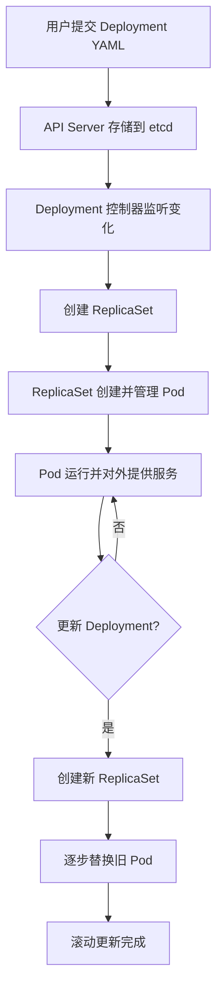

# Deployment

在 Kubernetes 中，**Deployment 控制器** 是用于管理**无状态应用**的核心控制器。它的主要职责是确保指定数量的 Pod 副本始终处于运行状态，并提供一种声明式的方式来管理应用的更新和回滚。

简单来说，Deployment 控制器就是你告诉 Kubernetes **“我需要我的应用运行 3 个副本”**，然后它就会去确保这个状态。如果有一个 Pod 意外崩溃了，它会自动创建新的 Pod 来替代它，从而保证你的应用始终可用。

---

## Deployment 控制器的工作原理

Deployment 控制器本身并不直接管理 Pod，它通过一个名为 **ReplicaSet** 的中间层来工作。其工作流程如下：

1.  **你创建或更新一个 Deployment 对象**：你定义了期望的状态，比如应用的镜像、副本数（`replicas`）以及 Pod 的标签。
2.  **Deployment 控制器创建或更新 ReplicaSet**：Deployment 控制器会创建一个或多个 ReplicaSet。每个 ReplicaSet 负责维护特定版本的 Pod 模板，并确保其 Pod 副本数与期望值相符。
3.  **ReplicaSet 控制器管理 Pod**：ReplicaSet 控制器直接负责创建、删除和管理 Pod。当 Deployment 告诉它需要 3 个 Pod 时，它就会去创建 3 个 Pod；如果 Pod 意外终止，它会立刻启动一个新的。

这种分层管理的好处是，Deployment 负责高层的版本管理和更新策略，而 ReplicaSet 则专注于底层的 Pod 数量维护。

---

## 关键功能

Deployment 控制器之所以如此重要，是因为它提供了几个关键的自动化功能：

### 1. 滚动更新 (Rolling Update)

这是 Deployment 最强大的功能之一。当你更新应用的镜像或配置时，Deployment 控制器会以**零停机**的方式逐步替换旧的 Pod。它会按照设定的策略（例如，一次替换一个 Pod）来创建新的 Pod 并终止旧的 Pod，直到所有 Pod 都更新到新版本。这确保了用户在更新过程中不会感受到服务中断。

### 2. 回滚 (Rollback)

如果你发现新版本有问题，Deployment 允许你轻松地回滚到上一个或任意一个历史版本。它会维护每次更新的修订历史（Revision），你只需要执行一个命令，它就会将所有 Pod 恢复到指定的旧版本。

### 3. 自动扩容与缩容

你可以通过修改 Deployment 的 `replicas` 字段来手动增加或减少 Pod 的副本数。此外，Deployment 还可以与 **Horizontal Pod Autoscaler (HPA)** 配合使用，根据 CPU 或内存使用率等指标自动调整副本数，实现应用的自动伸缩。

---

## 总结

Deployment 控制器是 Kubernetes 中管理无状态应用的**首选工具**。它提供了一种强大、可靠且自动化的方式来处理应用的部署、更新和扩展。它抽象了底层的 ReplicaSet 和 Pod 管理，让开发者可以专注于声明应用的期望状态，而将运维的复杂性交给 Kubernetes 自身来处理。


## 案例场景

假设你有一个名为 `my-app` 的 Web 应用，现在你想用 Kubernetes 来部署它。你的目标是：

1.  初始部署 3 个 Pod 副本。
2.  将应用的镜像从 `v1` 更新到 `v2`。
3.  如果 `v2` 版本出现问题，能够快速回滚到 `v1`。

-----

## 第 1 步：创建 Deployment

首先，你需要创建一个 `deployment.yaml` 文件来定义你的应用。这个文件会告诉 Kubernetes 你想要的**期望状态**。

```yaml
# deployment.yaml
apiVersion: apps/v1
kind: Deployment
metadata:
  name: my-app-deployment
  labels:
    app: my-app
spec:
  replicas: 3
  selector:
    matchLabels:
      app: my-app
  template:
    metadata:
      labels:
        app: my-app
    spec:
      containers:
      - name: my-app-container
        image: your-repo/my-app:v1  # 初始版本
        ports:
        - containerPort: 80
```

  * `replicas: 3`: 告诉 Deployment 控制器，你需要 **3 个 Pod 副本**。
  * `image: your-repo/my-app:v1`: 指定了你的应用使用的 **`v1` 版本镜像**。

现在，使用 `kubectl` 命令创建 Deployment：

```sh
kubectl apply -f deployment.yaml
```

**发生了什么？**

1.  `kubectl` 将 `deployment.yaml` 文件发送到 Kubernetes API 服务器。
2.  **Deployment 控制器**接收到这个请求，并开始工作。
3.  它发现集群中没有与这个 Deployment 关联的 Pod，所以它创建一个 **ReplicaSet**，并告诉 ReplicaSet 需要创建 3 个 Pod。
4.  **ReplicaSet 控制器**创建 3 个新的 Pod，每个 Pod 都使用 `my-app:v1` 镜像。

你可以用以下命令查看 Pod 状态：

```sh
kubectl get pods
```

你会看到类似这样的输出：

```sh
NAME                                 READY   STATUS    RESTARTS   AGE
my-app-deployment-55d8d85f57-abcde   1/1     Running   0          1m
my-app-deployment-55d8d85f57-fghij   1/1     Running   0          1m
my-app-deployment-55d8d85f57-klmno   1/1     Running   0          1m
```

-----

## 第 2 步：滚动更新 (Rolling Update)

现在，你的开发团队发布了 `v2` 版本，你想在不中断服务的情况下更新应用。你只需要修改 `deployment.yaml` 文件中的镜像版本：

```yaml
# deployment.yaml
apiVersion: apps/v1
kind: Deployment
metadata:
  name: my-app-deployment
  labels:
    app: my-app
spec:
  replicas: 3
  selector:
    matchLabels:
      app: my-app
  template:
    metadata:
      labels:
        app: my-app
    spec:
      containers:
      - name: my-app-container
        image: your-repo/my-app:v2  # 更新为 v2
        ports:
        - containerPort: 80
```

然后，再次应用这个文件：

```sh
kubectl apply -f deployment.yaml
```

**发生了什么？**

这就是 **Deployment 控制器**的魔法所在：

1.  **Deployment 控制器**检测到 `deployment.yaml` 中的镜像发生了变化。
2.  它开始执行**滚动更新**。它会创建一个**新的 ReplicaSet**，并告诉它需要 3 个 Pod。
3.  **Deployment 控制器**会逐步地、一个接一个地创建新的 `v2` Pod，并同时逐步删除旧的 `v1` Pod。这个过程会一直持续，直到所有 `v1` Pod 被 `v2` Pod 替换。

你可以通过以下命令观察滚动更新的过程：

```sh
kubectl get pods
```

你会看到新旧 Pod 共存的场景：

```sh
NAME                                 READY   STATUS        RESTARTS   AGE
my-app-deployment-6889d87b55-vwxyz   0/1     ContainerCreating   0          5s  # 新的 v2 Pod 正在创建
my-app-deployment-6889d87b55-uvwx   1/1     Running       0          10s # 新的 v2 Pod
my-app-deployment-6889d87b55-stuv   1/1     Running       0          15s # 新的 v2 Pod
my-app-deployment-55d8d85f57-abcde   1/1     Running       0          5m  # 旧的 v1 Pod 正在被终止
```

-----

## 第 3 步：回滚 (Rollback)

如果你发现 `v2` 版本有 bug，想要立即回到 `v1` 版本，**Deployment 控制器**可以轻松实现这一点。

首先，查看 Deployment 的修订历史：

```sh
kubectl rollout history deployment my-app-deployment
```

输出会显示不同的修订版本：

```sh
REVISION  CHANGE-CAUSE
1         <none>
2         <none>
```

通常，修订 1 是你的初始部署，修订 2 是你的 `v2` 更新。

现在，执行回滚命令：

```sh
kubectl rollout undo deployment my-app-deployment
```

**发生了什么？**

1.  **Deployment 控制器**收到回滚命令。
2.  它会将 Deployment 的状态恢复到上一个修订版本（即 `v1` 版本）。
3.  它会再次执行一个**滚动更新**，但这次是反向的。它会创建 `v1` 的 Pod，并逐步删除 `v2` 的 Pod。

当回滚完成后，你再次查看 Pod 状态：

```sh
kubectl get pods
```

你会发现所有 Pod 都回到了 `v1` 版本：

```sh
NAME                                 READY   STATUS    RESTARTS   AGE
my-app-deployment-55d8d85f57-abcde   1/1     Running   0          10m
my-app-deployment-55d8d85f57-fghij   1/1     Running   0          10m
my-app-deployment-55d8d85f57-klmno   1/1     Running   0          10m
```
## 使用场景
- Web 服务（如 Nginx、Tomcat、Spring Boot 应用）
- 微服务（无状态服务）
- 需要高可用和无中断升级的业务

## Deployment 生命周期管理流程（Mermaid 图）

