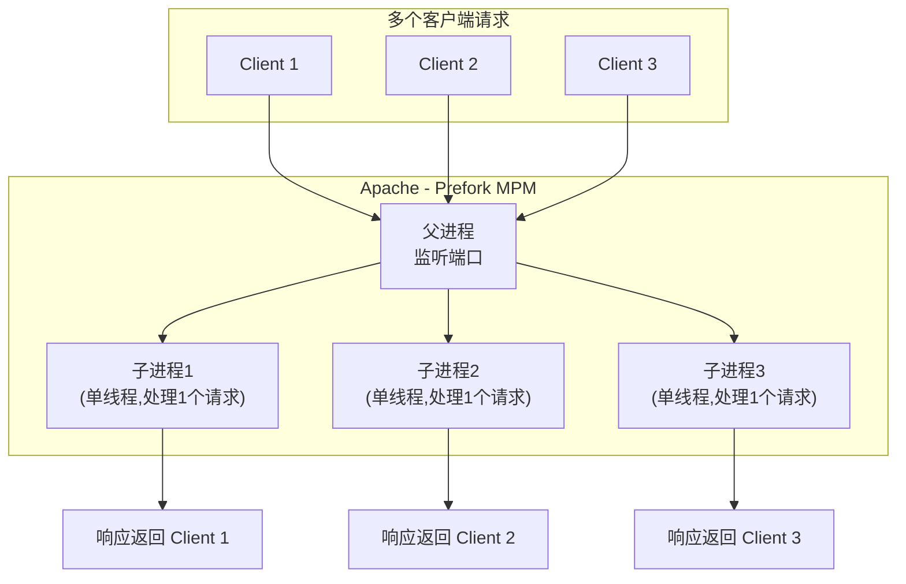
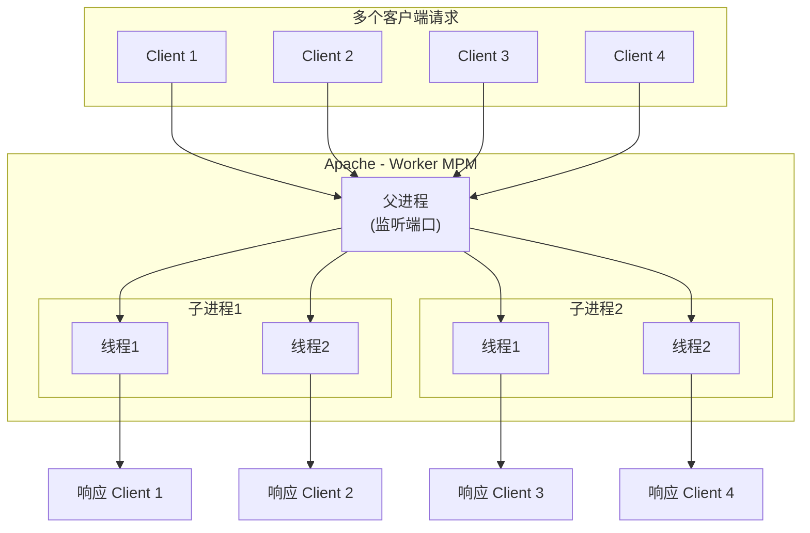
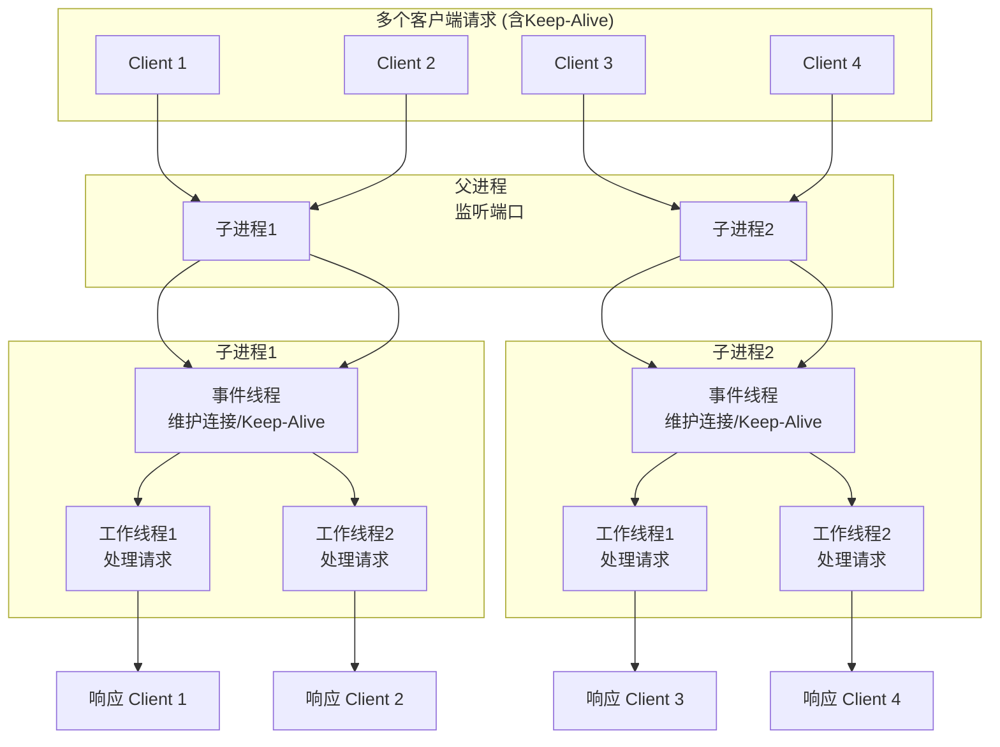
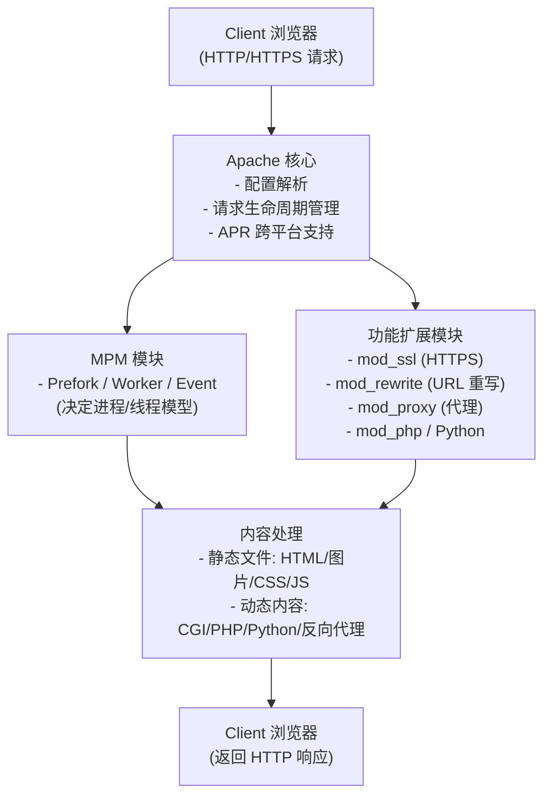

## **第一章：Apache Web 服务器概述**

### 1. **Apache 简介**

Apache HTTP Server 是一个 跨平台、开源且免费 的网络服务器软件，遵循 Apache License 2.0 协议发行。最初为类 Unix 系统设计，现在广泛支持 Windows、macOS 和 Linux 等操作系统，通过丰富的模块机制提供高度可扩展性。  名称由来颇具趣味，“Apache” 一词部分灵感来自 “A PAtCHy” （打补丁的），形象地传达了它最初是在 NCSA HTTPd 的代码上，通过众多修补程序不断改进而成的过程。

   -  Apache 的发展历史与现状

<ul>
<li>起源：1995 年 4 月，在 NCSA HTTPd 停止维护后，一群开发者通过邮件列表协作，将众多补丁整合起来，并形成首个公开版本 Apache 0.6.2 </li><li>Apache 软件基金会成立：随着项目影响扩大，1999 年 Apache Group 正式成立 Apache 软件基金会（ASF），为 Apache HTTP Server 及其他项目提供法律、组织支持 </li><li>长期主导市场：Apache 曾长期占据互联网网页服务器市场主流地位。在 1996 年 4 月起，它逐渐成为最流行的 HTTP 服务器；2005 年 7 月市占率曾升至 69%；2009 年仍约 54%</li>
</ul>
如今，虽然市场份额有所下降，但仍是重要选项之一。

   -  Apache 在 Web 服务市场的地位

<ul>
<li>截至 2025 年 7 月，Aguko 数据显示，Apache 与 Nginx 平分天下，分别占据约 39% 市场份额，其后依次是 IIS（8%）、OpenResty（5%）和 LiteSpeed（5%） </li><li>W3Techs（2025 年 8 月） 报告指出：Nginx 使用率为 33.8%，Apache 约 25.7%，IIS 则为 3.8% </li><li>其他数据显示，W3Techs 曾统计 Nginx 首位、Apache 次之，在最繁忙网站中占比分别为 33.8%、25.7% </li>
</ul>
尽管不同统计数据略有差异，但总体趋势是：Apache 仍具市场影响力，不过已经逐步被性能优越或架构轻量的竞品如 Nginx 所挑战。

   - Apache 与 Nginx、IIS 的对比

### 2. **应用场景**

   * 静态网站部署
  
   * 动态网站与后端语言（PHP、Python、Perl）
   * 反向代理与负载均衡
   * HTTPS 网站与证书部署

### 3. **Apache 架构原理**

  <strong>1.核心（Core）+ 可扩展模块（Modules）</strong> 
 Apache 架构设计基于一个 轻量核心 和若干功能模块的组合模式。核心负责基础功能，如网络监听、请求调度，而各项业务功能（如认证、URL 重写、SSL 支持）则由模块来扩展实现，可在运行时动态加载或卸载。 
  <strong>2. Apache Portable Runtime（APR）</strong> 
为了跨平台兼容性，Apache 借助 APR 层封装了底层操作系统调用（如文件 I/O、网络、线程管理等），增强了移植性及性能。 
<strong>3. 多进程/多线程模式（MPMs）</strong> 
模块（MPMs）决定了 Apache 接受和处理客户端连接的方式：
Prefork、Worker、Event 模式分别采用多进程、混合线程以及事件驱动机制，适配不同性能需求或兼容性场景。

#### Apache MPM 模型详解（Prefork、Worker、Event）

  <strong>✅ Prefork MPM（进程模型）</strong> 
  <ul>
    <li>机制：为每个连接创建一个独立的子进程（单线程）。每个进程处理一个请求，互相隔离。</li>
    <li>优点：高稳定性和隔离性，一旦某个进程崩溃，不会影响其他进程。适用于需要兼容非线程安全模块或旧代码的环境。</li>
    <li>缺点：占用资源高，随着连接数增加会显著消耗内存。</li>
    <li>适用场景：低至中等流量、对稳定性要求极高、或需要兼容旧 PHP 模块（如 mod_php）的场景。</li>
  </ul>

  <strong>✅ Worker MPM（混合多线程模型）</strong> 
  <ul>
    <li>机制：每个子进程包含多个线程，每个线程处理一个请求（多进程 + 多线程 hybrid 模式）。</li>
    <li>优点：内存使用效率高，可处理更多并发连接。</li>
    <li>缺点：如果使用了线程不安全代码或模块，可能会引发稳定性问题。</li>
    <li>适用场景：高并发需求场景，且使用线程安全模块或外部服务处理不安全代码（如 PHP-FPM）</li>
  </ul>

  <strong>✅ Event MPM（事件驱动模型）</strong> 
  <ul>
    <li>机制：类似于 Worker，但引入事件循环机制。处理请求时只占用线程本身，而不是整个连接。即请求处理与连接保持分离。</li>
    <li>优点： 
  - 更高效处理 Keep-Alive 请求，不在连接空闲时占用线程资源，从而提高性能。 
      - Apache 2.4 中性能接近其他高效事件驱动服务器。</li>
  <li>缺点：仅支持 Apache 2.4 及以上版本；某些旧模块可能不兼容。</li>
  <li>推荐场景：现代高并发、高性能需求场景，推荐优先使用（需确保模块兼容性）。</li>
  </ul>

#### MPM 模型对比表

| MPM 模型 | 架构类型                  | 资源使用             | 稳定性/隔离性    | 最适合场景                            |
| -------- | ------------------------- | -------------------- | ---------------- | ------------------------------------- |
| Prefork  | 多进程、单线程            | 高                   | 很高（进程隔离） | 低流量、兼容旧模块或非线程安全环境    |
| Worker   | 多进程、多线程            | 中                   | 一般（线程共享） | 高并发环境，需线程安全或使用 PHP-FPM  |
| Event    | 多进程、多线程 + 事件机制 | 最高（连接不占线程） | 良好             | 极高并发、长 Keep-Alive，现代架构推荐 |

  <strong>  如何选择合适的 MPM</strong> 
  <ul>
    <li>优先使用 Event MPM，效率最高，表现优秀（Apache 2.4+ 推荐）。</li>
    <li>如果你使用旧的、不支持线程安全的库（如 mod_php），则仍需使用 Prefork 保证稳定性。</li>
		<li>Worker 是一个较好的折衷选择，但需确保使用 PHP-FPM 等机制来避免线程安全问题（mod_php 不推荐与 Worker 一起使用）。</li>
		<li>系统默认设置通常倾向 Event → Worker → Prefork，取决于 OS 是否支持线程和 epoll/kqueue。</li>
      </ul>

#### Apache 高层架构图

---

## **第二章：Apache 安装与环境准备**

### 1. **系统准备**

   * 操作系统选择（Linux / Windows）
   * 依赖包与工具安装
### 2. **Apache 安装方式**

   * 使用系统包管理器（YUM / APT）
   * 从源码编译安装（自定义模块支持）
### 3. **目录结构与核心文件**

   * bin、conf、logs、htdocs
   * 配置文件 httpd.conf / sites-enabled

---

## **第三章：Apache 基本配置**

### 1. **端口与监听**

   * Listen 指令
   * 多端口监听
### 2. **虚拟主机配置**

   * 基于域名的虚拟主机
   * 基于 IP 的虚拟主机
   * 基于端口的虚拟主机
### 3. **目录与文件访问控制**

   * DocumentRoot 设置
   * <Directory> 与 <Location> 指令
   * Index 文件与自动目录列表

---

## **第四章：Apache 模块与功能扩展**

1. **模块管理**

   * mod\_info / mod\_status
   * 动态加载模块（LoadModule）
2. **常用模块**

   * mod\_rewrite（URL 重写）
   * mod\_ssl（HTTPS 支持）
   * mod\_proxy / mod\_proxy\_balancer（反向代理与负载均衡）
   * mod\_deflate / mod\_expires（压缩与缓存）

---

## **第五章：Apache 与动态语言集成**

1. **PHP 集成**

   * mod\_php
   * PHP-FPM + Apache（FastCGI）
2. **Python 集成**

   * mod\_wsgi
3. **Perl 集成**

   * mod\_perl

---

## **第六章：Apache 性能优化**

1. **MPM 模式选择与调优**

   * Prefork / Worker / Event 模式对比
2. **缓存与压缩**

   * mod\_cache / mod\_expires / mod\_deflate
3. **连接优化**

   * KeepAlive 设置
   * 超时控制

---

## **第七章：Apache 安全加固**

1. **基本安全措施**

   * 隐藏 Apache 版本信息
   * 禁止目录浏览
   * 控制文件访问权限
2. **HTTPS 配置**

   * 自签名证书
   * Let's Encrypt 免费证书
   * 强制 HTTPS（Rewrite/Redirect）
3. **防护与限制**

   * 限制 IP 访问
   * mod\_security WAF 基础配置

---

## **第八章：Apache 日志与监控**

1. **访问日志**

   * LogFormat 与 CustomLog
2. **错误日志**

   * ErrorLog 设置与级别控制
3. **监控与分析**

   * Apache mod\_status 监控
   * AWStats / GoAccess 日志分析

---

## **第九章：Apache 故障排查**

1. **常见错误分析**

   * 403 Forbidden
   * 404 Not Found
   * 500 Internal Server Error
2. **调试技巧**

   * 日志分析
   * 配置文件检查（apachectl configtest）

---

## **第十章：案例与实战**

1. **部署一个静态网站**
2. **部署 WordPress（LAMP 环境）**
3. **反向代理到后端 Tomcat**
4. **启用 HTTPS 并实现 HTTP 自动跳转**
5. **基于 mod\_rewrite 实现 URL 美化**

---
