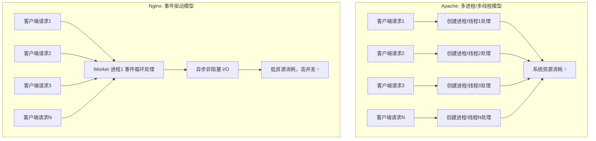

# Nginx

## **一、Nginx 基础概述**

### 1. Nginx 简介
Nginx（发音同“engine X”）作为一款轻量级、高性能的Web服务器和反向代理服务器，已成为全球互联网流量入口的关键组件 。该软件由俄罗斯程序员伊戈尔·赛索耶夫开发，并于2004年首次公开发布，其设计目标是超越Apache Web服务器的性能 。Nginx使用异步事件驱动的方法来处理请求，这种非阻塞、事件驱动的架构使其在高并发场景下表现卓越，相比之下，在低并发下其性能与Apache相当甚至略低，但在高并发下，Nginx能够保持低资源消耗和高性能，每秒可处理的请求量约为Apache的四倍.

   * Nginx 的历史与发展
<div style="border:1px solid #0099cc; background-color:#e6f7ff; padding:10px; border-radius:5px;">
  <strong>诞生背景：</strong> </p>
  <ul>
  <li>Nginx 由俄罗斯工程师 Igor Sysoev 于 2004 年首次发布。</li>
  <li>设计初衷是为了解决 高并发连接 和 高性能 Web 服务的需求，特别是应对 C10K（同时处理一万个连接）问题。</li>
  </ul>
  <strong>发展历程：</strong> </p>
  <ul>
    <li>2004 年：Nginx 开源发布。</li>
    <li>2011 年：成立商业公司 Nginx, Inc.，提供企业支持与增强版。</li>
    <li>2019 年：被 F5 Networks 收购，继续保持开源社区版。</li>
  </ul>
  <strong>现状：</strong>
  <ul> 
    <li>已成为全球主流的 Web 服务器和反向代理软件。</li>
    <li>在 高并发、负载均衡、反向代理 场景中应用广泛。</li>
    <li>全球网站占有率（如 Netcraft 统计）：Nginx 与 Apache 长期处于市场前两位。</li>

</div>
   * Nginx 与 Apache、Lighttpd 对比
  
| 特性          | **Nginx**              | **Apache**      | **Lighttpd**  |
| ----------- | ---------------------- | --------------- | ------------- |
| **并发处理模型**  | 事件驱动，异步非阻塞             | 基于进程/线程，多进程或多线程 | 事件驱动，轻量级      |
| **性能（高并发）** | 高并发场景表现优异              | 高并发时性能下降明显      | 高并发支持较好，但功能有限 |
| **资源消耗**    | 内存和 CPU 占用低            | 内存占用较高，线程/进程开销大 | 占用低，但扩展性不佳    |
| **功能丰富度**   | 功能丰富，支持反向代理、负载均衡、缓存    | 模块众多，功能最全面      | 功能较少，适合小型场景   |
| **适用场景**    | 静态资源服务、反向代理、负载均衡、微服务网关 | 动态 Web 服务、传统网站  | 小型站点、嵌入式环境    |


   * Nginx 的应用场景（Web 服务、反向代理、负载均衡、缓存）
<div style="border:1px solid #0099cc; background-color:#e6f7ff; padding:10px; border-radius:5px;">
  <strong>Web：</strong> </p>
  <ul>
  <li>作为 Web 服务器，支持静态页面（HTML、CSS、JS、图片、视频等）高效处理。</li>
  <li>与 PHP-FPM、Tomcat、Python Web 框架（Flask、Django）配合，构建动态网站。</li>
  </ul>
  <strong>反向代理：</strong> </p>
  <ul>
    <li>客户端访问请求先到 Nginx，由 Nginx 转发到后端应用服务器。</li>
    <li>提供负载分担、安全保护、隐藏真实后端 IP。</li>
  </ul>
   <strong>负载均衡：</strong> </p>
  <ul>
    <li>支持多种调度算法（轮询、权重、IP 哈希、最少连接等）。</li>
    <li>常用于分布式架构，将流量分发到多个后端服务器，提高可靠性和性能。</li>
  </ul>
  <strong>缓存服务：</strong> </p>
  <ul>
    <li>支持 静态缓存 和 动态缓存（Proxy Cache、FastCGI Cache）。</li>
    <li>降低后端服务器压力，提高响应速度。</li>
  </ul>
  <strong>其他应用：</strong> </p>
  <ul>
    <li>作为 API 网关，管理微服务架构的请求。</li>
    <li>配合 HTTPS / TLS 提供安全通信。</li>
    <li>配合 监控工具（Prometheus、Grafana） 用于可观测性。</li>
  </ul>
</div>


### 2. Nginx 架构与特点

   * 事件驱动模型
<div style="border:1px solid #0099cc; background-color:#e6f7ff; padding:10px; border-radius:5px;">
  <strong>传统 Web 服务器问题：</strong> </p>
  <ul>
  <li>Apache 默认的 多进程/多线程模型：每个请求由独立的进程/线程处理。。</li>
  <li>在高并发场景下，系统需要创建/切换大量线程或进程，导致 内存开销大、CPU 上下文切换频繁，性能下降明显。</li>
  </ul>
  <strong>Nginx 的改进：</strong> </p>
  <ul>
    <li>采用 事件驱动（event-driven）、异步非阻塞 I/O 模型。</li>
    <li>单个 worker 进程可以同时处理 数以万计的并发连接。</li>
    <li>通过 epoll（Linux）/ kqueue（BSD） 等高效的 I/O 多路复用机制，实现“一个线程管理多个连接”。</li>
  </ul>
  <strong>优点：</strong> </p>
  <ul>
    <li>高效利用 CPU 和内存。</li>
    <li>支持长连接（如 WebSocket、HTTP Keep-Alive）。</li>
    <li>特别适合 高并发场景（百万级连接数）。</li>
  </ul>
</div>
   * 模块化设计
<div style="border:1px solid #0099cc; background-color:#e6f7ff; padding:10px; border-radius:5px;">
  <strong>模块化架构：</strong> </p>
  <ul>
  <li>Nginx 的核心非常小巧，其他功能都通过 模块 实现。</li>
  <li>模块分为三类：</li>
    <ul>
        <li>核心模块：处理 HTTP、事件、配置解析等基础功能。</li>
        <li>标准模块：常见功能（静态文件处理、反向代理、负载均衡、缓存）。</li>
        <li>第三方模块：扩展功能（如 Lua 脚本支持、GeoIP、Headers More）。</li>
    </ul>
  </ul>
  <strong>好处：</strong> </p>
  <ul>
    <li>灵活扩展，可以按需编译或动态加载模块。</li>
    <li>功能解耦，方便维护。</li>
    <li>结合 OpenResty，能用 Lua 脚本快速开发 Web 应用网关。</li>
  </ul>
</div>

   * 高并发与高性能的实现
<div style="border:1px solid #0099cc; background-color:#e6f7ff; padding:10px; border-radius:5px;">
  <strong>核心机制：</strong></p>
  <ul>
    <li>1. Master-Worker 架构</li>
        <ul>
            <li>Master 负责管理（启动/停止/重载配置），Worker 专注处理请求。</li>
            <li>多个 Worker 进程之间通过 共享内存 进行负载分担。</li>
        </ul>
    <li>2. 零拷贝（sendfile）</li>
        <ul>
            <li>静态文件传输时直接从内核缓冲区到网卡，无需用户态拷贝，减少 CPU 消耗。</li>
        </ul>
    <li>3. 内存池机制</li>
          <ul>
            <li>避免频繁申请/释放内存，提高效率。</li>
        </ul>
    <li>4. 异步非阻塞 I/O</li>
        <ul>
            <li>保证高并发请求不会阻塞 worker。</li>
        </ul>
  </ul>
  <strong>性能特点：</strong></p>
  <ul>
    <li>处理静态资源的能力极强，常用于图片、视频、下载服务.</li>
    <li>在低资源消耗的情况下支撑 百万级并发连接。</li>
    <li>对比 Apache：相同硬件下，Nginx 通常能承载数倍甚至十倍以上的并发请求。</li>
  </ul>
</div>

  Nginx vs Apache
  

  
---

## **二、Nginx 安装与配置**

### 1. 安装方式


   * 源码编译安装</p>
>特点： 灵活，可选择所需模块，自定义功能，但安装步骤较多，适合进阶用户或定制需求场景。
<div style="background-color: #f0f8ff; border-left: 5px solid #1e90ff; padding: 10px; border-radius: 5px; margin: 10px 0;">
  <strong>📖 安装依赖：</strong>
</div>

```shell
yum install gcc gcc-c++ make pcre pcre-devel zlib zlib-devel openssl openssl-devel -y
```

<div style="background-color: #f0f8ff; border-left: 5px solid #1e90ff; padding: 10px; border-radius: 5px; margin: 10px 0;">
  <strong>📖 下载并解压源码包：</strong> 
</div>
```shell
wget http://nginx.org/download/nginx-1.26.2.tar.gz
tar -zxvf nginx-1.26.2.tar.gz
cd nginx-1.26.2
```

<div style="background-color: #f0f8ff; border-left: 5px solid #1e90ff; padding: 10px; border-radius: 5px; margin: 10px 0;">
  <strong>📖 配置编译参数：</strong>
</div>
```shell
./configure --prefix=/usr/local/nginx \
--with-http_ssl_module \
--with-http_stub_status_module
```

<div style="background-color: #f0f8ff; border-left: 5px solid #1e90ff; padding: 10px; border-radius: 5px; margin: 10px 0;">
  <strong>📖 编译并安装：</strong>
</div>

```shell
make && make install
```

<div style="background-color: #f0f8ff; border-left: 5px solid #1e90ff; padding: 10px; border-radius: 5px; margin: 10px 0;">
  <strong>📖 启动 Nginx：</strong> 
</div>

```shell
/usr/local/nginx/sbin/nginx
```

   * 包管理器安装（YUM、APT）
> 特点： 简单快捷，适合快速部署，但模块选择有限。
<div style="background-color: #f0f8ff; border-left: 5px solid #1e90ff; padding: 10px; border-radius: 5px; margin: 10px 0;">
  <strong>📖CentOS/Rocky Linux/RHEL：</strong> 
</div>

```shell
yum install epel-release -y
yum install nginx -y
systemctl enable nginx --now
```

<div style="background-color: #f0f8ff; border-left: 5px solid #1e90ff; padding: 10px; border-radius: 5px; margin: 10px 0;">
  <strong>📖Ubuntu / Debian：</strong> 
</div>

```shell
apt update
apt install nginx -y
systemctl enable nginx --now
```

<div style="background-color: #f0f8ff; border-left: 5px solid #1e90ff; padding: 10px; border-radius: 5px; margin: 10px 0;">
  <strong>📖验证安装：</strong> 
</div>
```shell
nginx -v
curl http://127.0.0.1
```

   * Docker 部署 Nginx
> 特点： 部署简单，跨平台，便于与微服务架构集成。

<div style="background-color: #f0f8ff; border-left: 5px solid #1e90ff; padding: 10px; border-radius: 5px; margin: 10px 0;">
  <strong>📖拉取镜像：</strong> 
</div>
```shell
docker pull nginx:latest
```
<div style="background-color: #f0f8ff; border-left: 5px solid #1e90ff; padding: 10px; border-radius: 5px; margin: 10px 0;">
  <strong>📖运行容器：</strong> 
</div>
```shell
docker run -d --name mynginx -p 80:80 nginx
```
<div style="background-color: #f0f8ff; border-left: 5px solid #1e90ff; padding: 10px; border-radius: 5px; margin: 10px 0;">
  <strong>📖挂载配置文件（推荐方式）：</strong> 
</div>
```shell
docker run -d --name mynginx \
  -p 80:80 \
  -v /mydata/nginx/html:/usr/share/nginx/html \
  -v /mydata/nginx/conf:/etc/nginx \
  nginx

```
<div style="background-color: #f0f8ff; border-left: 5px solid #1e90ff; padding: 10px; border-radius: 5px; margin: 10px 0;">
  <strong>📖Nginx 安装方式对比：</strong> 
</div>

| 安装方式                | 优点 ✅                                   | 缺点 ❌                            | 适用场景                            |
| ------------------- | -------------------------------------- | ------------------------------- | ------------------------------- |
| **源码编译安装**          | - 可按需选择模块<br>- 高度灵活，可定制<br>- 性能可优化     | - 步骤繁琐<br>- 维护成本高<br>- 升级需要重新编译 | 生产环境需要 **定制化功能** 或 **特殊优化** 的场景 |
| **包管理器安装**（YUM/APT） | - 安装简单快捷<br>- 系统自动管理依赖<br>- 升级方便       | - 模块选择有限<br>- 版本可能不是最新          | 适合 **快速部署**、测试环境或对功能要求不高的生产环境   |
| **Docker 部署**       | - 跨平台，环境一致<br>- 部署快速，方便迁移<br>- 适合微服务架构 | - 配置需挂载到宿主机<br>- 学习成本稍高         | 云原生环境、**微服务架构**、DevOps 部署       |


### 2. 基础配置文件解析

   * `nginx.conf` 主配置结构

<div style="background-color: #f0f8ff; border-left: 5px solid #1e90ff; padding: 10px; border-radius: 5px; margin: 10px 0;">
  <strong>📖nginx.conf 主配置结构：</strong> 
  Nginx 的配置文件一般位于：
  <ul>
    <li>Linux 源码安装：<code>/usr/local/nginx/conf/nginx.conf</code></li>
    <li>包管理安装：<code>/etc/nginx/nginx.conf</code></li>
  </ul>
</div>
基本结构如下：
```shell
# 全局块
worker_processes  1;
error_log  /var/log/nginx/error.log warn;
pid        /var/run/nginx.pid;

# events 块
events {
    worker_connections  1024;
}

# http 块
http {
    include       mime.types;
    default_type  application/octet-stream;

    sendfile        on;
    keepalive_timeout  65;

    # server 块
    server {
        listen       80;
        server_name  localhost;

        # location 块
        location / {
            root   html;
            index  index.html index.htm;
        }

        error_page   500 502 503 504  /50x.html;
        location = /50x.html {
            root   html;
        }
    }
}
```


   * 全局块 / events 块 / http 块 / server 块 / location 块
  
#### 全局块
<div style="background-color: #f0f8ff; border-left: 5px solid #1e90ff; padding: 10px; border-radius: 5px; margin: 10px 0;">
  <strong>📖 全局块：</strong> 
  <ul>
  <li>配置影响 Nginx 全局运行环境 的指令，如工作进程数、日志路径、PID 文件。</li>
  <li>Example:</li>
  ```shell
  worker_processes  4;        # 定义工作进程数
  error_log  /var/log/nginx/error.log warn;   # 错误日志
  pid        /var/run/nginx.pid;              # 进程 PID 文件
  ```
  </ul>
</div>

#### events
<div style="background-color: #f0f8ff; border-left: 5px solid #1e90ff; padding: 10px; border-radius: 5px; margin: 10px 0;">
  <strong>📖 events 块：</strong>
  <ul>
  <li>定义 Nginx 与客户端网络连接相关 的配置</li>
  <li>Exmaple:</li>
```shell
events {
    worker_connections  1024;
    use epoll;
    multi_accept on;
}
```
</div>
##### 🎯 最佳实践事件驱动模型
<div style="background-color: #e6f7ff; border-left: 5px solid #1890ff; padding: 10px; border-radius: 5px; margin: 10px 0;">
  <strong>🎯 最佳实践 use：</strong> 指定 事件驱动模型（不同操作系统支持不同方式）：
    <ul>
    <li>select、poll → 通用，但效率低 </li>
    <li>epoll → Linux 高性能 I/O 模型（推荐）</li>
    <li>kqueue → FreeBSD、macOS </li>
```shell
events {
    use epoll;
}

```
    </ul>
  <strong>🎯 最佳实践 multi_accept：</strong> 指定 事件驱动模型（不同操作系统支持不同方式）： 
  <ul>
    <li>定义 一个 worker 进程在接收到新连接时是否一次性接收尽可能多的连接。</li>
    <li>默认：off（一次只处理一个新连接）。</li>
    <li>推荐开启：</li>
```shell
events {
    multi_accept on;
}
```
  </ul>
</div>
#### location
<div style="background-color: #f0f8ff; border-left: 5px solid #1e90ff; padding: 10px; border-radius: 5px; margin: 10px 0;">
  <strong>📖 location 块：</strong> 
  <ul>
    <li>定义请求的路由规则，用于 URL 匹配。</li>
    <li>常用于 动静分离、反向代理、访问控制。</li>
      <li>Example:</li>
```shell
location /images/ {
    root /data;
}

location /api/ {
    proxy_pass http://127.0.0.1:5000;
}
```
  </ul>
</div>

| 匹配符           | 含义                | 示例                        | 优先级 |             
| ------------- | ----------------- | -------------------------     | --- | 
| **=**         | 精确匹配              | `location = /login {}`     | 最高  |            
| **^\~**       | 前缀匹配，且 **不再检查正则** | `location ^~ /static/ {}` | 高   |             
| **\~**        | 正则匹配（区分大小写）       | `location ~ \.php$ {}`    | 中   |             
| **\~**\*      | 正则匹配（不区分大小写）      | \`location \~\* .(jpg\|png\|gif)\$ {}\` | 中 |
| **前缀匹配**（无符号） | 普通前缀匹配            | `location /images/ {}`    | 低   |             
| **default**   | 通配，匹配所有请求         | `location / {}`           | 最低  |            

#### 匹配优先级
```shell
1. 精确匹配 (=)
2. 前缀匹配 ^~
3. 正则匹配 (~, ~*)（按配置顺序执行）
4. 普通前缀匹配（最长匹配优先）
5. 默认 location /
```
#### 配置示例：
```shell
server {
    listen 80;
    server_name www.example.com;

    # 1. 精确匹配
    location = /login {
        proxy_pass http://127.0.0.1:8080;
    }

    # 2. 前缀匹配（高优先级）
    location ^~ /static/ {
        root /data/web;
    }

    # 3. 正则匹配（区分大小写）
    location ~ \.php$ {
        fastcgi_pass 127.0.0.1:9000;
    }

    # 4. 正则匹配（不区分大小写）
    location ~* \.(jpg|jpeg|png|gif|css|js)$ {
        root /data/static;
    }

    # 5. 普通前缀匹配
    location /images/ {
        root /data/pic;
    }

    # 6. 默认规则
    location / {
        root /var/www/html;
        index index.html index.htm;
    }
}

```


#### server
<div style="background-color: #f0f8ff; border-left: 5px solid #1e90ff; padding: 10px; border-radius: 5px; margin: 10px 0;">
  <strong>📖 server 块：</strong> 
  <ul>
    <li>配置虚拟主机（域名、端口、站点目录）。</li>
    <li>一个 http 可以包含多个 server，每个 server 对应一个站点或服务。</li>
      <li>Example:</li>
```shell
server {
    listen       80;
    server_name  www.example.com;
    location / {
        root   /var/www/html;
        index  index.html;
    }
}

```
  </ul>
</div>

#### HTTP 
<div style="background-color: #f0f8ff; border-left: 5px solid #1e90ff; padding: 10px; border-radius: 5px; margin: 10px 0;">
  <strong>📖 http block：</strong>
  <ul>
  <li>配置 HTTP 服务相关的参数，可以包含多个 server 块</li>
  <li>包含 全局 Web 服务配置（如 MIME 类型、日志、压缩、缓存等）。</li>
  </ul>
</div>


#### 常用指令：
<div style="background-color: #f0f8ff; border-left: 5px solid #1e90ff; padding: 10px; border-radius: 5px; margin: 10px 0;">
  <ul>
  <li>worker_processes</li>
    <ul>
    <li>定义工作进程数，通常设置为 CPU 核心数。</li>
    <li>建议：<code>worker_processes auto</code>;</li>
    </ul>
  <li>worker_connections</li>
    <ul>
        <li>每个 worker 进程允许的最大并发连接数。</li>
        <li>总并发数 = worker_processes × worker_connections</li>
    </ul>
  <li>error_log</li>
    <ul>
        <li>定义错误日志路径及级别（debug、info、notice、warn、error、crit）。</li>
    </ul>
  <li>pid</li>
    <ul>
        <li>定义 Nginx 主进程的 PID 文件路径。</li>
    </ul>
  </ul>
</div>

---

## **三、Web 服务配置**

### 1. 静态资源服务

   * 配置 `root` 与 `index`
   
```shell
server {
    listen 80;
    server_name www.example.com;

    location / {
        root   /var/www/html;
        index  index.html index.htm;
    }
}

```
   * MIME 类型配置
```shell
http {
    include       mime.types;   # 引入 MIME 类型文件
    default_type  application/octet-stream;  # 默认类型
}

```
   * 访问日志和错误日志
```shell
http {
    access_log  /var/log/nginx/access.log;
    error_log   /var/log/nginx/error.log warn;
}

```
### 2. 虚拟主机配置

   * 基于域名的虚拟主机
```shell
server {
    listen 80;
    server_name www.site1.com;
    root /var/www/site1;
}

server {
    listen 80;
    server_name www.site2.com;
    root /var/www/site2;
}

```
   * 基于端口的虚拟主机
```shell
server {
    listen 8080;
    server_name _;
    root /var/www/site1;
}

server {
    listen 9090;
    server_name _;
    root /var/www/site2;
}

```
   * 基于 IP 的虚拟主机
```shell
server {
    listen 80;
    server_name _;
    root /var/www/site1;
    listen 192.168.1.10:80;
}

server {
    listen 80;
    server_name _;
    root /var/www/site2;
    listen 192.168.1.11:80;
}

```

---

## **四、反向代理与负载均衡**

### 1. 反向代理

   * proxy\_pass 配置
```shell
server {
    listen 80;
    server_name www.example.com;

    location / {
        proxy_pass http://127.0.0.1:8080;
    }
}
```
   * 设置请求头（X-Forwarded-For、X-Real-IP）
> 为了让后端获取真实客户端 IP，需要设置头部：

```shell
location / {
    proxy_pass http://127.0.0.1:8080;

    # 传递客户端真实 IP
    proxy_set_header X-Real-IP $remote_addr;
    proxy_set_header X-Forwarded-For $proxy_add_x_forwarded_for;
    proxy_set_header Host $host;
}
X-Real-IP：保存客户端真实 IP
X-Forwarded-For：记录客户端和代理链路上的 IP
Host：保持请求的域名
```

   * 反向代理与正向代理对比

| 特点   | 正向代理 (Forward Proxy) | 反向代理 (Reverse Proxy) |
| ---- | -------------------- | -------------------- |
| 代理对象 | **客户端** → 外网         | **服务器** ← 外网         |
| 使用场景 | 突破防火墙、访问被限制资源（如科学上网） | 网站加速、隐藏真实服务器、负载均衡    |
| 示例   | VPN、Shadowsocks      | Nginx、CDN            |

### 2. 负载均衡（Load Balancing）

   * 轮询（Round Robin）
   * 权重（Weight）
   * IP 哈希（IP Hash）
   * 最少连接（Least Connections）
   * upstream 配置

---

## **五、Nginx 与安全**

### 1. HTTPS 配置

#### (1) SSL/TLS 基础

* **SSL/TLS**：用于加密 HTTP 通信，防止窃听和篡改。
* 浏览器访问 HTTPS → Nginx 使用证书和私钥进行握手。

---

#### (2) 自签名证书配置（测试环境）

生成证书和私钥（OpenSSL）：

```bash
openssl req -new -newkey rsa:2048 -nodes -keyout nginx.key -out nginx.csr
openssl x509 -req -days 365 -in nginx.csr -signkey nginx.key -out nginx.crt
```

Nginx 配置：

```nginx
server {
    listen 443 ssl;
    server_name www.example.com;

    ssl_certificate     /etc/nginx/ssl/nginx.crt;
    ssl_certificate_key /etc/nginx/ssl/nginx.key;

    location / {
        root /var/www/html;
        index index.html;
    }
}
```

---

#### (3) Let’s Encrypt 免费证书（生产推荐）

使用 **Certbot** 自动申请和续期：

```bash
sudo apt install certbot python3-certbot-nginx -y
sudo certbot --nginx -d www.example.com -d example.com
```

👉 自动配置 Nginx HTTPS，并定期续期。

---

### 2. 访问控制

#### (1) 基于 IP 的访问限制

```nginx
location /admin {
    allow 192.168.1.0/24;   # 允许内网
    deny all;               # 其他全部拒绝
}
```

---

#### (2) 基于密码的访问控制（Basic Auth）

生成用户密码文件：

```bash
htpasswd -c /etc/nginx/.htpasswd admin
```

Nginx 配置：

```nginx
location /secure {
    auth_basic "Restricted Area";
    auth_basic_user_file /etc/nginx/.htpasswd;
}
```

👉 访问 `/secure` 目录需要输入账号密码。

---

### 3. 防盗链、防刷请求

#### (1) 防盗链（图片/视频等资源）

只允许指定域名引用资源：

```nginx
location /images/ {
    valid_referers none blocked *.example.com;
    if ($invalid_referer) {
        return 403;
    }
}
```

---

#### (2) 防刷请求（限制频率）

通过 **limit\_req 模块**：

```nginx
http {
    limit_req_zone $binary_remote_addr zone=one:10m rate=5r/s;

    server {
        location /api/ {
            limit_req zone=one burst=10 nodelay;
        }
    }
}
```
👉 每个客户端 **每秒最多 5 次请求**，超出则返回 503。

## **六、Nginx 高级功能**

### 1. 缓存配置

   * Proxy Cache 缓存
   * FastCGI Cache 缓存
   * 缓存清理策略
### 2. 动静分离

   * 静态文件由 Nginx 处理
   * 动态请求转发到后端应用（PHP-FPM、Tomcat、Flask、Django 等）

### 3. Rewrite 与重定向

   * rewrite 规则
   * permanent / redirect / return

---

## **七、Nginx 性能优化**

### 1. Worker 进程与连接数调优
### 2. Gzip 压缩配置
### 3. Keepalive 长连接
### 4. 日志切割与优化

---

## **八、Nginx 实战案例**

### 1. LNMP 架构（Linux + Nginx + MySQL + PHP）
### 2. Nginx + Tomcat/Java Web 应用
### 3. Nginx + Flask/Django
### 4. Nginx + Docker + 微服务网关

---

## **九、Nginx 运维与监控**

### 1. 常见错误与排查方法

   * 502 Bad Gateway
   * 504 Gateway Timeout
   * 413 Request Entity Too Large

### 2. Nginx 日志分析
### 3. 状态监控模块（stub\_status）
### 4. 配合 Prometheus + Grafana 监控

---

## **十、Nginx 模块扩展**

### 1. 官方模块与第三方模块
### 2. 动态模块编译
### 3. 常见第三方模块案例：

   * Lua 模块（OpenResty）
   * GeoIP 模块
   * Headers More 模块

---
