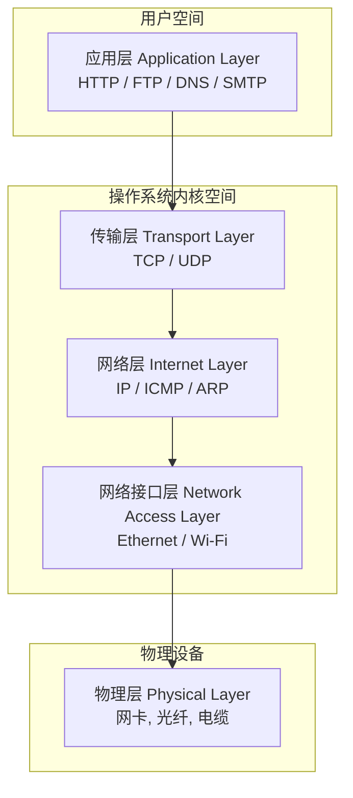
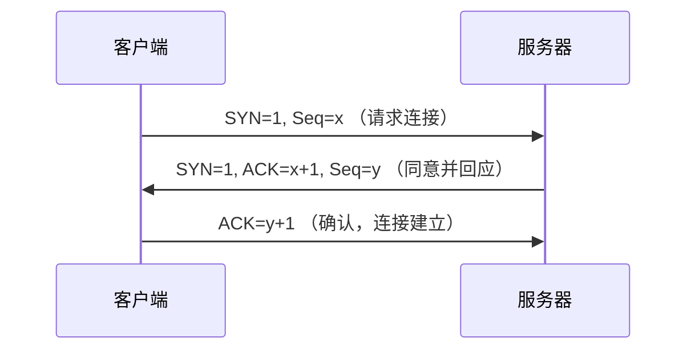
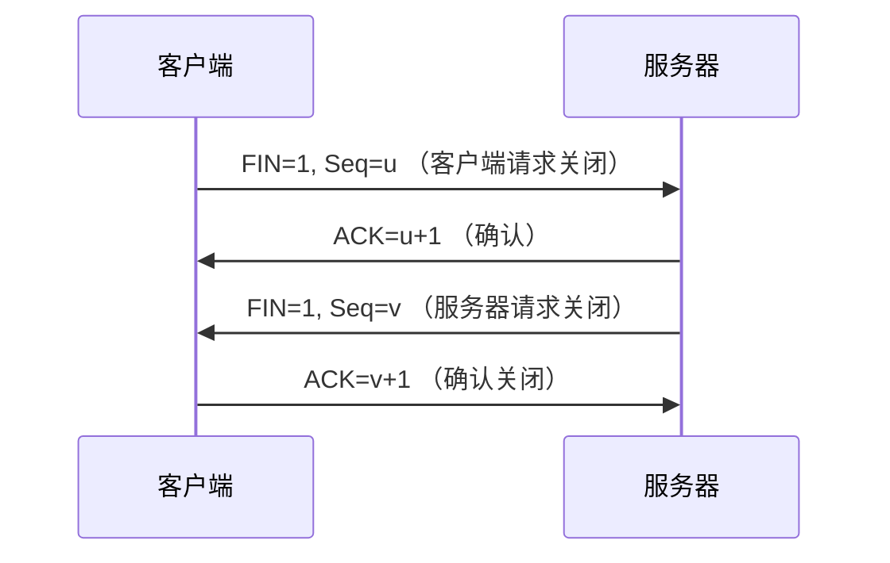
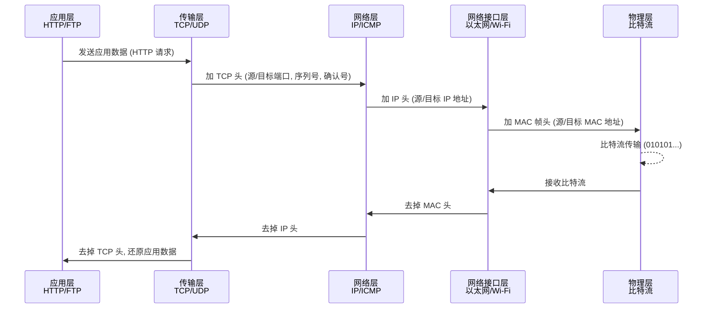

# TCP/IP 协议栈

  TCP/IP（传输控制协议/互联网协议）是实现计算机网络通信的基础网络协议套件。它由四层组成：网络接口层、互联网层、传输层和应用层。在 Linux 中，TCP/IP 是操作系统功能不可或缺的一部分，允许主机跨相同或不同的网络连接并传输数据。

## TCP/IP协议栈：现代网络之基石的深刻洞察与技术剖析

前言：

  <strong>TCP/IP协议栈：</strong> 现代网络之基石

    在当今高度互联的数字世界中，无论是个人浏览网页、企业进行远程协作，还是海量的物联网设备相互通信，其背后都离不开一套看不见但至关重要的规则体系——TCP/IP协议栈。它不仅是互联网的底层基石，更是一种将复杂通信任务分解、抽象和标准化的工程哲学体现。本报告旨在从历史、理论、机制和应用等多个维度，对TCP/IP协议栈进行系统性、深入的分析，为读者提供一个全面的技术框架，并探讨其在演进过程中所面临的挑战与机遇。

### 历史溯源与核心设计哲学

  <strong>从ARPANET到互联网：</strong> TCP/IP的诞生与演进历程

   TCP/IP协议栈的起源可以追溯到20世纪70年代，它诞生于美国国防高等研究计划署（DARPA）的资助项目，其初衷是为了解决不同计算机网络之间互联互通的难题 。1975年，TCP/IP通信首次在斯坦福大学与伦敦大学学院（UCL）之间进行测试，并在1977年扩展到美国、英国和挪威的三网络测试，这些早期的原型开发奠定了其技术基础 。

   TCP/IP协议栈发展的里程碑事件发生在1983年1月1日，当时ARPANET完成了向TCP/IP的全面转换，这标志着该协议的成熟和广泛应用 。次年，美国国防部正式将TCP/IP定为所有计算机网络的标准，确立了其在行业中的主导地位 。然而，TCP/IP的真正蓬勃发展是在1990年代中期，当时一些关键而可靠的工具，如页面描述语言HTML和浏览器Mosaic的问世，极大地促进了互联网应用的飞速发展，从而将TCP/IP推向了商业应用的舞台 。

#### 协议栈的精髓

   <strong>协议栈的精髓：</strong> 分层、模块化与标准化

   TCP/IP协议栈的核心设计理念在于将复杂的网络通信任务划分为不同的功能区块，即所谓的“层级” 。这种分层抽象化的过程，使得每一层都建立在低一层所提供的服务之上，并为更高一层提供服务 。例如，网络层的IP协议只关心数据如何跨越本地网络边界，而不关心如何利用具体的传输媒体或数据本身的内容 。这种设计将复杂的通信过程分解为一系列可管理的、独立的子任务，从而实现了高度的模块化。

   协议栈下的各种协议，根据其功能不同，分别归属于这些层次结构之中，并常被视为是简化版的七层OSI模型 。为了确保协议的开放性与互操作性，所有这些协议都在相应的RFC（Request for Comments）文档中进行了讨论和标准化 。在RFC文档中，协议状态被清晰地标记为“必须”、“推荐”或“可选”，为开发和实现提供了明确的指引 。

#### TCP/IP模型与OSI模型的异同

   <strong>TCP/IP模型与OSI模型的异同：</strong> 实用主义与理论框架的对比

   尽管OSI模型在网络理论中被广泛用作教学和参考框架，但它更多是一种理想化的、独立于协议的框架 。相比之下，TCP/IP是一种更具实用主义色彩的模型，它旨在解决特定的通信挑战并依赖于标准化协议 。

   TCP/IP模型通常被简化为四层或五层结构，它将OSI模型中的一些层，如应用层、表示层和会话层，合并为一个层，或者根本不使用某些层 。这种精简和务实的做法使得TCP/IP模型更符合实际应用的需求。下表清晰地展示了两种模型在层级数量和功能划分上的对应关系与差异。

#### 分层设计的核心价值

   <strong>分层设计的核心价值：</strong> 模块化与演进能力

    TCP/IP的成功远不止于其协议本身，其分层设计所体现的工程哲学才是其长盛不衰的根本原因。这种设计将复杂的网络通信任务分解为可管理的、独立的子任务，从而实现了高内聚、低耦合的架构。

    这种架构的价值在于，它使得各层协议的开发和演进可以相互独立，而无需担心对整个系统造成连锁反应。例如，IP协议只关心如何使数据能够跨越网络边界，而不关心数据内容或上层协议 。当IP协议的第四版（IPv4）地址空间面临耗尽的困境时 , 业界可以开发出新的第六版（IPv6）来取代它，而无需修改上层的TCP或UDP协议，更不用说应用层的HTTP或FTP协议。这种设计使得互联网能够平稳地从一个核心协议版本迁移到另一个版本。反之亦然，新的应用协议（如基于UDP的HTTP/3）也可以在不改变IP层和数据链路层的前提下被引入，以适应新的性能需求。这种分离带来的巨大灵活性和可扩展性，正是TCP/IP协议栈持续演进并主导互联网的根本原因。它并非一个静态的、完美的模型，而是一个适应性极强的、动态的系统。

   <strong>从ARPANET到互联网：</strong> TCP/IP的诞生与演进历程

   <strong>从ARPANET到互联网：</strong> TCP/IP的诞生与演进历程

## TCP/IP分层模型深度解析

### TCP/IP 四层模型示意图

### 应用层：直接面向用户的服务接口层

应用层是协议栈的最顶层，它包括所有与用户应用程序协同工作的协议，定义了任何用户均可使用的标准互联网服务和网络应用程序 。常见的应用层协议包括：

  <ul>
  <li>HTTP（超文本传输协议）：  万维网的基础，工作在经典的客户端-服务端模型上，通过不同的方法（如“GET”和“POST”）来请求或提交信息 。</li>
  <li>FTP（文件传输协议）：  支持在本地主机和远程主机之间进行文件传输 。</li>
  <li>DNS（域名系统）：  就像网站的“电话簿”，它将用户输入的域名（如example.com）转换为机器可识别的IP地址，从而使浏览器能够找到托管网站的服务器 。</li>
  </ul>

尽管HTTP被设计为无状态协议，即服务器不会在两个请求之间保留任何数据 ，这简化了服务器的设计，但为了满足现代Web应用的需求（如用户登录状态、购物车），它必须依赖于在应用层之上或之外实现的额外机制。这就是HTTP Cookie机制的由来 。HTTP协议的无状态特性意味着服务器无法记住任何关于客户端的信息，因此，开发者通过引入Cookie，将状态信息从服务器传递给客户端，再由客户端在后续请求中带回，从而模拟了“状态”。这种做法揭示了分层模型的一个重要原则：当某一层的设计无法满足上层应用需求时，上层可以在不改变下层协议的前提下，通过引入新的机制来弥补不足。这种实践也解释了为什么DDoS攻击可以在应用层（第七层）发生，因为攻击者可以利用HTTP请求的复杂性，发送大量请求耗尽服务器资源，而无需破坏底层的TCP或IP协议 。

### 传输层：端到端通信的管家

传输层是协议栈中负责提供端到端通信服务的关键层，主要有两个核心协议：TCP和UDP。

#### TCP: 面向连接的可靠传输

TCP（传输控制协议）通常被称为“面向连接的”协议，因为它在数据传输前会建立一个连接，并确保数据被成功、按序地传送到接收主机 。TCP将从应用层收到的数据流分成多个“段”（segment），并为每个段附加一个头 。

三次握手是TCP建立连接的关键过程。首先，发送方将一个SYN（同步）段发送给接收方，请求建立连接。接收方收到后，会返回一个SYN-ACK段作为响应，表示同意连接。最后，发送方再发送一个ACK（确认）段，确认收到对方的响应，至此连接正式建立 。这个看似简单的三次握手，其目的在于防止服务器接受网络中过时、延迟的连接请求包，避免不必要的资源浪费 。

为了确保可靠性，TCP报文段的头部包含了多个关键字段 。序列号（Sequence Number）用于标识每个段中第一个数据字节的序号，从而实现数据的按序传输。确认号（Acknowledgement Number）则用于告诉发送方，接收方期望收到的下一个字节的序号，以此来确认已接收的数据。校验和（Checksum）字段用于验证数据传输过程中是否出现错误 。

- TCP 三次握手（建立连接）

- TCP 四次挥手（释放连接）

#### UDP: 无连接的高效数据报服务

UDP（用户数据报协议）则是一种无连接的协议 。它在数据传输前无需建立连接，也不对数据包进行排序、重传或流量控制，因此是一种不可靠的协议 。

正是由于其简单、开销低的特性，UDP特别适用于对实时性要求高但对数据丢失不敏感的场景 。例如，视频流媒体、在线游戏和IP语音（VoIP）等应用，更看重传输的即时性，偶尔丢失几个数据包通常是可以接受的 。UDP数据报的头部结构非常简单，仅包含源/目的端口、长度和校验和 。

#### TCP与UDP 对比

| 特性            | **TCP（Transmission Control Protocol）**              | **UDP（User Datagram Protocol）**     |
| ------------- | --------------------------------------------------- | ----------------------------------- |
| **连接方式**      | 面向连接（三次握手建立，四次挥手释放）                                 | 无连接（直接发送）                           |
| **传输可靠性**     | 可靠：有确认、重传、顺序保证                                      | 不可靠：尽力而为，不确认、不重传                    |
| **数据传输方式**    | 字节流，数据像“流水”一样连续                                     | 报文（message），一包一发，不合并                |
| **速度**        | 慢（需要连接管理与确认机制）                                      | 快（直接发，不管丢失顺序）                       |
| **开销**        | 头部较大（20 字节起）                                        | 头部小（8 字节）                           |
| **适用场景**      | 高可靠性要求：HTTP/HTTPS、邮件（SMTP/IMAP）、文件传输（FTP）、远程登录（SSH） | 高实时性要求：视频会议、语音（VoIP）、DNS 查询、在线游戏、直播 |
| **流量控制/拥塞控制** | 有（滑动窗口、拥塞控制）                                        | 无                                   |
| **顺序保证**      | 有（按序接收）                                             | 无（可能乱序）                             |

### 网络层：网络间的寻址与路由

#### IP：无连接的数据报投递服务

<strong>IP（互联网协议）</strong>是整个TCP/IP协议栈中最重要的部分 。它是一个无连接协议，负责将传输层传递下来的段或数据报格式化为被称为“IP数据报”的单元，并进行高效投递 。IP协议的无连接特性意味着每个数据单元都会被单独寻址和路由，即使它们属于同一个传输，也可能经过不同的路径到达目的地 。

IP协议的核心是IP地址，这是网络中设备的唯一标识号 。目前主流的IP版本有两个：IPv4和IPv6。IPv4使用32位地址，理论上可提供约40亿个地址空间，但随着互联网和物联网的飞速发展，其地址空间已接近上限 。作为其继任者，IPv6使用128位地址，提供了近乎无限的地址空间，从根本上解决了IPv4的地址枯竭问题 。此外，IPv6在设计时还内置了对自动配置、路由聚合、端到端安全和QoS（服务质量）的支持，相较于IPv4有了显著改进 。

IP路由选择是“逐跳”进行的 。当数据报到达路由器时，路由器会分析其目的IP地址，并查询其内部的<strong>路由表</strong>来决定数据报的下一个最佳传输路径 。路由表中的条目可能包括与目的IP地址完全匹配的表项、与目的网络号匹配的表项，以及用于所有其他目的地址的“默认”表项 。路由算法试图以最低的成本将数据包转发到下一个最佳链路，以确保数据能够高效地到达目的地.

#### 辅助协议：ARP与ICMP的角色

除了IP之外，网络层还有两个重要的辅助协议：
<ul>
<li><strong>ARP（地址解析协议）:</strong>  ARP工作在数据链路层和网络层之间，负责将32位的IP地址映射到48位的硬件地址（如以太网MAC地址），从而帮助IP将数据报定向到正确的接收系统 。</li>
<li><strong>ICMP（互联网控制消息协议）：</strong>ICMP用于检测和报告网络错误情况，例如当数据报无法到达目的地时，它会生成“目标主机不可达”等错误消息，并将这些消息发送给发送方 。</li>
<ul>

### 数据链路层与物理层：承载数据的物理基础

<strong>数据链路层</strong>负责将IP数据报格式化为“帧”（frame），并附加用于错误校验的循环冗余码校验（CRC）字段，最后将帧传递给物理层 。该层协议包括以太网和点对点协议（PPP）等 。 

<strong>物理层</strong>是TCP/IP协议栈的最底层，它定义了用于网络的硬件特征，如通信介质的物理特性和硬件标准（如IEEE 802.3以太网） 。该层将帧转换为适合网络介质传输的电信号或光信号，并以比特流的形式发送出去 。

## 数据传输流程与封装解封装机制

TCP/IP协议栈最精妙的运作原理体现在其数据封装（Encapsulation）和解封装（Decapsulation）机制上。

### 数据封装：从应用数据到物理帧的完整流程

数据封装是指数据从发送端应用层向下传递，在每一层被逐层“打包”或“封装”的过程 。
<ul>
<li><strong>应用层：</strong> 数据（message/data stream）在应用层准备好，并由应用协议进行格式化 。</li>
<li>传输层： 应用数据被封装为段（segment，用于TCP）或用户数据报（datagram，用于UDP），并附加传输层头部，包含端口号、排序信息和校验和等 。</li>
<li>网络层： 传输层的数据单元被封装为IP数据报（IP datagram），并添加IP头部，包含源IP和目的IP地址等信息 。</li>
<li>数据链路层： IP数据报被格式化为帧（frame），并添加帧头部和脚注，其中包括CRC校验字段 。</li>
<li>物理层： 帧被转换为适合网络介质传输的硬件地址，并以比特流形式发送出去 。</li>
</ul>

### 数据解封装：接收端逆向解析与数据还原过程

当数据包到达接收主机时，它会按照发送时相反的顺序，从下往上经过协议栈 。接收主机上的每一层协议都会删除由发送主机上的相应对等协议附加的头部信息，直到数据最终被还原并交付给应用层 。这一过程确保了原始数据能够完整、准确地到达目标应用程序。

- 网络传输过程

## 协议栈的进阶应用与挑战

### 性能优化与拥塞控制

TCP/IP的性能优化是一个动态的、多层面的系统工程。TCP通过拥塞控制算法来动态调整发送速率，以避免网络过载 。在Windows操作系统中，拥塞控制算法如CUBIC、NewReno和复合TCP等，会评估带宽延迟积（BDP）来动态调整发送窗口，从而充分利用网络带宽 。

除了拥塞控制，还有其他性能调优技术，例如TCP接收窗口自动调整功能，它专为高延迟网络设计，旨在扩展连接以提高吞吐量 。此外，在硬件层面，启用巨型帧（Jumbo frames）等网络接口卡（NIC）的高级特性，也可以显著提高网络性能 。

这些优化技术表明，TCP/IP协议栈的参数并非一成不变的“最优解”，而需要根据具体的网络条件（如高延迟或低延迟）进行动态调整和优化。同时，性能瓶颈可能出现在协议栈的任何一层，从应用层的CPU/存储瓶颈到物理层的丢包 。一个真正的专家需要从系统的角度出发，通过性能监视器等工具来综合诊断和解决问题，而不是盲目调整单一参数 。

### 安全威胁与防御策略

尽管TCP/IP协议栈是互联网的基石，但其本身也存在安全漏洞，并成为重要的攻击面。

