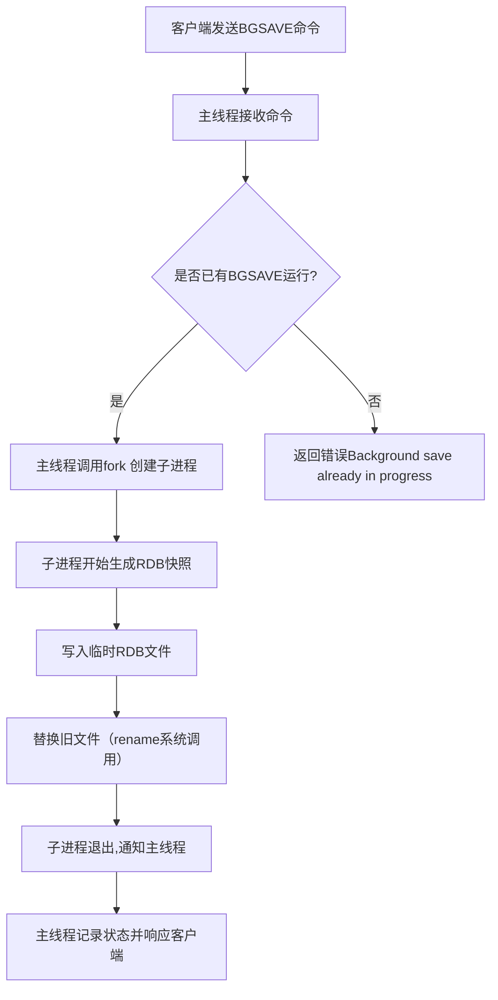
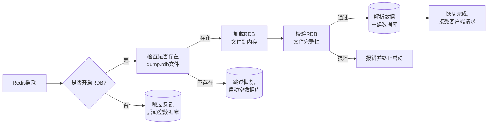
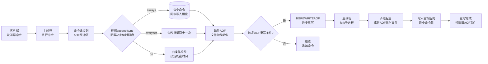
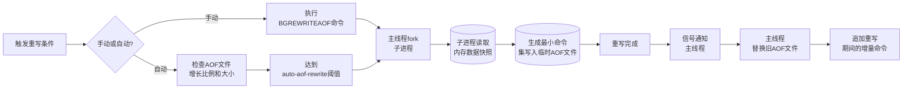
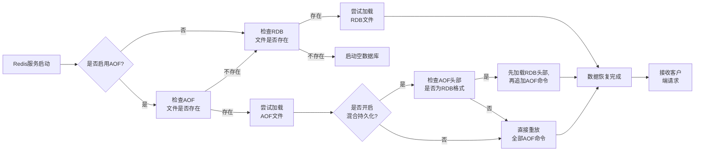
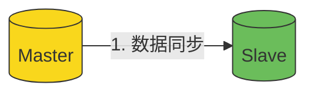
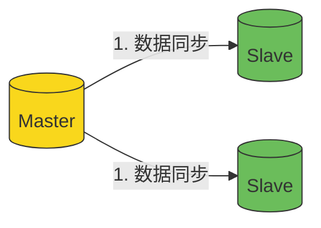
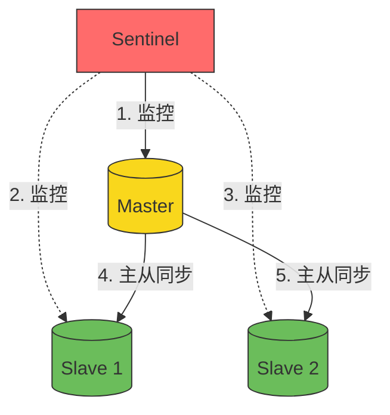
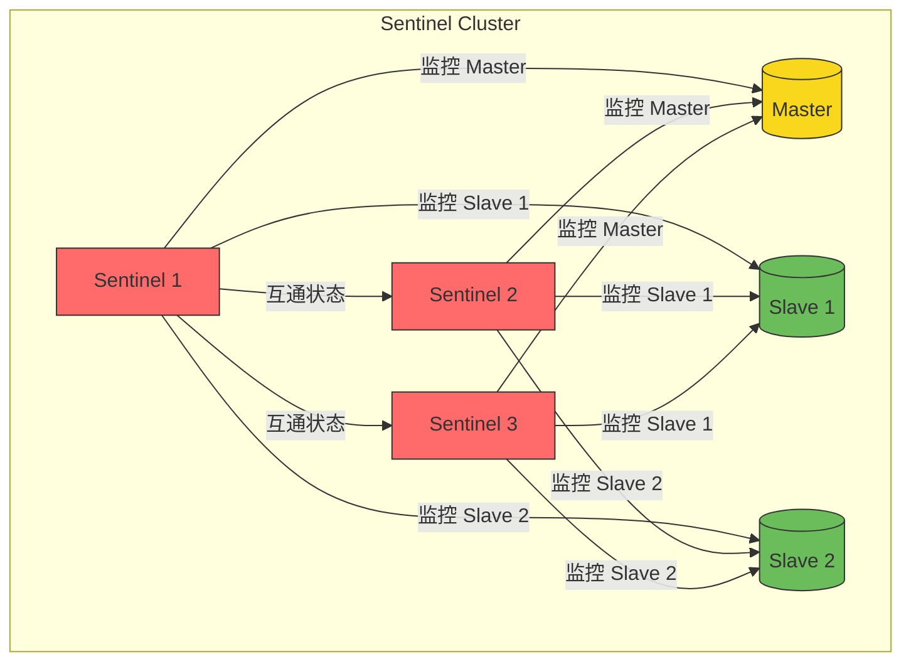

# Redis

Redis（全称：Remote Dictionary Server 远程字典服务）是一个开源的使用ANSI C语言编写、支持网络、可基于内存亦可持久化的日志型、Key-Value数据库，并提供多种语言的API。从2010年3月15日起，Redis的开发工作由VMware主持。从2013年5月开始，Redis的开发由Pivotal赞助。

Redis是一个开源的使用ANSI C语言编写、遵守BSD协议、支持网络、可基于内存亦可持久化的日志型、Key-Value数据库，并提供多种语言的API。它通常被称为数据结构服务器，因为值（value）可以是 字符串(String), 哈希(Map), 列表(list), 集合(sets)和有序集合(sorted sets)等类型

## 一、 Redis 概述

### 1.1、NoSQL

-----

NoSQL，泛指非关系型的数据库，是不同于传统的关系型数据库的数据库管理系统的统称。

NoSQL用于超大规模数据的存储，收集万亿比特的数据。这些类型的数据存储没有固定的形式，没有多余操作就可以横向扩展。

NoSQL 数据库的分类
1. 键值数据库
       Redis     MemCache  Leveldb
2. 文档数据库  MongoDB
3. 列式数据库 HBase
4. 图数据库 Neo4j GraphDB

### 1.2、什么是Redis

----

Redis是NoSQL中的一种存储工具，他是一个key-value存储系统。默认有16个数据库从0到15来进行表示。Redis的存储类型：包括string(字符串)、list(链表)、set(集合)、zset(sorted set --有序集合)和hash（哈希类型）。在此基础上，Redis支持各种不同方式的排序。

Redis 被广泛应用在缓存方向，与传统数据库不同的是 Redis 的数据是存在内存中的，因此读写速度非常快。

Redis为分布式缓存，在多客户端的情况下，共用一份缓存数据，缓存具有一致性。

Redis会周期性的把更新的数据写入磁盘或者把修改操作写入追加的记录文件，并且在此基础上实现了master-slave(主从)同步，为了可靠性。


### 1.3、Redis特点

----

**性能极高** – Redis读的速度是11W次/s,写的速度是81K次/s

**支持数据的持久化**，可以将内存中的数据保存在磁盘中，重启的时候可以再次加载进行使用。

**丰富的数据类型**，Redis不仅仅支持简单的key-value类型的数据，同时还提供Strings, Lists, Hashes, Sets 及 Ordered Sets 等数据结构的存储。

**支持数据的备份**，即master-slave模式的数据备份。

### 1.4、Redis优缺点

-----

**优点：**

- 对数据高并发读写
- 对海量数据的高效率存储和访问
- 对数据具有的可扩展性和高可用性

**缺点：**

- redis(ACID)处理非常简单
- 无法做到太复杂的关系数据库模型

## 二、 Redis 部署

### 2.1、Redis下载

**下载地址:** http://www.redis.cn/download.html


### 2.2、Redis安装

#### 2.2.1、指定redis存放位置

/usr/local/目录下


#### 2.2.2、解压

```
[root@localhost local]# tar xzf redis-5.0.5.tar.gz 
```

#### 2.2.3、改名

```
[root@localhost local]# mv redis-5.0.5 redis
```

#### 2.2.3、安装

进入redis目录，输入make

```
[root@localhost /]# cd /usr/local/redis
[root@localhost redis]# make
```

#### 2.2.4、启动服务

进入src目录，输入./redis-server

```
[root@localhost redis]# cd src
[root@localhost src]# ./redis-server
```


#### 2.2.5、使用客户端程序

进入src目录，输入./redis-cli

```
[root@localhost ~]# cd /usr/local/redis/src
[root@localhost src]# ./redis-cli
```


## 三、服务器操作

### 3.1、服务器端

#### 3.1.1、查看是否启动

```
[root@localhost redis]# ps -ef|grep redis
```

或

```
[root@localhost redis]# ./src/redis-cli ping
```

#### 3.1.2、启动

**前台启动**

```
[root@localhost redis]# ./src/redis-server  
```

**后台启动**

修改/usr/local/redis/redis.conf文件

```
daemonize yes  #前台启动，改后台启动
```

指定配置文件，启动

```
[root@localhost redis]# ./src/redis-server ./redis.conf
```

#### 3.1.3、关闭

```
[root@localhost redis]# ./src/redis-cli shutdown
```

### 3.2、客户端

#### 3.2.1、启动

```
[root@localhost redis]# ./src/redis-cli
127.0.0.1:6379> 
```

#### 3.2.2、关闭

方式一：指令ctrl+c

方式二：执行指令quit

方式三：执行指令exit

### 3.3、设置远程访问

修改/usr/local/redis/redis.conf文件

```
#bind 127.0.0.1  #注释掉允许本地连接 
protected-mode no  #允许远程访问
```

## 四、Redis客户端

### 4.1、Redis客户端下载

**下载地址:** https://redisdesktop.com/pricing


### 4.2、安装

双击打开程序，选择“下一步”


继续选择“我同意”


选择安装路径，点击“安装”


安装中。。。。。。。


安装完成，点击“下一步”


选择“桌面快捷”，点击“完成”


## 五、Redis客户端应用

### 5.1、连接Redis服务端

打开客户端


点击“Connect to Redis Server”,创建连接


### 5.2、客户端操作


## 六、 Redis 命令操作

### 一、连接命令

**ping**

通常用于测试与服务器的连接是否仍然生效，或者用于测量延迟值。

如果连接正常就返回一个PONG ，否则返回一个连接错误。

```
127.0.0.1:6379> ping
PONG
```

**echo m**

打印一个特定的信息 m ，测试时使用。

```
127.0.0.1:6379> echo 'hello world'
"hello world"
```

**select i**

切换到指定的数据库，数据库索引号 i 用数字值指定，以 0 作为起始索引值。默认使用 0号数据库。

```
127.0.0.1:6379> select 1
OK
127.0.0.1:6379[1]> 
```

**案例：**

在0号数据库中设置键a为‘hello world’，在1号数据库中调用

```
127.0.0.1:6379> set a 'hello world'
OK
127.0.0.1:6379> select 1
OK
127.0.0.1:6379[1]> get a
(nil)
```

**auth pword**

开启了密码保护，在每次连接 Redis 服务器之后，就要使用auth命令解锁，解锁之后才能使用其他 Redis 命令。密码匹配时返回 `OK` ，否则返回一个错误。

设置密码

```
127.0.0.1:6379> config set requirepass redis123456
OK   #requirepass的值就是密码
127.0.0.1:6379> quit
```

在次登录

```
[root@localhost redis]# ./src/redis-cli
127.0.0.1:6379> ping
(error) NOAUTH Authentication required.
127.0.0.1:6379> auth redis123456
OK
127.0.0.1:6379> ping
PONG
```

清空密码

```
127.0.0.1:6379> config set requirepass “”
OK   #requirepass的值就是密码
127.0.0.1:6379> quit
```

**quit**

请求服务器关闭与当前客户端的连接。总是返回 `OK` (但是不会被打印显示，因为当时 Redis-cli 已经退出)。

```
127.0.0.1:6379[1]> quit
[root@localhost redis]# 
```

### 二、键命令

**set key value**

将字符串值 value关联到 key 。

```
127.0.0.1:6379> set key1 1  #传入的都是字符串
OK
```

**get key**

返回 key所关联的字符串值。如果 key 不存在那么返回特殊值 nil 。

```
127.0.0.1:6379> get key1
"1"
```

**del key1 [key2 … keyn]**

删除给定的一个或多个 key 。没有的key忽略，返回被删除 key 的数量。

```
127.0.0.1:6379> del key1
(integer) 1
```

**案例：**

声明key1,key2,key3，删除key1,key2,key4

```
127.0.0.1:6379> set key1 1
OK
127.0.0.1:6379> set key2 1
OK
127.0.0.1:6379> set key3 1
OK
127.0.0.1:6379> del key1 key2 key4
(integer) 2
```

**exists key**

检查给定 key 是否存在。若 key 存在，返回 1 ，否则返回 0 。

```
127.0.0.1:6379> exists key3
(integer) 1
```

**type key**

返回 key 所储存的值的类型。none (key不存在)、string (字符串)、list (列表)、set (集合)、zset (有序集)、hash (哈希表)

```
127.0.0.1:6379> type key1
string
```

**expire key seconds**

为给定 key 设置生存时间，以秒为单位，当 key 过期时(生存时间为 0 )，它会被自动删除。设置成功返回 1 。其他为0。

```
127.0.0.1:6379> expire key3 30
(integer) 1
127.0.0.1:6379> ttl key3  #查看有效时间
(integer) 24
127.0.0.1:6379> exists key3 #验证是否存在
(integer) 0
```

**pexpire key mseconds**

这个命令和 EXPIRE 命令的作用类似，但是它以毫秒为单位设置 key 的生存时间，而不像 EXPIRE 命令那样，以秒为单位。设置成功，返回 1。key不存在或设置失败，返回0

```
127.0.0.1:6379> set key1 abc
OK
127.0.0.1:6379> pexpire key1 10000
(integer) 1
127.0.0.1:6379> ttl key1
(integer) 5
127.0.0.1:6379> pttl key1
(integer) 746
```

**persist key**

移除给定 key 的生存时间，将这个 key 从易失的转换成持久的。当生存时间移除成功时，返回 1 .如果 key 不存在或 key 没有设置生存时间，返回 0 。

```
127.0.0.1:6379> set zhangwu 1
OK
127.0.0.1:6379> persist zhangwu
(integer) 0
127.0.0.1:6379> expire zhangwu 30
(integer) 1
127.0.0.1:6379> persist zhangwu
(integer) 1
127.0.0.1:6379> ttl zhangwu
(integer) -1
```

**ttl key**

以秒为单位，返回给定 key 的剩余生存时间(TTL, time to live)。当 key 不存在时，返回 -2 。当 key 存在但没有设置剩余生存时间时，返回 -1 。

```
127.0.0.1:6379> set key1 helloworld
OK
127.0.0.1:6379> ttl key1
(integer) -1
127.0.0.1:6379> expire key1 50
(integer) 1
127.0.0.1:6379> ttl key1
(integer) 44
127.0.0.1:6379> ttl key1
(integer) -2
```

**pttl key**

这个命令类似于 TTL 命令，但它以毫秒为单位返回 key 的剩余生存时间，而不是像 TTL 命令那样，以秒为单位。当 key 不存在时，返回 -2 。当 key 存在但没有设置剩余生存时间时，返回 -1 。

```
127.0.0.1:6379> pttl key1
(integer) -2
127.0.0.1:6379> set key1 abc
OK
127.0.0.1:6379> pexpire key1 30000
(integer) 1
127.0.0.1:6379> pttl key1
(integer) 27345
```

**keys pattern**

查找所有符合给定模式 pattern 的 key 。符合给定模式的 key 列表。

**通配符**

```
* 表示多个字符
? 表示一个字符
[] 表示只能是[]里面的字符
\ 表示指定特殊字符
127.0.0.1:6379> mset zhangsan 1 zhangsi 2 zhangwu 3
OK
127.0.0.1:6379> keys *
1) "zhangwu"
2) "zhangsan"
3) "zhangsi"
127.0.0.1:6379> keys ng*
(empty list or set)
127.0.0.1:6379> keys *ng*
1) "zhangwu"
2) "zhangsan"
3) "zhangsi"
127.0.0.1:6379> keys zhang??
1) "zhangwu"
2) "zhangsi"
127.0.0.1:6379> keys zha[ng]si
(empty list or set)
127.0.0.1:6379> keys zhan[ng]si
1) "zhangsi"
```

**move key db**

将当前数据库的 key 移动到给定的数据库 db 当中。移动成功返回 1 ，失败则返回 0 。

```
127.0.0.1:6379> keys *
1) "zhangwu"
2) "zhangsan"
3) "zhangsi"
127.0.0.1:6379> select 1
OK
127.0.0.1:6379[1]> keys *
(empty list or set)
127.0.0.1:6379[1]> select 0
OK
127.0.0.1:6379> move zhangsan 1
(integer) 1
127.0.0.1:6379> select 1
OK
127.0.0.1:6379[1]> keys *
1) "zhangsan"
127.0.0.1:6379[1]> select 0
OK
127.0.0.1:6379> keys *
1) "zhangwu"
2) "zhangsi"
```

**注意：**

> key不存在时，移动失败
>
> key移动到1库时，1库中出现同名的key，移动失败

**random key**

从当前数据库中随机返回(不删除)一个 key 。当数据库不为空时，返回一个 key 。当数据库为空时，返回 nil 。

```
127.0.0.1:6379> randomkey
"zhangwu"
127.0.0.1:6379> randomkey
"key"
127.0.0.1:6379> randomkey
"key"
127.0.0.1:6379> randomkey
"zhangwu"
```

**rename key newkey**

将 key 改名为 newkey 。改名成功时提示 OK ，失败时候返回一个错误。

```
127.0.0.1:6379> rename key key1
OK
127.0.0.1:6379> keys *
1) "key1"
2) "zhangwu"
3) "zhangsi"
```

**注意：**

> 当 key 和 newkey 相同，或者 key 不存在时，返回一个错误。
>
> 当 newkey 已经存在时， RENAME 命令将覆盖旧值。

**renamenx key newkey**

当且仅当 newkey 不存在时，将 key 改名为 newkey 。修改成功时，返回 1 。如果 newkey 已经存在，返回 0 。

```
127.0.0.1:6379> renamenx zhangsi zhangwu
(integer) 0
127.0.0.1:6379> renamenx zhangsi zhangsan
(integer) 1
127.0.0.1:6379> keys *
1) "zhangsan"
2) "key1"
3) "zhangwu"
```

## 七、 Redis 数据库类型

Redis支持五种数据类型：String（字符串），Hash（哈希），List（列表），Set（集合）及Zset(sorted set：有序集合)。

### 一、字符串类型概述

#### 1.1、数据类型

Redis支持五种数据类型：String（字符串），Hash（哈希），List（列表），Set（集合）及Zset(sorted set：有序集合)。

#### 1.2、字符串简介

字符串类型是redis最基础的数据结构，首先键是字符串类型，而且其他几种结构都是在字符串类型基础上构建的，所以字符串类型为其他四种数据结构尊定了基础。

字符串类型实际上可以是简单的字符串、复杂的字符串（xml、json）、数字（整数、浮点数）、二进制（图片、音频、视频）。

#### 1.3、字符串应用场景

**共享session：**

用户登录后，用户刷新一次可能会重复登录，这个时候我们就将用户session集中管理，在这种模式下每次获取和更新用户信息都可以从redis中获取。

**限速：**

当我们在登录时，用来限制为我手机接到验证码的时间，防止我们的短信接口不被频繁访问，会限制用户每分钟获取验证码的频率。

### 二、字符串命令

**set key value [EX seconds] [PX milliseconds] [NX|XX]**

将字符串值 value 关联到 key

**注意：**

EX:设置键的过期时间为 second 秒

PX:设置键的过期时间为 millisecond 毫秒

NX:只在键不存在时，才对键进行设置操作。

XX:只在键已经存在时，才对键进行设置操作。

```shell
# EX 秒
127.0.0.1:6379> set key1 hello EX 1000
OK
127.0.0.1:6379> get key1
"hello"
127.0.0.1:6379> ttl key1
(integer) 992

# PX 毫秒
127.0.0.1:6379> set key2 hello PX 100000
OK
127.0.0.1:6379> get key2
"hello"
127.0.0.1:6379> pttl key2
(integer) 89973

#NX 键不存在设置成功
127.0.0.1:6379> set key3 hello NX
OK
127.0.0.1:6379> get key3
"hello"
127.0.0.1:6379> set key3 helloworld NX
(nil)
127.0.0.1:6379> get key3
"hello"

#XX 键存在设置成功
127.0.0.1:6379> set key4 helloworld XX
(nil)
127.0.0.1:6379> set key3 helloworld XX
OK
127.0.0.1:6379> get key3
"helloworld"
127.0.0.1:6379> get key4
(nil)
```

**注意：**

因为 SET 命令可以通过参数来实现和 SETNX 、 SETEX 和 PSETEX 三个命令的效果:

SETNX:若给定的 key 已经存在，则 SETNX 不做任何动作

SETEX:如果 key 已经存在， SETEX 命令将覆写旧值。

PSETEX:这个命令和 SETEX 命令相似，但它以毫秒为单位设置 key 的生存时间，而不是像 SETEX 命令那样，以秒为单位。

**get key**

返回 key 所关联的字符串值。

当 key 不存在时，返回 nil ，否则，返回 key 的值。如果 key 不是字符串类型，那么返回一个错误。

```
127.0.0.1:6379> set key1 hello
OK
127.0.0.1:6379> get key1
"hello"
127.0.0.1:6379> get key2
(nil)
```

**mset key value [key value …]**

同时设置一个或多个 key-value 对。

```
127.0.0.1:6379> mset k1 zhangsan k2 lisi k3 wangwu
OK
127.0.0.1:6379> get k1
"zhangsan"
127.0.0.1:6379> mget k1 k2 k3
1) "zhangsan"
2) "lisi"
3) "wangwu"
```

**mget key [key …]**

返回所有(一个或多个)给定 key 的值。

如果给定的 key 里面，有某个 key 不存在，那么这个 key 返回特殊值 nil 。因此，该命令永不失败。

```
127.0.0.1:6379> del k1 k2 k3
(integer) 3
127.0.0.1:6379> keys *
1) "key1"
2) "key3"
127.0.0.1:6379> set k1 zhangsan
OK
127.0.0.1:6379> set k2 lisi
OK
127.0.0.1:6379> mget k1 k2 k3
1) "zhangsan"
2) "lisi"
3) (nil)
```

**append key value**

如果 key 已经存在并且是一个字符串， APPEND 命令将 value 追加到 key 原来的值的末尾。

如果 key 不存在， APPEND 就简单地将给定 key 设为 value ，就像执行 SET key value 一样。

```
127.0.0.1:6379> append k1 zhang
(integer) 5
127.0.0.1:6379> get k1
"zhang"
127.0.0.1:6379> append k1 san
(integer) 8
127.0.0.1:6379> get k1
"zhangsan"
```

**decr key**

将 key 中储存的数字值减一。

如果 key 不存在，那么 key 的值会先被初始化为 0 ，然后再执行 DECR 操作。

如果值包含错误的类型，或字符串类型的值不能表示为数字，那么返回一个错误。

```
127.0.0.1:6379> set k2 10
OK
127.0.0.1:6379> decr k2
(integer) 9
127.0.0.1:6379> get k2
"9"
127.0.0.1:6379> set k3 zhangsan
OK
127.0.0.1:6379> decr k3
(error) ERR value is not an integer or out of range
127.0.0.1:6379> decr k4
(integer) -1
127.0.0.1:6379> get k4
"-1"
127.0.0.1:6379> keys *
1) "k4"
2) "k2"
3) "k1"
4) "k3"
```

**decrby key decrement**

将 key 所储存的值减去减量 decrement 。

如果 key 不存在，那么 key 的值会先被初始化为 0 ，然后再执行 DECRBY 操作。

如果值包含错误的类型，或字符串类型的值不能表示为数字，那么返回一个错误。

```
127.0.0.1:6379> set k1 100
OK
127.0.0.1:6379> decrby k1 20
(integer) 80
127.0.0.1:6379> get k1
"80"
127.0.0.1:6379> decrby k2 20
(integer) -20
127.0.0.1:6379> get k2
"-20"
127.0.0.1:6379> set k3 zhangsan
OK
127.0.0.1:6379> decrby k3 10
(error) ERR value is not an integer or out of range
```

**incr key**

将 key 中储存的数字值增一。

如果 key 不存在，那么 key 的值会先被初始化为 0 ，然后再执行 INCR 操作。

如果值包含错误的类型，或字符串类型的值不能表示为数字，那么返回一个错误。

```
127.0.0.1:6379> set n 10
OK
127.0.0.1:6379> incr n
(integer) 11
127.0.0.1:6379> get n
"11"
127.0.0.1:6379> incr m
(integer) 1
127.0.0.1:6379> get m
"1"
127.0.0.1:6379> set s 'zhangsan'
OK
127.0.0.1:6379> incr s
(error) ERR value is not an integer or out of range
```

**incrby key increment**

将 key 所储存的值加上增量 increment 。

如果 key 不存在，那么 key 的值会先被初始化为 0 ，然后再执行 INCRBY 命令。

如果值包含错误的类型，或字符串类型的值不能表示为数字，那么返回一个错误。

```
127.0.0.1:6379> set n 10
OK
127.0.0.1:6379> incrby n 10
(integer) 20
127.0.0.1:6379> get n
"20"
127.0.0.1:6379> incrby m -20
(integer) -20
127.0.0.1:6379> get m
"-20"
127.0.0.1:6379> set s abc
OK
127.0.0.1:6379> incrby s 10
(error) ERR value is not an integer or out of range
```

**incrbyfloat key increment**

为 key 中所储存的值加上浮点数增量 increment 。

如果 key 不存在，那么 INCRBYFLOAT 会先将 key 的值设为 0 ，再执行加法操作。

```
127.0.0.1:6379> set m 10.05
OK
127.0.0.1:6379> incrbyfloat m 0.1
"10.15"
```

**getrange key start end**

返回 key 中字符串值的子字符串，字符串的截取范围由 start 和 end 两个偏移量决定(包括 start 和 end 在内)。

负数偏移量表示从字符串最后开始计数， -1 表示最后一个字符， -2 表示倒数第二个，以此类推。

```
127.0.0.1:6379> set str 'hello world!'
OK
127.0.0.1:6379> getrange str 0 4
"hello"
127.0.0.1:6379> getrange str -4 -1
"rld!"
127.0.0.1:6379> getrange str -1 -5
""
127.0.0.1:6379> getrange str 0 -1
"hello world!"
127.0.0.1:6379> getrange str 0 20
"hello world!"
```

**注意：**

substr与getrange一样

**getset key value**

将给定 key 的值设为 value ，并返回 key 的旧值(old value)。

返回给定 key 的旧值。当 key 没有旧值时，也即是， key 不存在时，返回 nil 。

```
127.0.0.1:6379> getset db mysql
(nil)
127.0.0.1:6379> get db
"mysql"
127.0.0.1:6379> getset db oracle
"mysql"
127.0.0.1:6379> get db
"oracle"
```

**strlen key**

返回 key 所储存的字符串值的长度。

当 key 储存的不是字符串值时，返回一个错误。

```
127.0.0.1:6379> set s 'hello world!'
OK
127.0.0.1:6379> strlen s
(integer) 12
```

### 三、哈希类型概述

#### 3.1、哈希介绍

在redis中哈希类型是指键本身又是一种键值对结构：

value格式：{{key1,value1},…{keyn,valuen}}

#### 3.2、哈希类型应用场景

适合存储对象，并且可以像数据库中update一样，去修改其中的一个属性中的一个值。比如：用户（姓名、性别、年龄等），文章（标题、发布时间、作者、内容），那么我们就可以对用户里面的性别，年龄等属性做到一对一的修改、存储、读取。

#### 3.3、哈希命令

**hset key field value**

将哈希表 key 中的域 field 的值设为 value 。

如果 key 不存在，一个新的哈希表被创建并进行 HSET 操作。

如果域 field 已经存在于哈希表中，旧值将被覆盖。

如果 field 是哈希表中的一个新建域，并且值设置成功，返回 1 。

如果哈希表中域 field 已经存在且旧值已被新值覆盖，返回 0 。

```
127.0.0.1:6379> hset k1 xm zhangsan xb '男'
(integer) 2
127.0.0.1:6379> hget k1 xb
"\xe7\x94\xb7"
127.0.0.1:6379> hget k1 xm
"zhangsan"
127.0.0.1:6379> hset k1 xb nan
(integer) 0
127.0.0.1:6379> hget k1 xb
"nan"
```

**hget key field**

返回哈希表 key 中给定域 field 的值。

给定域的值。

当给定域不存在或是给定 key 不存在时，返回 nil 。

```
127.0.0.1:6379> hset k2 xm lisi
(integer) 1
127.0.0.1:6379> hget k2 xm
"lisi"
127.0.0.1:6379> hget k2
(error) ERR wrong number of arguments for 'hget' command
```

**hdel key field [field …]**

删除哈希表 key 中的一个或多个指定域，不存在的域将被忽略。

```
127.0.0.1:6379> del k1
(integer) 1
127.0.0.1:6379> keys *
1) "s"
2) "k2"
3) "m"
127.0.0.1:6379> hdel k2
(error) ERR wrong number of arguments for 'hdel' command
127.0.0.1:6379> hdel k2 xm
(integer) 1
127.0.0.1:6379> keys *
1) "s"
2) "m"
```

**注意：**

HDEL 每次只能删除单个域，如果你需要在一个原子时间内删除多个域，请将命令包含在 MULTI / EXEC 块内（事务）。

**hexists key field**

查看哈希表 key 中，给定域 field 是否存在。

如果哈希表含有给定域，返回 1 。

如果哈希表不含有给定域，或 key 不存在，返回 0 。

```
127.0.0.1:6379> hset k1 xm zhangsan xb nan
(integer) 2
127.0.0.1:6379> hexists k1 xm
(integer) 1
127.0.0.1:6379> hdel k1 xb
(integer) 1
127.0.0.1:6379> hexists k1 xb
(integer) 0
```

**hgetall key**

返回哈希表 key 中，所有的域和值。

以列表形式返回哈希表的域和域的值。

若 key不存在，返回空列表。

```
127.0.0.1:6379> hgetall k1
1) "xm"
2) "zhangsan"
127.0.0.1:6379> hset k1 xb nan
(integer) 1
127.0.0.1:6379> hgetall k1
1) "xm"
2) "zhangsan"
3) "xb"
4) "nan"
```

**hincrby key field increment**

为哈希表 key 中的域 field 的值加上增量 increment 。

增量也可以为负数，相当于对给定域进行减法操作。

```
127.0.0.1:6379> hset count h_i 100
(integer) 1
127.0.0.1:6379> hincrby count h_i 1
(integer) 101
127.0.0.1:6379> hincrby count h_i -10
(integer) 91
127.0.0.1:6379> hincrby count n_i -10
(integer) -10
127.0.0.1:6379> hgetall count
1) "h_i"
2) "91"
3) "n_i"
4) "-10"
```

**hincrbyfloat key field increment**

为哈希表 key 中的域 field 加上浮点数增量 increment 。

```
127.0.0.1:6379> hset count m_i 11.56
(integer) 1
127.0.0.1:6379> hincrbyfloat count m_i 11.2
"22.76"
```

**hkeys key**

返回哈希表 key 中的所有域。

一个包含哈希表中所有域的表。

当 key 不存在时，返回一个空表。

```
127.0.0.1:6379> hset stu xm zhangsan xb nan 
(integer) 0
127.0.0.1:6379> hkeys *
(empty list or set)
127.0.0.1:6379> hkeys stu
1) "xm"
2) "xb"
```

**hlen key**

返回哈希表 key 中域的数量。

当 key 不存在时，返回 0 。

```
127.0.0.1:6379> hlen stu
(integer) 2
```

**hmset key field value [field value …]**

同时将多个 field-value (域-值)对设置到哈希表 key 中。

此命令会覆盖哈希表中已存在的域。

```
127.0.0.1:6379> hmset www baidu www.baidu.com jd www.jd.com 
OK
127.0.0.1:6379> hget www baidu
"www.baidu.com"
127.0.0.1:6379> hget www jd
"www.jd.com"
```

**hmget key field [field …]**

返回哈希表 key 中，一个或多个给定域的值。

如果给定的域不存在于哈希表，那么返回一个 nil 值。

```
127.0.0.1:6379> hmget www baidu jd
1) "www.baidu.com"
2) "www.jd.com"
```

**hsetnx key field value**

将哈希表 key 中的域 field 的值设置为 value ，当且仅当域 field 不存在。

若域 field 已经存在，该操作无效。

```
127.0.0.1:6379> hsetnx ww taobao www.taobao.com
(integer) 1
127.0.0.1:6379> hsetnx ww taobao www.taobao.com
(integer) 0
```

**hvals key**

返回哈希表 key 中所有域的值。

```
127.0.0.1:6379> hvals www
1) "www.baidu.com"
2) "www.jd.com"
```

### 四、列表类型概述

#### 4.1、列表简介

列表类型是用来储存多个有序的字符串，列表类型中字符串称之为元素，一个列表最多可以储存2的32次方-1个元素。我们可以对列表两端插入和弹出操作，还可以通过索引下标获取指定范围的元素列表、获取指定索引下标元素等。

优点：

列表类型中的元素可以重复。

列表类型中的元素是有序的。

列表类型中的元素可以通过索引下标获取某个或某个范围内的元素列表。

#### 4.2、使用场景

栈：先进后出

队列：先进先出  kafa

消息队列： 主要表现在生产者与消费者之间。比如：小红希望小明多读书，常寻找好书给小明看，之前的方式是这样：小红问小明什么时候有空，把书给小明送去，并亲眼监督小明读完书才走。久而久之，两人都觉得麻烦。

后来的方式改成了：小红对小明说：“我放到书架上的书你都要看“，然后小红每次发现不错的书都放到书架上，小明则看到书架上有书就拿下来看。
书架就是一个消息队列，小红是生产者，小明是消费者。

最新列表：例如新闻列表页面最新的新闻列表，如果总数量很大的情况下，尽量不要使用select a from A limit 10这种low货，用 LPUSH命令构建List，一个个顺序都塞进去就可以啦。

我们可以通过列表操作来模拟以下情况：

lpush+lpop=Stack(栈)
lpush+rpop=Queue（队列）
lpush+ltrim=Capped Collection（有限集合）
lpush+brpop=Message Queue（消息队列）

#### 4.3、列表命令

**lpush key value [value …]**

将一个或多个值 value 插入到列表 key 的表头

如果有多个 value 值，那么各个 value 值按从左到右的顺序依次插入到表头。

**如：**

```
lpush k a b c #他的值为:c  b  a 
#相当于
lpush k a
lpush k b
lpush k c
```

如果 key 不存在，一个空列表会被创建并执行 LPUSH 操作。

当 key 存在但不是列表类型时，返回一个错误。

```
127.0.0.1:6379> lpush k1 a b c
(integer) 3
127.0.0.1:6379> lpush k1 a
(integer) 4
127.0.0.1:6379> lrange k1 0 -1
1) "a"
2) "c"
3) "b"
4) "a"
```

**注意：**
lpush可以重复，写在前面的在底部，后进来的在前面

**rpush key value [value …]**

将一个或多个值 value 插入到列表 key 的表尾(最右边)。

如果有多个 value 值，那么各个 value 值按从左到右的顺序依次插入到表尾。

如：

```
rpush k a b c #他的值为:a  b  c 
#相当于
rpush k a
rpush k b
rpush k c
```

如果 key 不存在，一个空列表会被创建并执行 RPUSH 操作。

当 key 存在但不是列表类型时，返回一个错误。

```
127.0.0.1:6379> rpush k2 a b c 
(integer) 3
127.0.0.1:6379> rpush k2 a
(integer) 4
127.0.0.1:6379> lrange k2 0 -1
1) "a"
2) "b"
3) "c"
4) "a"
```

**llen key**

返回列表 key 的长度。

如果 key 不存在，则 key 被解释为一个空列表，返回 0 .

如果 key 不是列表类型，返回一个错误。

```
127.0.0.1:6379> llen k3
(integer) 0
127.0.0.1:6379> lpush k3 "hello world" "what you name"
(integer) 2
127.0.0.1:6379> llen k3
(integer) 2
```

**lrange key start stop**

返回列表 key 中指定区间内的元素，区间以偏移量 start 和 stop 指定。

下标(index)参数 start 和 stop 都以 0 为底，也就是说，以 0 表示列表的第一个元素，以 1 表示列表的第二个元素，以此类推。

你也可以使用负数下标，以 -1 表示列表的最后一个元素， -2 表示列表的倒数第二个元素，以此类推。

```
127.0.0.1:6379> lrange k3 1 2
1) "hello world"
127.0.0.1:6379> lrange k3 0 2
1) "what you name"
2) "hello world"
127.0.0.1:6379> lrange k2 0 2
1) "a"
2) "b"
3) "c"
127.0.0.1:6379> lrange k2 0 -1
1) "a"
2) "b"
3) "c"
4) "a"
```

**ltrim key start stop**

让列表只保留指定区间内的元素，不在指定区间之内的元素都将被删除。

如：

```
ltrim k1 0 2 #表示只保留列表 list 的前三个元素，其余元素全部删除。
```

下标(index)参数 start 和 stop 都以 0 为底，也就是说，以 0 表示列表的第一个元素，以 1 表示列表的第二个元素，以此类推。

你也可以使用负数下标，以 -1 表示列表的最后一个元素， -2 表示列表的倒数第二个元素，以此类推。

当 key 不是列表类型时，返回一个错误。

```
127.0.0.1:6379> lpush k4 a b c d e f g
(integer) 7
127.0.0.1:6379> lrange k4 0 -1
1) "g"
2) "f"
3) "e"
4) "d"
5) "c"
6) "b"
7) "a"
127.0.0.1:6379> ltrim k4 1 -1
OK
127.0.0.1:6379> lrange k4 0 -1
1) "f"
2) "e"
3) "d"
4) "c"
5) "b"
6) "a"
127.0.0.1:6379> ltrim k4 1000 2000
OK
127.0.0.1:6379> lrange k4 0 -1
(empty list or set)
127.0.0.1:6379> rpush k5 a b c d e f g
(integer) 7
127.0.0.1:6379> ltrim k5 1000 2000
OK
127.0.0.1:6379> lrange k5 0 -1
(empty list or set)
```

**lset key index value**

将列表 key 下标为 index 的元素的值设置为 value 。

当 index 参数超出范围，或对一个空列表( key 不存在)进行 LSET 时，返回一个错误。

```
127.0.0.1:6379> exists k1
(integer) 0
127.0.0.1:6379> lset k1 0 item1
(error) ERR no such key
127.0.0.1:6379> lpush k1 item1 item2
(integer) 2
127.0.0.1:6379> lset k1 0 item0
OK
127.0.0.1:6379> lrange k1 0 -1
1) "item0"
2) "item1"
127.0.0.1:6379> rpush k2 item1 item2 
(integer) 2
127.0.0.1:6379> lset k2 0 item0
OK
127.0.0.1:6379> lrange k2 0 -1
1) "item0"
2) "item2"
127.0.0.1:6379> lset k1 5 item5
(error) ERR index out of range
127.0.0.1:6379> lset k2 5 item5
(error) ERR index out of range
```

**lrem key count value**

根据参数 count 的值，移除列表中与参数 value 相等的元素。

count 的值可以是以下几种：

count > 0: 从表头开始向表尾搜索，移除与value相等的元素，数量为count 。

count < 0: 从表尾开始向表头搜索，移除与value相等的元素，数量为count的绝对值。

count = 0 : 移除表中所有与 value 相等的值。

```
127.0.0.1:6379> lpush k3 a b d f a d f b e c 
(integer) 10
127.0.0.1:6379> lrange k3 0 -1
 1) "c"
 2) "e"
 3) "b"
 4) "f"
 5) "d"
 6) "a"
 7) "f"
 8) "d"
 9) "b"
10) "a"
127.0.0.1:6379> lrem k3 1 a
(integer) 1
127.0.0.1:6379> lrange k3 0 -1
1) "c"
2) "e"
3) "b"
4) "f"
5) "d"
6) "f"
7) "d"
8) "b"
9) "a"
127.0.0.1:6379> lrem k3 1 f
(integer) 1
127.0.0.1:6379> lrange k3 0 -1
1) "c"
2) "e"
3) "b"
4) "d"
5) "f"
6) "d"
7) "b"
8) "a"
127.0.0.1:6379> lrem k3 2 d
(integer) 2
127.0.0.1:6379> lrange k3 0 -1
1) "c"
2) "e"
3) "b"
4) "f"
5) "b"
6) "a"
127.0.0.1:6379> lrem k3 -1 a
(integer) 1
127.0.0.1:6379> lrange k3 0 -1
1) "c"
2) "e"
3) "b"
4) "f"
5) "b"
127.0.0.1:6379> lrem k3 0 b
(integer) 2
127.0.0.1:6379> lrange k3 0 -1
1) "c"
2) "e"
3) "f"
```

**lpop key**

移除并返回列表 key 的头元素。

```
127.0.0.1:6379> lpush a 212 fdsf fds fd fsd fds 
(integer) 6
127.0.0.1:6379> lrange a 0 -1
1) "fds"
2) "fsd"
3) "fd"
4) "fds"
5) "fdsf"
6) "212"
127.0.0.1:6379> lpop a 
"fds"
127.0.0.1:6379> lrange a 0 -1
1) "fsd"
2) "fd"
3) "fds"
4) "fdsf"
5) "212"
127.0.0.1:6379> rpush b fdsf fds  fd s fd f d
(integer) 7
127.0.0.1:6379> lrange b 0 -1
1) "fdsf"
2) "fds"
3) "fd"
4) "s"
5) "fd"
6) "f"
7) "d"
127.0.0.1:6379> lpop b
"fdsf"
127.0.0.1:6379> lrange b 0 -1
1) "fds"
2) "fd"
3) "s"
4) "fd"
5) "f"
6) "d"
```

**rpop key**

移除并返回列表 key 的尾元素。

```
127.0.0.1:6379> lrange a 0 -1
1) "fsd"
2) "fd"
3) "fds"
4) "fdsf"
5) "212"
127.0.0.1:6379> rpop a
"212"
127.0.0.1:6379> lrange a 0 -1
1) "fsd"
2) "fd"
3) "fds"
4) "fdsf"
127.0.0.1:6379> lrange b 0 -1
1) "fds"
2) "fd"
3) "s"
4) "fd"
5) "f"
6) "d"
127.0.0.1:6379> rpop b
"d"
127.0.0.1:6379> lrange b 0 -1
1) "fds"
2) "fd"
3) "s"
4) "fd"
5) "f"
127.0.0.1:6379> 
```

**blpop key [key …] timeout**

当给定多个 key 参数时，按参数 key 的先后顺序依次检查各个列表，弹出第一个非空列表的头元素。

当key元素存在，非阻塞行为

```
127.0.0.1:6379> lpush a hello
(integer) 1
127.0.0.1:6379> lpush b world
(integer) 1
127.0.0.1:6379> blpop a b 0
1) "a"
2) "hello"
127.0.0.1:6379> blpop c a b 0
1) "b"
2) "world"
```

当key元素不存在，阻塞行为

```
127.0.0.1:6379> blpop a b c 0
```

**brpop key [key …] timeout**

当给定多个 key 参数时，按参数 key 的先后顺序依次检查各个列表，弹出第一个非空列表的尾部元素。

```
127.0.0.1:6379> llen a
(integer) 0
127.0.0.1:6379> rpush a java
(integer) 1
127.0.0.1:6379> rpush a python
(integer) 2
127.0.0.1:6379> brpop a 30
1) "a"
2) "python"
```

### 五、集合概述

#### 5.1、集合简介

集合类型也是用来保存多个字符串的元素，集合类型中不允许有重复的元素，集合类型中元素是无序的，不能通过索引下标获取元素。在redis除了学习集合的增删改查，同时还可以对集合类型进行取交集、并集、差集。

#### 5.2、使用场景

兴趣标签（tag）：兴趣标签可以用来标记一个用户对什么样的活动感兴趣，如：唱歌、跳舞、爬山等都是我们的兴趣标签。如果我们有很多用户都 有这些兴趣标签的话，有了这些数据就可以得到同一标签的人，以及用户的共同爱好的标签，这些数据对于用户体验以及曾强用户粘度比较重要。

我们可以通过集合操作来模拟以下情况：

sadd=tagging（标签）

spop/srandmember=random item（生成随机数，比如抽奖）

sadd+sinter=social Graph(社交需求)

#### 5.3、集合命令

**sadd key member [member …]**

将一个或多个 member 元素加入到集合 key 当中，已经存在于集合的 member 元素将被忽略。

假如 key 不存在，则创建一个只包含 member 元素作成员的集合。

当 key 不是集合类型时，返回一个错误。

```
127.0.0.1:6379> sadd s_a 123 234 345
(integer) 3
127.0.0.1:6379> smembers s_a
1) "123"
2) "234"
3) "345"
127.0.0.1:6379> sadd s_a 123 987
(integer) 1
127.0.0.1:6379> smembers s_a
1) "123"
2) "234"
3) "345"
4) "987"
```

**smembers key**

返回集合 key 中的所有成员。

不存在的 key 被视为空集合。

```
127.0.0.1:6379> sadd s_d dfs fds fds
(integer) 2
127.0.0.1:6379> smembers s_d
1) "dfs"
2) "fds"
```

**srem key member [member …]**

移除集合 key 中的一个或多个 member 元素，不存在的 member 元素会被忽略。

当 key 不是集合类型，返回一个错误。

```
127.0.0.1:6379> smembers s_a
1) "123"
2) "234"
3) "345"
4) "987"
127.0.0.1:6379> srem s_a 234
(integer) 1
127.0.0.1:6379> smembers s_a
1) "123"
2) "345"
3) "987"
127.0.0.1:6379> srem s_a 134
(integer) 0
127.0.0.1:6379> srem s_a 123 987
(integer) 2
127.0.0.1:6379> smembers s_a
1) "345"
```

**spop key**

移除并返回集合中的一个随机元素。

```
127.0.0.1:6379> sadd s_b abc bcd fd sfds fdfd
(integer) 5
127.0.0.1:6379> smembers s_b
1) "sfds"
2) "bcd"
3) "abc"
4) "fd"
5) "fdfd"
127.0.0.1:6379> spop s_b
"fd"
127.0.0.1:6379> smembers s_b
1) "sfds"
2) "abc"
3) "bcd"
4) "fdfd"
127.0.0.1:6379> spop s_b
"sfds"
127.0.0.1:6379> smembers s_b
1) "abc"
2) "bcd"
3) "fdfd"
```

**srandmember key [count]**

如果命令执行时，只提供了 key 参数，那么返回集合中的一个随机元素，不删除。

如果 count 为正数，且小于集合基数，那么命令返回一个包含 count 个元素的数组，数组中的元素各不相同。如果 count 大于等于集合基数，那么返回整个集合。

如果 count 为负数，那么命令返回一个数组，数组中的元素可能会重复出现多次，而数组的长度为 count 的绝对值。

```
127.0.0.1:6379> sadd s_c afd fds fd s fds dfs dfs fd sfds
(integer) 6
127.0.0.1:6379> srandmember s_c
"s"
127.0.0.1:6379> srandmember s_c
"sfds"
127.0.0.1:6379> smembers s_c
1) "sfds"
2) "s"
3) "fd"
4) "dfs"
5) "afd"
6) "fds"
127.0.0.1:6379> srandmember s_c 3
1) "sfds"
2) "s"
3) "afd"
127.0.0.1:6379> srandmember s_c 3
1) "sfds"
2) "s"
3) "fd"
127.0.0.1:6379> srandmember s_c -3
1) "dfs"
2) "s"
3) "s"
127.0.0.1:6379> srandmember s_c -3
1) "fd"
2) "afd"
3) "s"
127.0.0.1:6379> srandmember s_c 10
1) "fd"
2) "sfds"
3) "s"
4) "dfs"
5) "afd"
6) "fds"
127.0.0.1:6379> srandmember s_c -10
 1) "fd"
 2) "dfs"
 3) "s"
 4) "s"
 5) "fds"
 6) "s"
 7) "fds"
 8) "sfds"
 9) "fds"
10) "fd"
127.0.0.1:6379> smembers s_c
1) "sfds"
2) "s"
3) "fd"
4) "dfs"
5) "afd"
6) "fds"
```

**smove source destination member**

将 member 元素从 source 集合移动到 destination 集合。

```
127.0.0.1:6379> smembers s_a
1) "345"
127.0.0.1:6379> smembers s_b
1) "abc"
2) "bcd"
3) "fdfd"
127.0.0.1:6379> smove s_b s_a abc
(integer) 1
127.0.0.1:6379> smembers s_a
1) "abc"
2) "345"
127.0.0.1:6379> smembers s_b
1) "bcd"
2) "fdfd"
```

**scard key**

返回集合 key 的基数(集合中元素的数量)。

```
127.0.0.1:6379> smembers s_c
1) "sfds"
2) "s"
3) "fd"
4) "dfs"
5) "afd"
6) "fds"
127.0.0.1:6379> scard s_c
(integer) 6
127.0.0.1:6379> del s_c
(integer) 1
127.0.0.1:6379> scard s_c
(integer) 0
```

**sismember key member**

判断 member 元素是否集合 key 的成员。

```
127.0.0.1:6379> smembers s_b
1) "bcd"
2) "fdfd"
127.0.0.1:6379> sismember s_b bcd
(integer) 1
127.0.0.1:6379> sismember s_b bcf
(integer) 0
```

**sinter key [key …]**

返回一个集合的全部成员，该集合是所有给定集合的交集。

不存在的 key 被视为空集。

当给定集合当中有一个空集时，结果也为空集(根据集合运算定律)。

```
127.0.0.1:6379> smembers s_a
1) "abc"
2) "345"
127.0.0.1:6379> smembers s_b
1) "bcd"
2) "fdfd"
127.0.0.1:6379> sinter s_a s_b
(empty list or set)
127.0.0.1:6379> sadd s_a bcd
(integer) 1
127.0.0.1:6379> sinter s_a s_b
1) "bcd"
```

**sinterstore destination key [key …]**

这个命令类似于 [SINTER key key …] 命令，但它将结果保存到 destination 集合，而不是简单地返回结果集。

如果 destination 集合已经存在，则将其覆盖。

destination 可以是 key 本身。

```
127.0.0.1:6379> smembers s_a
1) "bcd"
2) "abc"
3) "345"
127.0.0.1:6379> smembers s_b
1) "bcd"
2) "fdfd"
127.0.0.1:6379> sinterstore s_c s_a s_b
(integer) 1
127.0.0.1:6379> smembers s_c
1) "bcd"
127.0.0.1:6379> sinterstore s_a s_a s_b
(integer) 1
127.0.0.1:6379> smembers s_a
1) "bcd"
```

**sunion key [key …]**

返回一个集合的全部成员，该集合是所有给定集合的并集。

不存在的 key被视为空集。

```
127.0.0.1:6379> smembers s_a
1) "bcd"
2) "fd"
127.0.0.1:6379> smembers s_b
1) "bcd"
2) "fdfd"
127.0.0.1:6379> sunion s_a s_b
1) "bcd"
2) "fdfd"
3) "fd"
```

**sunionstore destination key [key …]**

这个命令类似于 [SUNION key key …] 命令，但它将结果保存到 destination 集合，而不是简单地返回结果集。

如果 destination 已经存在，则将其覆盖。

destination 可以是 key 本身。

```
127.0.0.1:6379> smembers s_a
1) "bcd"
2) "fd"
127.0.0.1:6379> smembers s_b
1) "bcd"
2) "fdfd"
127.0.0.1:6379> sunionstore s_c s_a s_b
(integer) 3
127.0.0.1:6379> smembers s_c
1) "bcd"
2) "fdfd"
3) "fd"
127.0.0.1:6379> sunionstore s_a s_a s_b
(integer) 3
127.0.0.1:6379> smembers s_a
1) "bcd"
2) "fdfd"
3) "fd"
```

**sdiff key [key …]**

返回一个集合的全部成员，该集合是所有给定集合之间的差集。

不存在的 key 被视为空集。

```
127.0.0.1:6379> smembers s_a
1) "bcd"
2) "fdfd"
3) "fd"
127.0.0.1:6379> smembers s_b
1) "bcd"
2) "fdfd"
127.0.0.1:6379> sdiff s_a s_b
1) "fd"
```

**sdiffstore destination key [key …]**

这个命令的作用和 [SDIFF key key …] 类似，但它将结果保存到 destination 集合，而不是简单地返回结果集。

如果 destination 集合已经存在，则将其覆盖。

destination 可以是 key 本身。

```
127.0.0.1:6379> smembers s_a
1) "bcd"
2) "fdfd"
3) "fd"
127.0.0.1:6379> smembers s_b
1) "bcd"
2) "fdfd"
127.0.0.1:6379> sdiffstore s_c s_a s_b
(integer) 1
127.0.0.1:6379> smembers s_c
1) "fd"
127.0.0.1:6379> sdiffstore s_a s_a s_b
(integer) 1
127.0.0.1:6379> smembers s_a
1) "fd"
```

### 六、有序集合概述

#### 6.1、有序集合简介

有序集合保留了集合中不能有重复成员的特性，与集合不同的是有序集合中的元素是可以进行排序，他的排序方式是给每个元素设置一个分数，作为排序的依据。

有序集合中的元素不可以重复，但是score可以重复，就和一个人的身份证号不能重复一样，但姓名是可以重复的。

#### 6.2、使用场景

排行榜：有序集合经典使用场景。比如说朋友圈集赞排行榜，我们以用户的点赞数作为score,在按照点赞数来进行排序，这样我们就可以按照点赞数获取排行榜了。

#### 6.3、有序集合命令

**zadd key score member [[score member] …]**

将一个或多个 member 元素及其 score 值加入到有序集 key 当中。

如果某个 member 已经是有序集的成员，那么更新这个 member 的 score 值，并通过重新插入这个 member 元素，来保证该 member 在正确的位置上。

score 值可以是整数值或双精度浮点数。

如果 key 不存在，则创建一个空的有序集并执行 ZADD 操作。

当 key 存在但不是有序集类型时，返回一个错误。

```
127.0.0.1:6379> zadd z_a 9 abc 10 def
(integer) 2
127.0.0.1:6379> zadd z_a 8 fdfd
(integer) 1
127.0.0.1:6379> zrange z_a 0 -1
1) "fdfd"
2) "abc"
3) "def"
127.0.0.1:6379> zrange z_a 0 -1 withscores
1) "fdfd"
2) "8"
3) "abc"
4) "9"
5) "def"
6) "10"
127.0.0.1:6379> zadd z_a 7 abc
(integer) 0
127.0.0.1:6379> zrange z_a 0 -1 withscores
1) "abc"
2) "7"
3) "fdfd"
4) "8"
5) "def"
6) "10"
127.0.0.1:6379> zadd z_a 4 afdsc
(integer) 1
127.0.0.1:6379> zrange z_a 0 -1 withscores
1) "afdsc"
2) "4"
3) "abc"
4) "7"
5) "fdfd"
6) "8"
7) "def"
8) "10"
127.0.0.1:6379> zadd z_a 9 afddsc
(integer) 1
127.0.0.1:6379> zrange z_a 0 -1 withscores
 1) "afdsc"
 2) "4"
 3) "abc"
 4) "7"
 5) "fdfd"
 6) "8"
 7) "afddsc"
 8) "9"
 9) "def"
10) "10"
```

**zrange key start stop [withscores]**

返回有序集 key 中，指定区间内的成员。

其中成员的位置按 score 值递增(从小到大)来排序。

具有相同 score 值的成员按字典序(lexicographical order )来排列。

如果你需要成员按 score 值递减(从大到小)来排列，请使用 [ZREVRANGE key start stop WITHSCORES] 命令。

下标参数 start 和 stop 都以 0 为底，也就是说，以 0 表示有序集第一个成员，以 1 表示有序集第二个成员，以此类推。 你也可以使用负数下标，以 -1 表示最后一个成员， -2 表示倒数第二个成员，以此类推。

超出范围的下标并不会引起错误。 比如说，当 start 的值比有序集的最大下标还要大，或是 start > stop 时， ZRANGE 命令只是简单地返回一个空列表。 另一方面，假如 stop 参数的值比有序集的最大下标还要大，那么 Redis 将 stop 当作最大下标来处理。

可以通过使用 WITHSCORES 选项，来让成员和它的 score 值一并返回，返回列表以 value1,score1, …, valueN,scoreN 的格式表示。 客户端库可能会返回一些更复杂的数据类型，比如数组、元组等。

```
127.0.0.1:6379> zrange z_a 0 -1 withscores
1) "afdsc"
2) "4"
3) "fdfd"
4) "8"
5) "afddsc"
6) "9"
127.0.0.1:6379> zrange z_a 1 2 withscores
1) "fdfd"
2) "8"
3) "afddsc"
4) "9"
127.0.0.1:6379> zrange z_a 0 200 withscores
1) "afdsc"
2) "4"
3) "fdfd"
4) "8"
5) "afddsc"
6) "9"
127.0.0.1:6379> zrange z_a 200 300 withscores
(empty list or set)
```

**zrevrange key start stop [withscores]**

返回有序集 key 中，指定区间内的成员。

其中成员的位置按 score 值递减(从大到小)来排列。 具有相同 score 值的成员按字典序的逆序(reverse lexicographical order)排列。

```
127.0.0.1:6379> zrange z_a 0 -1 withscores
1) "aaa"
2) "2"
3) "afdsc"
4) "4"
5) "fdfd"
6) "4"
7) "afddsc"
8) "9"
127.0.0.1:6379> zrevrange z_a 0 -1 withscores
1) "afddsc"
2) "9"
3) "fdfd"
4) "4"
5) "afdsc"
6) "4"
7) "aaa"
8) "2"
```

**zscore key member**

返回有序集 key 中，成员 member 的 score 值。

如果 member 元素不是有序集 key 的成员，或 key 不存在，返回 nil 。

```
127.0.0.1:6379> zrange z_a 0 -1 withscores
1) "afdsc"
2) "4"
3) "fdfd"
4) "8"
5) "afddsc"
6) "9"
127.0.0.1:6379> zscore z_a fdfd
"8"
```

**zrem key member [member …]**

移除有序集 key 中的一个或多个成员，不存在的成员将被忽略。

当 key 存在但不是有序集类型时，返回一个错误。

```
127.0.0.1:6379> zrange z_a 0 -1 withscores
 1) "afdsc"
 2) "4"
 3) "abc"
 4) "7"
 5) "fdfd"
 6) "8"
 7) "afddsc"
 8) "9"
 9) "def"
10) "10"
127.0.0.1:6379> zrem z_a 4
(integer) 0
127.0.0.1:6379> zrem z_a abc def
(integer) 2
127.0.0.1:6379> zrange z_a 0 -1 withscores
1) "afdsc"
2) "4"
3) "fdfd"
4) "8"
5) "afddsc"
6) "9"
```

**zincrby key increment member**

为有序集 key 的成员 member 的 score 值加上增量 increment 。

可以通过传递一个负数值 increment ，让 score 减去相应的值，比如 ZINCRBY key -5 member ，就是让 member 的 score 值减去 5 。

当 key 不存在，或 member 不是 key 的成员时， ZINCRBY key increment member 等同于 ZADD key increment member 。

当 key 不是有序集类型时，返回一个错误。

score 值可以是整数值或双精度浮点数。

```
127.0.0.1:6379> zrange z_a 0 -1 withscores
1) "afdsc"
2) "4"
3) "fdfd"
4) "8"
5) "afddsc"
6) "9"
127.0.0.1:6379> zscore afdsc
(error) ERR wrong number of arguments for 'zscore' command
127.0.0.1:6379> zscore z_a fdfd
"8"
127.0.0.1:6379> zincrby z_a 2 fdfd
"10"
127.0.0.1:6379> zrange z_a 0 -1 withscores
1) "afdsc"
2) "4"
3) "afddsc"
4) "9"
5) "fdfd"
6) "10"
127.0.0.1:6379> zincrby z_a -6 fdfd
"4"
127.0.0.1:6379> zrange z_a 0 -1 withscores
1) "afdsc"
2) "4"
3) "fdfd"
4) "4"
5) "afddsc"
6) "9"
```

**zrank key member**

返回有序集 key 中成员 member 的排名。其中有序集成员按 score 值递增(从小到大)顺序排列。

排名以 0 为底，也就是说， score 值最小的成员排名为 0 。

```
127.0.0.1:6379> zrange z_a 0 -1 withscores
1) "afdsc"
2) "4"
3) "fdfd"
4) "4"
5) "afddsc"
6) "9"
127.0.0.1:6379> zrank z_a fdfd
(integer) 1
127.0.0.1:6379> zrank z_a afdsc
(integer) 0
127.0.0.1:6379> zrank z_a afddsc
(integer) 2
127.0.0.1:6379> zadd z_a 2 aaa
(integer) 1
127.0.0.1:6379> zrange z_a 0 -1 withscores
1) "aaa"
2) "2"
3) "afdsc"
4) "4"
5) "fdfd"
6) "4"
7) "afddsc"
8) "9"
127.0.0.1:6379> zrank z_a fdfd
(integer) 2
```

**zrevrank key member**

返回有序集 key 中成员 member 的排名。其中有序集成员按 score 值递减(从大到小)排序。

排名以 0 为底，也就是说， score 值最大的成员排名为 0 。

```
127.0.0.1:6379> zrange z_a 0 -1 withscores
1) "aaa"
2) "2"
3) "afdsc"
4) "4"
5) "fdfd"
6) "4"
7) "afddsc"
8) "9"
127.0.0.1:6379> zrevrank z_a fdfd
(integer) 1
127.0.0.1:6379> zrevrank z_a afddsc
(integer) 0
127.0.0.1:6379> zrevrank z_a aaa
(integer) 3
```

**zrangebyscore key min max [withscores] [limit offset count]**

返回有序集 key 中，所有 score 值介于 min 和 max 之间(包括等于 min 或 max )的成员。有序集成员按 score 值递增(从小到大)次序排列。

具有相同 score 值的成员按字典序(lexicographical order)来排列(该属性是有序集提供的，不需要额外的计算)。

可选的 LIMIT 参数指定返回结果的数量及区间(就像SQL中的 SELECT LIMIT offset, count )，注意当 offset 很大时，定位 offset 的操作可能需要遍历整个有序集，此过程最坏复杂度为 O(N) 时间。

可选的 WITHSCORES 参数决定结果集是单单返回有序集的成员，还是将有序集成员及其 score 值一起返回。

```
127.0.0.1:6379> zadd salary 5000 zhangsan  2500 lisi  12000 wangwu
(integer) 3
127.0.0.1:6379> zrangebyscore salary -inf +inf
1) "lisi"
2) "zhangsan"
3) "wangwu"
127.0.0.1:6379> zrangebyscore salary -inf +inf withscores
1) "lisi"
2) "2500"
3) "zhangsan"
4) "5000"
5) "wangwu"
6) "12000"
127.0.0.1:6379> zrangebyscore salary -inf +inf withscores limit 0 2
1) "lisi"
2) "2500"
3) "zhangsan"
4) "5000"
127.0.0.1:6379> zrangebyscore salary -inf +inf withscores limit 2 2
1) "wangwu"
2) "12000"
127.0.0.1:6379> zrangebyscore salary -inf +inf withscores limit 1 2
1) "zhangsan"
2) "5000"
3) "wangwu"
4) "12000"
127.0.0.1:6379> zrangebyscore salary 2500 6000
1) "lisi"
2) "zhangsan"
127.0.0.1:6379> zrangebyscore salary (2500 6000
1) "zhangsan"
127.0.0.1:6379> zrangebyscore salary (2500 (5000
(empty list or set)
127.0.0.1:6379> zrangebyscore salary (2500 5000
1) "zhangsan"
```

**zcount key min max**

返回有序集 key 中， score 值在 min 和 max 之间(默认包括 score 值等于 min 或 max )的成员的数量。

```
127.0.0.1:6379> zadd salary 5000 zhangsan  2500 lisi  12000 wangwu
(integer) 3
127.0.0.1:6379> zcount salary -inf +inf
(integer) 3
127.0.0.1:6379> zcount salary 2500 5000
(integer) 2
127.0.0.1:6379> zcount salary 2500 (5000
(integer) 1
```

**zcard key**

返回有序集 key的基数。

```
127.0.0.1:6379> zcard z_a
(integer) 4
127.0.0.1:6379> zcard salary
(integer) 3
```


## 八、 Redis 持久化

Redis支持两种数据持久化方式：RDB方式和AOF方式。前者会根据配置的规则定时将内存中的数据持久化到硬盘上，后者则是在每次执行写命令之后将命令记录下来。两种持久化方式可以单独使用，但是通常会将两者结合使用。

### 一、持久化

#### 1.1、什么是持久化

持久化功能有效地避免因进程退出造成的数据丢失问题，当下次重启时利用之前持久化的文件即可实现数据恢复。

#### 1.2、持久化方式

Redis支持RDB和AOF两种持久化机制：

**RDB（快照方式）：** RDB方式是一种快照式的持久化方法，将某一时刻的数据持久化到磁盘中。这种方式就是将内存中数据以快照的方式写入到二进制文件中 ，默认的文件名为dump.rdb。

**AOF（日志追加）：** AOF方式是将执行过的写指令记录下来，在数据恢复时按照从前到后的顺序再将指令执行一遍。这种方式 redis 会将每一个收到的写命令都通过 write 函数追加到文件中(默认appendonly.aof)。

#### 1.3、RDB优缺点

**优点：**

RDB是一个紧凑的单一文件,方便传送，适用于灾难恢复。

与AOF相比,在恢复大的数据集的时候，RDB方式会更快一些。

**缺点：**

Redis意外宕机,可能会丢失几分钟的数据（取决于配置的save时间点）。RDB方式需要保存整个数据集，是一个比较繁重的工作，通常需要设置5分钟或者更久做一次完整的保存。

针对RDB不适合实时持久化的问题，Redis提供了AOF持久化方式来解决。

#### 1.4、AOF优缺点

**优点：**

AOF只是追加日志文件，因此对服务器性能影响较小，速度比RDB要快，消耗的内存较少。

**缺点：**

AOF方式生成的日志文件太大，即使通过AOF重写，文件体积仍然很大。

恢复数据的速度比RDB慢。

### 二、RDB持久化触发机制

触发RDB持久化过程分为手动触发和自动触发

#### 2.1、手动触发

手动触发持久化的操作有二个：save和bgsave。它们主要区别体现在：是否阻塞 Redis 主线程的执行。

**save命令**

在客户端中执行 save 命令，就会触发 Redis 的持久化，但同时也是使 Redis 处于阻塞状态，直到 RDB 持久化完成，才会响应其他客户端发来的命令，所以在生产环境一定要慎用。


执行过程：

查看/usr/local/redis/dump.rdb文件保存时间

```
[root@redis-server redis]# ls dump.rdb -l
-rw-r--r--. 1 root root 92 2月  28 03:37 dump.rdb
[root@redis-server redis]# ./src/redis-cli 
127.0.0.1:6379> save
OK
127.0.0.1:6379> exit
[root@redis-server redis]# ls dump.rdb -l
-rw-r--r--. 1 root root 92 2月  28 11:08 dump.rdb
```

当执行完 save 命令之后，持久化文件 dump.rdb 的修改时间就变了，这就表示 save 成功的触发了 RDB 持久化。

**bgsave命令**

bgsave（background save）既后台保存的意思， 它和 save 命令最大的区别就是 bgsave 会 fork() 一个子进程来执行持久化，整个过程中只有在 fork() 子进程时有短暂的阻塞，当子进程被创建之后，Redis 的主进程就可以响应其他客户端的请求了，相对于整个流程都阻塞的 save 命令来说，显然 bgsave 命令更适合我们使用。




执行过程

```
127.0.0.1:6379> bgsave
Background saving started
127.0.0.1:6379> exit
[root@redis-server redis]# ls dump.rdb -l
-rw-r--r--. 1 root root 92 2月  28 11:29 dump.rdb
```

#### 2.2、自动触发

自动触发持久化，本质是 Redis 通过判断，如果满足设置的触发条件，自动执行一次 bgsave 命令。

RDB 自动持久化主要来源于以下几种情况:

**save m n**

表示的是在 m 秒内，如果有 n 个键发生改变，则自动触发持久化。

如：

配置文件（/usr/local/redis/redis.conf）中的默认配置


```shell
save  900  1
save  300  10 
save  60   10000
```

当 900s 内如果有 1次 Redis 键值发生改变，就会触发持久化；
当 300s 内如果有 10次 Redis 键值发生改变，就会触发持久化；
当 60s 内如果有 10000次 Redis 键值发生改变，就会触发持久化;

**注意：**

当设置多个 save m n 命令时，满足任意一个条件都会触发持久化。

**flushall**

清空 Redis 数据库，在生产环境下一定慎用，当 Redis 执行了 flushall 命令之后，则会触发自动持久化，把 RDB 文件清空。

```
127.0.0.1:6379> flushall
OK
```

### 三、RDB持久化配置

#### 3.1、配置文件

vim /usr/local/redis/redis.conf

```shell
#RDB持久化自动触发条件
save 900 1
save 300 10
save 60 10000
#bgsave持久化失败，是否停止持久化数据到磁盘，yes 表示停止持久化，no 表示忽略错误继续写文件
stop-writes-on-bgsave-error yes
#rdb文件是否压缩
rdbcompression yes
#写入文件和读取文件时是否开启rdb文件检查，检查是否有无损坏，如果在启动是检查发现损坏，则停止启动。
rdbchecksum yes
#rdb持久化后存放的文件名
dbfilename dump.rdb
#rdb持久化后文件的存放路径
dir ./
```

**注意：**

> 文件压缩要是开启的话：Redis 会采用 LZF 算法进行压缩。如果不想消耗 CPU 性能来进行文件压缩的话，可以设置为关闭此功能，这样的缺点是需要更多的磁盘空间来保存文件。

#### 3.2、配置查询/设置

**config get xxx**

```
127.0.0.1:6379> config get dir
1) "dir"
2) "/usr/local/redis"
127.0.0.1:6379> config get dbfilename
1) "dbfilename"
2) "dump.rdb"
127.0.0.1:6379> config get stop-writes-on-bgsave-error
1) "stop-writes-on-bgsave-error"
2) "yes"
```

**config set xxx**

```
[root@redis-server redis]# mkdir data
[root@redis-server redis]# ./src/redis-cli 
127.0.0.1:6379> config set dir "/usr/local/redis/data"
OK
127.0.0.1:6379> config get dir
1) "dir"
2) "/usr/local/redis/data"
```

**注意：**

使用命令修改的方式，马上生效，在 Redis 重启之后就会丢失。手动修改 Redis 配置文件，想要立即生效需要重启 Redis 服务器，会一直有效。

#### 3.3、禁用持久化

```
127.0.0.1:6379> config set save ""
OK
```

#### 3.4、RDB文件恢复

当 Redis 服务器启动时，Redis 就会自动加载 RDB 文件恢复持久化数据。

**验证加载**

启动redis时



### 四、RDB持久化案例

#### 4.1、手动持久化

```
127.0.0.1:6379> config set save ""
OK
127.0.0.1:6379> set s helloworld!
OK
127.0.0.1:6379> get s
"helloworld!"
127.0.0.1:6379> save
OK
127.0.0.1:6379> del s
(integer) 1
127.0.0.1:6379> get s
(nil)
127.0.0.1:6379> exit
[root@redis-server redis]# ./src/redis-cli shutdown
[root@redis-server redis]# ./src/redis-server ./redis.conf
#Redis服务端启动成功提示信息
[root@redis-server redis]# ./src/redis-cli 
127.0.0.1:6379> get s
"helloworld!"
```

#### 4.2、自动持久化案例

```
#新建log文件夹
[root@redis-server redis]# mkdir log
#配置日志文件
[root@redis-server redis]# vim redis.conf
#配置：logfile "/usr/local/redis/log/redis.log"
[root@redis-server redis]# ./src/redis-server ./redis.conf
[root@redis-server redis]# ./src/redis-cli 
127.0.0.1:6379> config set save "10 1"
OK
127.0.0.1:6379> config get save
1) "save"
2) "10 1"
127.0.0.1:6379> set a 123
OK
127.0.0.1:6379> set b 456
OK
127.0.0.1:6379> set c 789
OK
127.0.0.1:6379> set d 8910
OK
127.0.0.1:6379> exit
[root@redis-server redis]# cd log
[root@redis-server log]# ls
redis.log
[root@redis-server log]# vim redis.log
```

### 五、AOF (append_only  file )持久化

AOF方式在使用Redis存储非临时数据时，一般都需要打开AOF持久化来降低进程终止导致的数据丢失，AOF可以将Redis执行的每一条写命令追加到硬盘文件中，这一过程显然会降低Redis的性能，但是大部分情况下这个影响是可以接受的，另外，使用较快的硬盘能提高AOF的性能。

#### 5.1、AOF工作流

命令写入 （append）、文件同步（sync）、文件重写（rewrite）、重启加载 （load）




#### 5.2、AOF特点

默认文件名是 appendonly.aof。保存的位置由配置中 dir 来配置目录。

AOF 每次都会保存写命令，数据实时性更高。

AOF 需要使用“重写机制”来优化，每次记录写命令，文件会很大的问题。

AOF 根据不同的“缓冲区同步策略”将我们缓冲区中写入的命令，同步到磁盘。

**重写机制**



**缓冲区同步策略**

设置appendfsync 控制，一共3种：

always：

客户端的每一个写操作都保存到aof文件当中，这种策略很安全，但是每个写都会有IO操作，所以也很慢。

everysec：

每秒写入一次aof文件，因此，最多可能会丢失1s的数据。 推荐使用这种方式。

no: 

交由操作系统来处理什么时候写入aof文件。更快，但也是最不安全的选择，不推荐使用。

#### 5.3、持久化恢复

在重启redis服务时，rdb与aof如何执行？



### 六、开启AOF持久化

#### 6.1、修改配置

修改配置文件/usr/local/redis/redis.conf

```
appendonly yes #表示开启AOF持久化，默认是no表示关闭
appendfilename "appendonly.aof" #AOF持久化文件名
appendfsync everysec #缓冲同步策略，默认值
no-appendfsync-on-rewrite no  #是否重写，默认不重写
```

#### 6.2、测试aof

开启之后，Redis每执行一条写命令就会将该命令写入硬盘中的AOF文件。AOF文件保存路径和RDB文件路径是一致的，都是通过dir参数配置 ， 默 认文 件 名 是 ： appendonly.aof

```shell
[root@redis-server redis]# ./src/redis-server ./redis.conf
[root@redis-server redis]# ./src/redis-cli 
127.0.0.1:6379> set x 123
OK
127.0.0.1:6379> set y 345
OK
127.0.0.1:6379> exit
[root@redis-server redis]# cat appendonly.aof
*2 #表示有二个参数，注意命令本身也是参数的一部份
$6 #第一个参数，长度为6（字节数）
SELECT #第一个参数，总是命令本身
$1 #第二个参数，长度为1
0 #第二个参数
*3
$3
set
$1
x
$3
123
*3
$3
set
$1
y
$3
345
```

在次测试

```shell
[root@redis-server redis]# ./src/redis-cli
127.0.0.1:6379> set z 23
OK
127.0.0.1:6379> get z
"23"
127.0.0.1:6379> exit
[root@redis-server redis]# cat appendonly.aof 
/*前面有以前的写命令,aof文件只会存储写命令*/
*2
$6
SELECT
$1
0
*3
$3
set
$1
z
$2
23
```

### 七、AOF重写

#### 7.1、为什么要重写

随着aof文件越来越大，需要定期对aof文件进行重写，达到压缩的目的。

#### 7.2、重写aof改变

进程内已经超时的数据不再写入文件。

旧的aof有无效命令（如：set k1 hello ex 10000），新的aof文件只保留最终数据的写入命令。

多条写命令可以合并为一个（如：lpush list a、lpush list b、lpush list c可以转化为：lpush list a b c）。但也不能将整个lpush生成的元素全部写在一起，所以对于list、set、hash、zset等类型操作，以64个元素为界拆分为多条。来防止客户端缓冲区溢出。

AOF重写降低了文件占用空间，更小的aof 文件启动redis时，加载更快。

#### 7.3、重写方式

###### AOF重写过程可以手动触发和自动触发：

**手动触发：**直接调用bgrewriteaof命令。

**自动触发：**根据auto-aof-rewrite-min-size和auto-aof-rewrite-percentage参数确定自动触发时机


#### 7.4、手动触发

```shell
127.0.0.1:6379> bgrewriteaof
Background append only file rewriting started
```

```shell
[root@redis-server redis]# ./src/redis-cli
127.0.0.1:6379> keys *
1) "k2"
2) "ff"
3) "h"
4) "k3"
5) "k1"
6) "fds"
7) "hfds"
8) "z"
9) "k"
127.0.0.1:6379> set a 1231
OK
127.0.0.1:6379> set b 12321
OK
127.0.0.1:6379> exit
[root@redis-server redis]# cat appendonly.aof 
```

#### 7.5、自动触发

##### 7.5.1、配置文件

修改配置文件/usr/local/redis/redis.conf

```shell
auto-aof-rewrite-percentage 100 #AOF文件增长率(当前AOF文件大小超过上一次重写的AOF文件大小的百分之多少才会重写)
auto-aof-rewrite-min-size 64mb #表示运行AOF重写时文件最小体积，默认为64MB。
```

**注意：**

aof_current_size: aof当前尺寸（单位：字节）

aof_base_size: aof上次启动和重写的尺寸（单位：字节）

##### 7.5.2、自动触发时机

当前 AOF 文件大小超过最小重写尺寸

当前 AOF 文件大小超过上次重写完的 AOF 尺寸*的百分之多少（*auto-aof-rewrite-percentage）

**换算**

自动触发时机=`aof_current_size > auto-aof-rewrite-min-size &&（aof_current_size-aof_base_size）/aof_base_size>=auto-aof-rewrite-percentage`

**查看aof_current_size和aof_base_size的值**

```shell
127.0.0.1:6379> info persistence
# Persistence
loading:0
rdb_changes_since_last_save:1
rdb_bgsave_in_progress:0
rdb_last_save_time:1583254417
rdb_last_bgsave_status:ok
rdb_last_bgsave_time_sec:0
rdb_current_bgsave_time_sec:-1
rdb_last_cow_size:188416
aof_enabled:1
aof_rewrite_in_progress:0
aof_rewrite_scheduled:0
aof_last_rewrite_time_sec:0
aof_current_rewrite_time_sec:-1
aof_last_bgrewrite_status:ok
aof_last_write_status:ok
aof_last_cow_size:2330624
aof_current_size:295
aof_base_size:211
aof_pending_rewrite:0
aof_buffer_length:0
aof_rewrite_buffer_length:0
aof_pending_bio_fsync:0
aof_delayed_fsync:0
```

**295>64M && (295-211)/211>=100**

只有当这二个条件同时成立，我们才会去触发我们的重写AOF

#### 7.6、aof文件恢复

在写入aof日志文件时，如果Redis服务器宕机，则aof日志文件文件会出格式错误，在重启Redis服务器时，Redis服务器会拒绝载入这个aof文件，可以通过以下步骤修复aof并恢复数据。

备份现在aof文件，以防万一。

出现以下提示：

使用redis-check-aof命令修复aof文件，该命令格式如下：

```shell
# 修复aof日志文件
$ redis-check-aof -fix file.aof
```

重启Redis服务器，加载已经修复的aof文件，恢复数据。

## 九、 Redis 主从复制

Redis有两种不同的持久化方式，Redis服务器通过持久化，把Redis内存中持久化到硬盘当中，当Redis宕机时，我们重启Redis服务器时，可以由RDB文件或AOF文件恢复内存中的数据。

不过持久化后的数据仍然只在一台机器上，因此当硬件发生故障时，比如主板或CPU坏了，这时候无法重启服务器，有什么办法可以保证服务器发生故障时数据的安全性？或者可以快速恢复数据呢？想做到这一点，我们需要再了解Redis另外一种机制：主从复制。

### 一、主从复制概述

#### 1.1、单机问题

##### 1.1.1、机器宕机

如果发生机器宕机（主板烧坏、硬盘损坏、内存损坏等），短时间内我们也无法修复，我们就会考虑将redis迁移到另外一台机器上，并且还要考虑数据同步问题。

##### 1.1.2、容量瓶颈

一台机器内存是16G，redis使用12个G内存，除了redis还要使用其他的应用，这个时候，我们可能需要32个G内存才能使用，但是redis的应用对内存的增加也会提交，我们不能一直去提高单机的内存？

##### 1.1.3、QPS瓶颈

redis官方数据显示redis可以处理达到10w的QPS，如果业务需要50w、100w的QPS时我们怎么办？

关于容量瓶颈、QPS瓶颈和机器宕机，这就是redis分布式和高可用需要解决的问题。

#### 1.2、什么是主从复制

Master可以拥有多个slave；多个slave可以连接同一个Master外，还可以连接到其他的slave；主从复制不会阻塞Master，在主从复制时，Master可以处理client请求。

#### 1.3、主从复制形式

##### 1.3.1、一主一从




左边是Master节点，右边是slave节点，即主节点和从节点。主节点是数据写入，从节点可以通过复制操作将主节点的数据同步过来，并且随着主节点数据不断写入，从节点数据也会做同步的更新。

##### 1.3.2、一主多从



一个master可以有多个slave，也就相当于有了多份的数据副本。这样可以做一个更加高可用的选择，例如一个master和一个slave挂掉了，还能有其他的slave数据备份。

#### 1.4、主从复制作用

**数据备份**

将master的数据，备份到slave

**读写分离**

用master来写入数据，用slave完成备份后，来完成只读的功能。

**注意：**

当master宕机后，不会去选择slave作为master。需要手动将一台slave使用slaveof on one提升为master，要想自动实现提升，我们就需要使用哨兵。

### 二、单机主从

配置一主二从

#### 2.1、复制redis.conf

在/usr/local/redis目下，将redis.conf复制成三份分别取名为：redis-8000.conf、redis-8001.conf、redis-8002.conf三个配置文件

```shell
[root@redis-server redis]# cp redis.conf redis-8000.conf
[root@redis-server redis]# cp redis.conf redis-8001.conf
[root@redis-server redis]# cp redis.conf redis-8002.conf
```

#### 2.2、配置主机

以redis-8000为主机

```shell
#bind 127.0.0.1  #将bind注释掉 或 bind 0.0.0.0
port 8000  #改变其服务端口
daemonize yes   #修改服务为后台运行
pidfile /var/run/redis_8000.pid   #指定不同的pid文件，注意三份配置文件不同。
logfile "/usr/local/redis/log/redis_8000.log"  #指定log日志路径，自己配，要求不同。
dir ./data/redis_8000  #这个指定rdb文件和aof文件的路径配置，要求改成不同。
masterauth ibethfy  #都配上吧，从服务到主服务的认证密码。
requirepass ibethfy  #三份文件都配置，客户端访问需要密码验证。
```

#### 2.3、配置从机

以redis-8001，redis-8002为从机

```shell
#bind 127.0.0.1  #将bind注释掉 或 bind 0.0.0.0
port 8001  #改变其服务端口
daemonize yes   #修改服务为后台运行
pidfile /var/run/redis_8001.pid   #指定不同的pid文件，注意三份配置文件不同。
logfile "/usr/local/redis/log/redis_8001.log"  #指定log日志路径，自己配，要求不同。
dir ./data/redis_8001  #这个指定rdb文件和aof文件的路径配置，要求改成不同。
replicaof 127.0.0.1 8000  #主服务这句话注释，从服务配置的两台需要开启。配置主服务的ip的port。
masterauth ibethfy  #都配上吧，从服务到主服务的认证密码。
requirepass ibethfy  #三份文件都配置，客户端访问需要密码验证。
#bind 127.0.0.1  #将bind注释掉 或 bind 0.0.0.0
port 8002  #改变其服务端口
daemonize yes   #修改服务为后台运行
pidfile /var/run/redis_8002.pid   #指定不同的pid文件，注意三份配置文件不同。
logfile "/usr/local/redis/log/redis_8002.log"  #指定log日志路径，自己配，要求不同。
dir ./data/redis_8002  #这个指定rdb文件和aof文件的路径配置，要求改成不同。
replicaof 127.0.0.1 8000  #主服务这句话注释，从服务配置的两台需要开启。配置主服务的ip的port。
masterauth ibethfy  #从服务到主服务的认证密码。
requirepass ibethfy  #三份文件都配置，客户端访问需要密码验证。
```

**注意：**

replicaof 127.0.0.1 8000 在以前的版本中用的是slaveof 127.0.0.1 8000，这个配置现在也可以使用

#### 2.4、启动服务

开启服务

```shell
[root@redis-server redis]# ./src/redis-server ./redis-8000.conf
[root@redis-server redis]# ./src/redis-server ./redis-8001.conf
[root@redis-server redis]# ./src/redis-server ./redis-8002.conf
```

查看服务是否启动

```shell
[root@redis-server redis]# ps -ef|grep redis
root      14464      1  0 11:58 ?        00:00:00 ./src/redis-server 0.0.0.0:8000
root      14477      1  0 11:58 ?        00:00:00 ./src/redis-server 0.0.0.0:8001
root      14484      1  0 11:58 ?        00:00:00 ./src/redis-server 0.0.0.0:8002
root      14491  13960  0 11:58 pts/1    00:00:00 grep --color=auto redis
```

开启三个客户端

```shell
[root@redis-server redis]# ./src/redis-cli -h 127.0.0.1 -p 8000
[root@redis-server redis]# ./src/redis-cli -h 127.0.0.1 -p 8001
[root@redis-server redis]# ./src/redis-cli -h 127.0.0.1 -p 8002
```

查看主从信息info replication

```shell
127.0.0.1:8000> info replication
# Replication
role:master
connected_slaves:2
slave0:ip=127.0.0.1,port=8001,state=online,offset=392,lag=1
slave1:ip=127.0.0.1,port=8002,state=online,offset=392,lag=1
master_replid:9e9ab9f313fae877e7330507fd7b4ce99bc98124
master_replid2:0000000000000000000000000000000000000000
master_repl_offset:392
second_repl_offset:-1
repl_backlog_active:1
repl_backlog_size:1048576
repl_backlog_first_byte_offset:1
repl_backlog_histlen:392
127.0.0.1:8001> info replication
# Replication
role:slave
master_host:127.0.0.1
master_port:8000
master_link_status:up
master_last_io_seconds_ago:6
master_sync_in_progress:0
slave_repl_offset:434
slave_priority:100
slave_read_only:1
connected_slaves:0
master_replid:9e9ab9f313fae877e7330507fd7b4ce99bc98124
master_replid2:0000000000000000000000000000000000000000
master_repl_offset:434
second_repl_offset:-1
repl_backlog_active:1
repl_backlog_size:1048576
repl_backlog_first_byte_offset:1
repl_backlog_histlen:434
127.0.0.1:8002> info replication
# Replication
role:slave
master_host:127.0.0.1
master_port:8000
master_link_status:up
master_last_io_seconds_ago:4
master_sync_in_progress:0
slave_repl_offset:420
slave_priority:100
slave_read_only:1
connected_slaves:0
master_replid:9e9ab9f313fae877e7330507fd7b4ce99bc98124
master_replid2:0000000000000000000000000000000000000000
master_repl_offset:420
second_repl_offset:-1
repl_backlog_active:1
repl_backlog_size:1048576
repl_backlog_first_byte_offset:1
repl_backlog_histlen:420
```

#### 2.5、读写分离

主机写入信息

```shell
[root@redis-server redis]# ./src/redis-cli -h 127.0.0.1 -p 8000
127.0.0.1:8000> set str helloworld
OK
```

从机查看信息

```shell
[root@redis-server redis]# ./src/redis-cli -h 127.0.0.1 -p 8001
127.0.0.1:8001> get str
"helloworld"
127.0.0.1:8001> set h 123
(error) READONLY You can't write against a read only replica.
[root@redis-server redis]# ./src/redis-cli -h 127.0.0.1 -p 8002
127.0.0.1:8002> get str
"helloworld"
127.0.0.1:8002> set h 123
(error) READONLY You can't write against a read only replica.
```

### 三、多机主从

配置一主二从

#### 3.1、准备工作

开启三台虚拟主机123、124、125，分别安装redis

关闭主机防火墙

```shell
firewall-cmd --state  #查看防火墙状态
service firewalld stop  #关闭防火墙
```

#### 3.2、配置主机和从机

123为主机，修改配置文件redis.conf

```shell
主机配置
#bind 127.0.0.1  #将bind注释掉 或 bind 0.0.0.0
port 6379  #改变其服务端口
daemonize yes   #修改服务为后台运行
pidfile /var/run/redis_6379.pid   #指定不同的pid文件，注意三份配置文件不同。
logfile "/usr/local/redis/log/redis.log"  #指定log日志路径，自己配，要求不同。
dir ./  #这个指定rdb文件和aof文件的路径配置，要求改成不同。
masterauth ibethfy  #都配上吧，从服务到主服务的认证密码。
requirepass ibethfy  #三份文件都配置，客户端访问需要密码验证。

从机配置
replicaof 192.168.1.123 6379  #主服务这句话注释，从服务配置的两台需要开启。配置主服务的ip的port。
```

#### 3.3、启动服务

分别启动三台主机的redis服务器端服务

```shell
[root@redis-server redis]# ./src/redis-server ./redis.conf
[root@redis-server redis]# ps -ef|grep redis
```

分别启动三台主机客户端服务

```shell
[root@redis-server redis]# ./src/redis-cli
```

查看主从信息info replication

```shell
127.0.0.1:6379> info replication
```

#### 3.4、读写分离

123为Master，124、125为Slave

Master为写

```shell
127.0.0.1:6379> set str helloworld
OK
```

Slave为读

```shell
127.0.0.1:6379> get str
"helloworld"
127.0.0.1:6379> set ss fdfd
(error) READONLY You can't write against a read only replica.
```

### 四、手动设置主从

当123虚拟机死机后，如何去手动设置我们的主从，124为主，125为从

**124执行slaveof no one**

执行命令 SLAVEOF NO ONE 将使得这个从属服务器关闭复制功能，并从从属服务器转变回主服务器，原来同步所得的数据集不会被丢弃。

```shell
127.0.0.1:6379> slaveof no one
OK
127.0.0.1:6379> info replication
# Replication
role:master
connected_slaves:0
master_replid:edb62cdf853a4c9caeab077005a58a3633cb55d0
master_replid2:4bf0fb1edcb4ed661b919c0d10e6be193c63ccd1
master_repl_offset:1630
second_repl_offset:1631
repl_backlog_active:1
repl_backlog_size:1048576
repl_backlog_first_byte_offset:1
repl_backlog_histlen:1630
```

**125执行slaveof host port**

执行 SLAVEOF host port 将使当前服务器停止对旧主服务器的同步，丢弃旧数据集，转而开始对新主服务器进行同步。

```shell
127.0.0.1:6379> slaveof 192.168.1.124 6379
OK
127.0.0.1:6379> info replication
# Replication
role:slave
master_host:192.168.1.124
master_port:6379
master_link_status:up
master_last_io_seconds_ago:3
master_sync_in_progress:0
slave_repl_offset:1701
slave_priority:100
slave_read_only:1
connected_slaves:0
master_replid:edb62cdf853a4c9caeab077005a58a3633cb55d0
master_replid2:4bf0fb1edcb4ed661b919c0d10e6be193c63ccd1
master_repl_offset:1701
second_repl_offset:1631
repl_backlog_active:1
repl_backlog_size:1048576
repl_backlog_first_byte_offset:1
repl_backlog_histlen:1701
```

## 十、 Redis 哨兵模式

哨兵是一个分布式系统，你可以在一个架构中运行多个哨兵进程，这些进程使用流言协议来接收关于Master主服务器是否下线的信息，并使用投票协议来决定是否执行自动故障迁移，以及选择哪个Slave作为新的Master。

### 一、哨兵模式概述

#### 1.1、为什么要启动哨兵模式

当我们的主服务器宕机后，要手动的去切换主从模式，这样的人工干预，费事费力，还会造成一段时间我们的服务不能使用。所有我们要使用哨兵模式来解决这一问题。

#### 1.2、什么是哨兵模式

哨兵是对Redis的系统的运行情况的监控，它是一个独立进程，功能有二个：

监控主机Redis和从机Redis是否运行正常；

主机Redis出现故障后自动将从机转化为主机；

#### 1.3、哨兵工作原理

**单个哨兵的工作原理：**




单个哨兵，只需要监控主Redis，就可能得到从Redis。

**多个哨兵的工作原理：**



多个哨兵，不仅同时监控主从Redis，而且哨兵之间互为监控。

多个哨兵，防止哨兵单点故障。

#### 1.4、哨兵功能

**集群监控**：负责监控主从集群中的Master和Slave进程是否正常工作。

**故障转移(failover)**：如果Master宕机，会自动从Slave中选举出新的Master，进行主从自动切换。

**配置中心**：如果发生了故障转移，Sentinel负责通知客户端新的Master的地址。

**消息通知**：如果某个redis节点有故障，那么Sentsinel会发送报警消息给系统管理员。

#### 1.5、配置说明

```shell
protected-mode no 
#关闭保护模式，使外网能访问。
port 26379 
#修改端口。三份文件分别不同。
daemonize no 
#修改为后台运行。
pidfile /var/run/redis-sentinel.pid 
#指定不同pid文件，注意文件夹不存在自己要新建。
logfile ""
#配置哨兵日志文件。
dir "/tmp"
#配置哨兵工作路径。
sentinel monitor mymaster 192.167.1.123 6379 1
#配置哨兵需要监控的主节点ip和端口，2表示哨兵数（quorum）
sentinel auth-pass mymaster ibethfy
#配置哨兵连接主节点的认证密码。（主节点配置的requirepass）。
sentinel down-after-milliseconds mymaster 5000
#配置多少毫秒后没收到主节点的反馈，则主观认为主节点down了。
sentinel failover-timeout mymaster 30000
#表示如果30秒后,mysater仍没活过来，则启动failover，从剩下的slave中选一个升级为master
sentinel parallel-syncs mymaster 1
#parallel-syncs 指定了在执行故障转移时， 最多可以有多少个slave同时对新的master进行同步， 这个数字越小， 完成故障转移所需的时间就越长
```

<div style="background-color: #e2f7e1; border-left: 5px solid #28a745; padding: 10px; border-radius: 5px; margin: 10px 0;">
  <strong>⏱️ 注意:</strong> 
  <ul>
    <li><code>majority</code> 表示大多数哨兵</li>
    <li><code>quorum</code> 表示哨兵数</li>
    <li>如果quorum < majority，比如5个哨兵，majority就是3，quorum设置为2，那么就3个哨兵授权就可以执行切换。</li>
    <li>但是如果quorum >= majority，那么必须quorum数量的哨兵都授权，比如5个哨兵，quorum是5，那么必须5个哨兵都同意授权，才能执行切换。</li>
  </ul>
  </div>

### 二、单哨兵模式

在一主多从的环境中 123为主机，123、124为从机

哨兵主机121

#### 2.1、设置哨兵

修改配置文件/usr/local/redis/sentinel.conf

```shell
[root@redis-server redis]# vim sentinel.conf

#修改配置
sentinel monitor mymaster 192.168.1.123 6379 1
```

<div style="background-color: #e2f7e1; border-left: 5px solid #28a745; padding: 10px; border-radius: 5px; margin: 10px 0;">
  <strong>⏱️ 注意:</strong> 
  <ul>
    <li><code>mymaster：</code> 监控主数据的名称，命名时可以使用大小写字母和“.-_”符号</li>
    <li><code>192.168.1.123 6379：</code> 主机的IP和端口号</li>
  </ul>
  </div>

#### 2.2、启动哨兵

```shell
[root@redis-server redis]# ./src/redis-sentinel ./sentinel.conf
或
[root@redis-server redis]# ./src/redis-server ./sentinel.conf --sentinel
```

> 看出：125为主机，123、124为从机

#### 2.3、从机宕机

杀死124从机进程，30秒后观察哨兵日志

```shell
[root@redis-server redis]# ps -ef|grep redis
root      18752  12399  0 06:35 pts/1    00:00:00 ./src/redis-cli
root      22163      1  0 12:18 ?        00:00:02 ./src/redis-server 0.0.0.0:6379
root      22392  22002  0 12:44 pts/2    00:00:00 grep --color=auto redis
[root@redis-server redis]# kill -s 9 22163
```

启动124从机，观察哨兵日志

```shell
[root@redis-server redis]# ./src/redis-server ./redis.conf
```

#### 2.4、主机宕机

杀死125主机进程，30秒后观察哨兵日志

```shell
[root@redis-server redis]# ps -ef|grep redis
root      14988      1  0 06:20 ?        00:01:15 ./src/redis-server 0.0.0.0:6379
root      15144   8874  0 06:35 pts/0    00:00:00 ./src/redis-cli
root      18527  18104  0 12:50 pts/1    00:00:00 grep --color=auto redis
[root@redis-server redis]# kill -s 9 14988
```

cd日志状态说明：

```shell
+reset-master:   #主服务器已被重置。
+slave:
#一个新的从服务器已经被 Sentinel 识别并关联。
+failover-state-reconf-slaves: 
#故障转移状态切换到了 reconf-slaves 状态。
+failover-detected:
#另一个 Sentinel 开始了一次故障转移操作，或者一个从服务器转换成了主服务器。
+slave-reconf-sent:
#领头（leader）的 Sentinel 向实例发送了 [SLAVEOF](/commands/slaveof.html) 命令，为实例设置新的主服务器。
+slave-reconf-inprog:
#实例正在将自己设置为指定主服务器的从服务器，但相应的同步过程仍未完成。
+slave-reconf-done:
#从服务器已经成功完成对新主服务器的同步。
-dup-sentinel: 
#对给定主服务器进行监视的一个或多个 Sentinel 已经因为重复出现而被移除 —— 当 Sentinel 实例重启的时候，就会出现这种情况。
+sentinel:
#一个监视给定主服务器的新 Sentinel 已经被识别并添加。
+sdown:
#给定的实例现在处于主观下线状态。
-sdown:
#给定的实例已经不再处于主观下线状态。
+odown:
#给定的实例现在处于客观下线状态。
-odown:
#给定的实例已经不再处于客观下线状态。
+new-epoch:
#当前的纪元（epoch）已经被更新。
+try-failover:
#一个新的故障迁移操作正在执行中，等待被大多数 Sentinel 选中（waiting to be elected by the majority）。
+elected-leader:
#赢得指定纪元的选举，可以进行故障迁移操作了。
+failover-state-select-slave:
#故障转移操作现在处于 select-slave 状态 —— Sentinel 正在寻找可以升级为主服务器的从服务器。
no-good-slave:
#Sentinel 操作未能找到适合进行升级的从服务器。Sentinel 会在一段时间之后再次尝试寻找合适的从服务器来进行升级，又或者直接放弃执行故障转移操作。
selected-slave:
#Sentinel 顺利找到适合进行升级的从服务器。
failover-state-send-slaveof-noone:
#Sentinel 正在将指定的从服务器升级为主服务器，等待升级功能完成。
failover-end-for-timeout:
#故障转移因为超时而中止，不过最终所有从服务器都会开始复制新的主服务器（slaves will eventually be configured to replicate with the new master anyway）。
failover-end:
#故障转移操作顺利完成。所有从服务器都开始复制新的主服务器了。
+switch-master
#配置变更，主服务器的 IP 和地址已经改变。 这是绝大多数外部用户都关心的信息。
+tilt:
#进入 tilt 模式。
-tilt:
#退出 tilt 模式
```

启动125主机，观察哨兵日志

```shell
[root@redis-server redis]# ./src/redis-server ./redis.conf
```

### 三、多哨兵模式

在一主多从的环境中，123为主机，124、125为从机

121中设置三个哨兵sentinel-1.conf、sentinel-2.conf、sentinel-3.conf

#### 3.1、设置哨兵

将哨兵文件sentinel.conf，复制三份sentinel-1.conf、sentinel-2.conf、sentinel-3.conf

```
[root@redis-server redis]# cp sentinel.conf sentinel-1.conf
[root@redis-server redis]# cp sentinel.conf sentinel-2.conf
[root@redis-server redis]# cp sentinel.conf sentinel-3.conf
```

修改配置文件/usr/local/redis/sentinel-1.conf

```
[root@redis-server redis]# vim sentine-l.conf

#修改配置
protected-mode no
port 27001
daemonize yes
pidfile "/var/run/redis-sentinel-27001.pid"
logfile "/usr/local/redis/log/27001.log"
sentinel monitor m1 192.168.1.123 6379 1
#sentinel myid c299ec06a9dde77dcbc086082e9d7e30a29615b7
```

修改配置文件/usr/local/redis/sentinel-2.conf

```
[root@redis-server redis]# vim sentine-2.conf

#修改配置
protected-mode no
port 27002
daemonize yes
pidfile "/var/run/redis-sentinel-27002.pid"
logfile "/usr/local/redis/log/27002.log"
sentinel monitor m2 192.168.1.123 6379 1
#sentinel myid c299ec06a9dde77dcbc086082e9d7e30a29615b7
```

修改配置文件/usr/local/redis/sentinel-3.conf

```
[root@redis-server redis]# vim sentine-3.conf

#修改配置
protected-mode no
port 27003
daemonize yes
pidfile "/var/run/redis-sentinel-27003.pid"
logfile "/usr/local/redis/log/27003.log"
sentinel monitor m3 192.168.1.123 6379 1
#sentinel myid c299ec06a9dde77dcbc086082e9d7e30a29615b7
```

#### 3.2、启动哨兵

```
[root@redis-server redis]# ./src/redis-sentinel ./sentinel-1.conf
[root@redis-server redis]# ./src/redis-sentinel ./sentinel-2.conf
[root@redis-server redis]# ./src/redis-sentinel ./sentinel-3.conf
```

#### 3.3、从机宕机

杀死125从机进程

```
[root@redis-server redis]# ps -ef|grep redis
root      20733      1  0 11:55 ?        00:00:00 ./src/redis-server 0.0.0.0:6379
root      20775  20646  0 11:59 pts/0    00:00:00 grep --color=auto redis
[root@redis-server redis]# kill -s 9 20733
```

启动125从机

```
[root@redis-server redis]# ./src/redis-server ./redis.conf
```

#### 3.4、主机宕机

杀死123主机进程，30秒后观察哨兵日志

```
[root@redis-server redis]# ps -ef|grep redis
root      27555      1  0 11:55 ?        00:00:01 ./src/redis-server 0.0.0.0:6379
root      27693  27393  0 12:08 pts/0    00:00:00 grep --color=auto redis
[root@redis-server redis]# kill -s 9 27555
```

启动123主机

```
[root@redis-server redis]# ./src/redis-server ./redis.conf
```


## 十一、 Redis 集群

> sentinel模式基本可以满足一般生产的需求，具备高可用性。但是当数据量过大到一台服务器存放不下的情况时，主从模式或sentinel模式就不能满足需求了，这个时候需要对存储的数据进行分片，将数据存储到多个Redis实例中。cluster模式的出现就是为了解决单机Redis容量有限的问题，将Redis的数据根据一定的规则分配到多台机器。

### 一、集群模式概述

#### 1.1、什么是集群模式

> Redis 的哨兵和主从模式基本已经可以实现高可用和读写分离 ，但是在这种模式下每台 Redis 服务器都存储相同的数据，浪费内存空间，所以在redis上加入了 Cluster 集群模式，实现了 Redis 的分布式存储，也就是说Redis 节点上存储不同的内容。

#### 1.2、集群模式特点

<div style="background-color: #fffbe6; border-left: 5px solid #faad14; padding: 10px; border-radius: 5px; margin: 10px 0;">
 <ul>
   <li>多个redis节点网络互联，数据共享</li>
	 <li>所有的节点都是一主一从（也可以是一主多从），其中从节点不提供服务，仅作为备用</li>
   <li>不支持同时处理多个key（如MSET/MGET），因为redis需要把key均匀分布在各个节点上，并发量很高的情况下同时创建key-value会降低性能并导致不可预测的行为</li>
   <li>支持在线增加、删除节点</li>
   <li>客户端可以连接任何一个主节点进行读写</li>
  </ul>
</div>

#### 1.3、集群工作方式

**数据存取工作方式**

<div style="background-color: #fffbe6; border-left: 5px solid #faad14; padding: 10px; border-radius: 5px; margin: 10px 0;">
 <ul>
   <li>在 Redis 的每一个节点上，都有这么两个东西，一个是插槽（slot），一个是cluster。</li>
	 <li>插槽的取值范围是：0-16383。cluster，可以理解为是一个集群管理的插件。</li>
   <li>当我们的存取 Key的时候，Redis 会根据算法得出一个结果，然后把结果对 16383 求余数，这样每个 key 都会对应一个编号在 0-16383 之间的哈希槽，通过这个值，去找到对应的插槽所对应的节点，然后直接自动跳转到这个对应的节点上进行存取操作。</li>
  </ul>
</div>

**集群工作方式**

<div style="background-color: #fffbe6; border-left: 5px solid #faad14; padding: 10px; border-radius: 5px; margin: 10px 0;">
 <ul>
   <li>为了保证高可用，redis集群模式引入了主从模式，一个主节点对应一个或者多个从节点，当主节点宕机的时候，就会启用从节点。</li>
<div style="background-color: #e6f7ff; border-left: 5px solid #1890ff; padding: 10px; border-radius: 5px; margin: 10px 0;">
  <strong>💡 信息：</strong> 那么如何发现主节点宕机？当其它主节点<code>ping</code>一个主节点C时，如果半数以上的主节点与C通信超时，那么认为主节点C宕机了。如果主节点C和它的从节点C1都宕机了，那么该集群就无法再提供服务了。
</div>
  </ul>
</div>


### 二、集群模式的搭建

#### 2.1、搭建前的准备

集群搭建：至少要三个master

第一步：创建一个文件夹redis-cluster，然后在其下面分别创建6个文件夹如下：

```
[root@redis-server redis]# mkdir redis-cluster
[root@redis-server redis]# cd redis-cluster/
[root@redis-server redis-cluster]# mkdir 7001
[root@redis-server redis-cluster]# mkdir 7002
[root@redis-server redis-cluster]# mkdir 7003
[root@redis-server redis-cluster]# mkdir 7004
[root@redis-server redis-cluster]# mkdir 7005
[root@redis-server redis-cluster]# mkdir 7006
```

第二步：把之前的redis.conf配置文件分别copy到700*下

```
[root@redis-server redis]# cp redis.conf ./redis-cluster/7001/redis.conf
[root@redis-server redis]# cp redis.conf ./redis-cluster/7002/redis.conf
[root@redis-server redis]# cp redis.conf ./redis-cluster/7003/redis.conf
[root@redis-server redis]# cp redis.conf ./redis-cluster/7004/redis.conf
[root@redis-server redis]# cp redis.conf ./redis-cluster/7005/redis.conf
[root@redis-server redis]# cp redis.conf ./redis-cluster/7006/redis.conf
```

第三步：由于redis集群需要使用ruby命令，所以我们需要安装ruby

```
yum install ruby
yum install rubygems
gem install redis #（安装redis和ruby的接口）
```

#### 2.2、修改集群配置

```
[root@redis-server redis]# vim ./redis-cluster/7001/redis.conf
#需要修改的配置
daemonize yes
port 700* #（分别对每个机器的端口号进行设置）
bind 192.168.1.171 #（必须要绑定当前机器的ip，不然会无限悲剧下去哇..深坑勿入！！！）
dir /usr/local/redis-cluster/700*/ #（指定数据文件存放位置，必须要指定不同的目录位置，不然会丢失数据，深坑勿入！！！）
appendonly yes
cluster-enabled yes  #（启动集群模式，开始玩耍）
cluster-config-file nodes700*.conf#（这里700x最好和port对应上）
cluster-node-timeout 5000  #redis节点宕机被发现的时间 
```

**注意：**

每个文件要修改端口号，bind的ip，数据存放的dir，并且nodes文件都需要进行修改！

#### 2.3、启动redis服务

```
[root@redis-server redis]# ./src/redis-server ./redis-cluster/7001/redis.conf
[root@redis-server redis]# ./src/redis-server ./redis-cluster/7002/redis.conf
[root@redis-server redis]# ./src/redis-server ./redis-cluster/7003/redis.conf
[root@redis-server redis]# ./src/redis-server ./redis-cluster/7004/redis.conf
[root@redis-server redis]# ./src/redis-server ./redis-cluster/7005/redis.conf
[root@redis-server redis]# ./src/redis-server ./redis-cluster/7006/redis.conf
```

#### 2.4、创建集群

执行redis-cli --cluster create命令

```
[root@redis-server redis]# ./src/redis-cli --cluster create 192.168.1.121:7001 192.168.1.121:7002 192.168.1.121:7003 192.168.1.121:7004 192.168.1.121:7005 192.168.1.121:7006 --cluster-replicas 1
```

**说明：**

> create 表示创建一个redis集群。
>
> –cluster-replicas 1

表示为集群中的每一个主节点指定一个从节点，即一比一的复制。

#### 2.5、查看redis服务状态

```
[root@redis-server redis]# ps -ef|grep redis
```

#### 2.6、进入一个节点

```shell
[root@redis-server redis]# ./src/redis-cli -c -h 192.168.1.121 -p 7001
192.168.1.121:7001> info cluster
# Cluster
cluster_enabled:1 #节点是否为cluster模式 。1是0否
#修复redis集群
redis-cli --cluster fix  172.16.136.197 6380  -a 123456
```

#### 2.7、测试操作

```
[root@redis-server redis]# ./src/redis-cli -c -h 192.168.1.121 -p 7005
192.168.1.121:7005> set b fdfsfsd
-> Redirected to slot [3300] located at 192.168.1.121:7001
OK
192.168.1.121:7001> get b 
"fdfsfsd"
192.168.1.121:7001> set c fdsfdfdsfds
-> Redirected to slot [7365] located at 192.168.1.121:7002
OK
192.168.1.121:7002> get c
"fdsfdfdsfds"
192.168.1.121:7002> set x fdsfdsfsdf
-> Redirected to slot [16287] located at 192.168.1.121:7003
OK
192.168.1.121:7003> keys *
1) "x"
2) "a"
192.168.1.121:7003> get b
-> Redirected to slot [3300] located at 192.168.1.121:7001
"fdfsfsd"
192.168.1.121:7001> keys *
1) "b"
192.168.1.121:7001> set d fdsfdsfsd
-> Redirected to slot [11298] located at 192.168.1.121:7003
OK
192.168.1.121:7003> get d
"fdsfdsfsd"
192.168.1.121:7003> set x zhangsan
OK
192.168.1.121:7003> get x
"zhangsan"
```

### 三、集群操作

#### 3.1、主从切换

查看节点信息

```
[root@redis-server redis]# ./src/redis-cli -c -h 192.168.1.121 -p 7001
192.168.1.121:7001> cluster nodes #查看集群中的节点
```

停掉7003，在查看节点信息

```
[root@redis-server redis]# ps -ef|grep redis
root      31370      1  0 21:04 ?        00:00:05 ./src/redis-server 192.168.1.121:7001 [cluster]
root      31375      1  0 21:04 ?        00:00:05 ./src/redis-server 192.168.1.121:7002 [cluster]
root      31380      1  0 21:04 ?        00:00:05 ./src/redis-server 192.168.1.121:7003 [cluster]
root      31385      1  0 21:05 ?        00:00:05 ./src/redis-server 192.168.1.121:7004 [cluster]
root      31394      1  0 21:05 ?        00:00:05 ./src/redis-server 192.168.1.121:7005 [cluster]
root      31399      1  0 21:05 ?        00:00:05 ./src/redis-server 192.168.1.121:7006 [cluster]
root      32361   2769  0 22:39 pts/0    00:00:00 grep --color=auto redis
[root@redis-server redis]# kill -s 9 31380
[root@redis-server redis]# ./src/redis-cli -c -h 192.168.1.121 -p 7005
192.168.1.121:7005> cluster nodes
```

启动7003，查看节点信息

```
[root@redis-server redis]# ./src/redis-server ./redis-cluster/7003/redis.conf 
[root@redis-server redis]# ./src/redis-cli -c -h 192.168.1.121 -p 7005
192.168.1.121:7005> cluster nodes
```

#### 3.2、从节点操作

##### 3.2.1、前期准备

准备一个新的Redis，7007

```
[root@redis-server redis]# cd redis-cluster/
[root@redis-server redis-cluster]# ls
7001  7002  7003  7004  7005  7006
[root@redis-server redis-cluster]# mkdir 7007
[root@redis-server redis-cluster]# cp ./7006/redis.conf ./7007/redis.conf
[root@redis-server redis-cluster]# cd ..
[root@redis-server redis]# vim ./redis-cluster/7007/redis.conf 
[root@redis-server redis]# ./src/redis-server ./redis-cluster/7007/redis.conf
```

##### 3.2.2、增加从节点

```
[root@redis-server redis]# ./src/redis-cli --cluster add-node 192.168.1.121:7007 192.168.1.121:7004 --cluster-slave
```


查看节点信息

```
[root@redis-server redis]# ./src/redis-cli -c -h 192.168.1.121 -p 7005
192.168.1.121:7005> cluster nodes
```


##### 3.2.3、删除从节点

删除7007节点

```
[root@redis-server redis]# ./src/redis-cli --cluster del-node 192.168.1.121:7007 99d2ceb080ef0d701546dea0901d4784a201fc06
>>> Removing node 99d2ceb080ef0d701546dea0901d4784a201fc06 from cluster 192.168.1.121:7007
>>> Sending CLUSTER FORGET messages to the cluster...
>>> SHUTDOWN the node.
```

查看节点信息

```
[root@redis-server redis]# ./src/redis-cli -c -h 192.168.1.121 -p 7005
192.168.1.121:7005> cluster nodes
```

#### 3.3、主节点操作

##### 3.3.1、添加主节点

将7007设置为7006的主节点

保证7007服务是启动的

```
[root@redis-server redis]# ./src/redis-cli --cluster add-node 192.168.1.121:7007 192.168.1.121:7006
```

查看节点信息，未分配槽位不能存储数据

```
[root@redis-server redis]# ./src/redis-cli -c -h 192.168.1.121 -p 7005
192.168.1.121:7005> cluster nodes
```

重新分配槽位

```
[root@redis-server redis]# ./src/redis-cli --cluster reshard 192.168.1.121:7007
```


查看节点信息

```
[root@redis-server redis]# ./src/redis-cli -c -h 192.168.1.121 -p 7005
192.168.1.121:7005> cluster nodes
```

##### 3.3.2、给主节点加从节点

准备一个新的Redis，7008

```
[root@redis-server redis]# cd redis-cluster/
[root@redis-server redis-cluster]# ls
7001  7002  7003  7004  7005  7006  7007
[root@redis-server redis-cluster]# mkdir 7008
[root@redis-server redis-cluster]# cp ./7007/redis.conf ./7008/redis.conf
[root@redis-server redis-cluster]# vim ./7008/redis.conf
[root@redis-server redis-cluster]# cd ..
[root@redis-server redis]# ./src/redis-server ./redis-cluster/7008/redis.conf 
```

为7007添加从节点7008

```
[root@redis-server redis]# ./src/redis-cli --cluster add-node 192.168.1.121:7008 192.168.1.121:7007 --cluster-slave
```

查看节点信息

```
[root@redis-server redis]# ./src/redis-cli -c -h 192.168.1.121 -p 7005
192.168.1.121:7005> cluster nodes
```


#### 3.4、主节点操作

##### 3.4.1、删除主节点

删除从节点

```
[root@redis-server redis]# ./src/redis-cli --cluster del-node 192.168.1.121:7008 8e52c94dafa72df26b1eddf94363a4780bed9339
>>> Removing node 8e52c94dafa72df26b1eddf94363a4780bed9339 from cluster 192.168.1.121:7008
>>> Sending CLUSTER FORGET messages to the cluster...
>>> SHUTDOWN the node.
```

移动数据将7007移动到7001节点

```
[root@redis-server redis]# ./src/redis-cli --cluster reshard 192.168.1.121:7007
```


查看节点信息

```
[root@redis-server redis]# ./src/redis-cli -c -h 192.168.1.121 -p 7005
192.168.1.121:7005> cluster nodes
```


删除主节点

```
[root@redis-server redis]# ./src/redis-cli --cluster del-node 192.168.1.121:7007 d7a3e48cd142dce6566023fce21e31669e9fa3d5
>>> Removing node d7a3e48cd142dce6566023fce21e31669e9fa3d5 from cluster 192.168.1.121:7007
>>> Sending CLUSTER FORGET messages to the cluster...
>>> SHUTDOWN the node.
```

查看节点信息

```
[root@redis-server redis]# ./src/redis-cli -c -h 192.168.1.121 -p 7005
192.168.1.121:7005> cluster nodes
```

