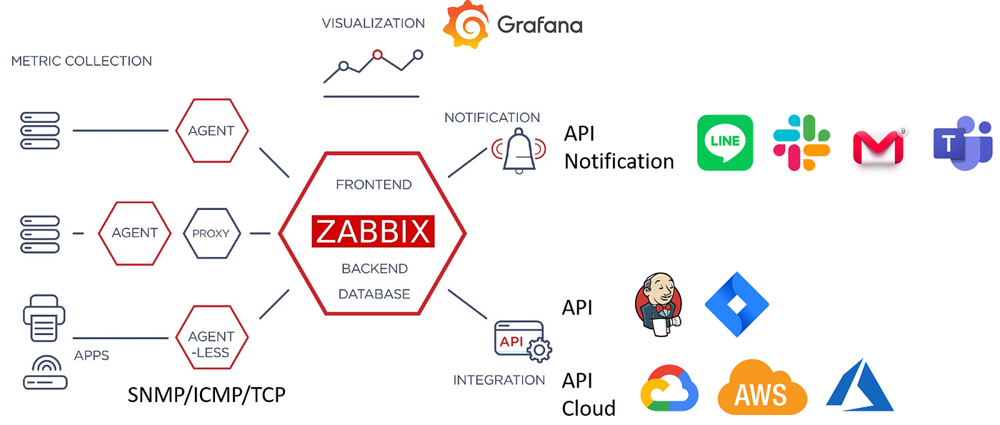

## 什么是监控系统？为什么需要监控？

  <strong>📖 说明：</strong>

 
监控系统 是一套用于实时收集、处理、展示和分析 IT 基础设施（如服务器、网络设备、应用程序等）各项指标的工具集。它就像是 IT 系统的“听诊器”和“体检中心”。

  <strong>📖 我们需要监控系统，因为它能帮助我们：</strong>

<ul>
<li>监控系统 是一套用于实时收集、处理、展示和分析 IT 基础设施（如服务器、网络设备、应用程序等）各项指标的工具集。它就像是 IT 系统的“听诊器”和“体检中心”。</li>

<li>主动发现问题：在故障发生前，通过预设的阈值和告警规则，及时发现潜在的性能瓶颈或异常行为，防患于未然。</li>

<li>快速定位问题：当故障发生时，监控系统能够提供详尽的历史数据和实时状态，帮助运维人员迅速锁定问题的根源，减少故障恢复时间。</li>

<li>评估系统健康状况：通过长期的数据积累和趋势分析，我们可以了解系统的运行情况，为容量规划和性能优化提供数据支持。</li>
</ul>

## 监控系统的核心指标

  <strong>📖 一个完整的监控系统通常关注以下三个核心指标：</strong>

<ul>
<li><strong>可用性（Availability）：</strong>系统是否正常运行？这是最基础的指标，通常用服务的在线时间百分比来衡量，比如 99.99% 的可用性。</li>

<li><strong>性能（Performance）：</strong>系统运行得如何？这包括响应时间、吞吐量、CPU 使用率、内存占用、磁盘 I/O 等，这些指标反映了系统的运行效率。</li>

<li><strong>告警（Alerting）：</strong>当可用性或性能出现问题时，监控系统能否及时通知到相关人员？高效的告警机制是监控系统发挥作用的关键。</li>
</ul>

## Zabbix 介绍

Zabbix 是一款功能强大的企业级开源分布式监控解决方案。它由 Alexei Vladishev 在 1998 年开始开发，并在 2001 年正式发布了第一个版本。经过多年的发展，Zabbix 已经成为一个功能全面、社区活跃、备受企业欢迎的监控平台。

  <strong>Zabbix 的核心组件包括：</strong> 
<ul>
<li>Zabbix Server：核心服务程序，负责数据的接收、处理、告警触发和通知。所有配置信息都存储在 Zabbix Server 后端的数据库中。</li>

<li>Zabbix Agent：部署在被监控主机上的轻量级代理，负责采集 CPU、内存、磁盘等本地数据，并发送给 Zabbix Server。</li>

<li>Zabbix Proxy：可选组件，用于分布式监控。它可以代替 Zabbix Server 收集远程区域的数据，然后将数据发送给 Zabbix Server，从而减轻 Zabbix Server 的负载，并解决跨网络监控的问题。</li>

<li>Zabbix Frontend：基于 Web 的图形化界面，用户通过它进行所有配置、数据查看和报表生成等操作。</li>
</ul>

## Zabbix 的优势与适用场景

  <strong>Zabbix 的优势：</strong> 
 <ul>
 <li><strong>功能全面：</strong> 支持多种监控方式（Agent、SNMP、IPMI、JMX 等），能够监控服务器、网络设备、数据库、应用程序等几乎所有 IT 资产。</li>
 <li><strong>分布式架构：</strong> 通过 Zabbix Proxy 实现了高度可扩展的分布式监控，适用于大规模、跨地域的复杂环境。</li>
 <li><strong>丰富的数据可视化：</strong> 提供多种图表、仪表盘和报表功能，帮助用户清晰地理解监控数据。</li>
 <li><strong>开源免费：</strong> 作为开源软件，Zabbix 降低了企业使用成本，并拥有庞大的社区支持。li<>/lio</li>
 </ul>

  <strong>适用场景：</strong> 
 <ul>
 <li><strong>中小型企业：</strong> 搭建一个统一的监控平台，全面管理企业内部的 IT 资产。</li>
 <li><strong>大型数据中心：</strong> 利用 Zabbix Proxy 搭建分布式监控架构，实现对成千上万台设备的集中管理。</li>
 <li><strong>云环境：</strong> 监控云服务器、容器和微服务，实现动态环境的自动化监控。</li>
 <li><strong>物联网 (IoT):</strong> 通过 Zabbix 的 API 和自定义监控项，实现对各类智能设备的监控。/li>
 </ul>

